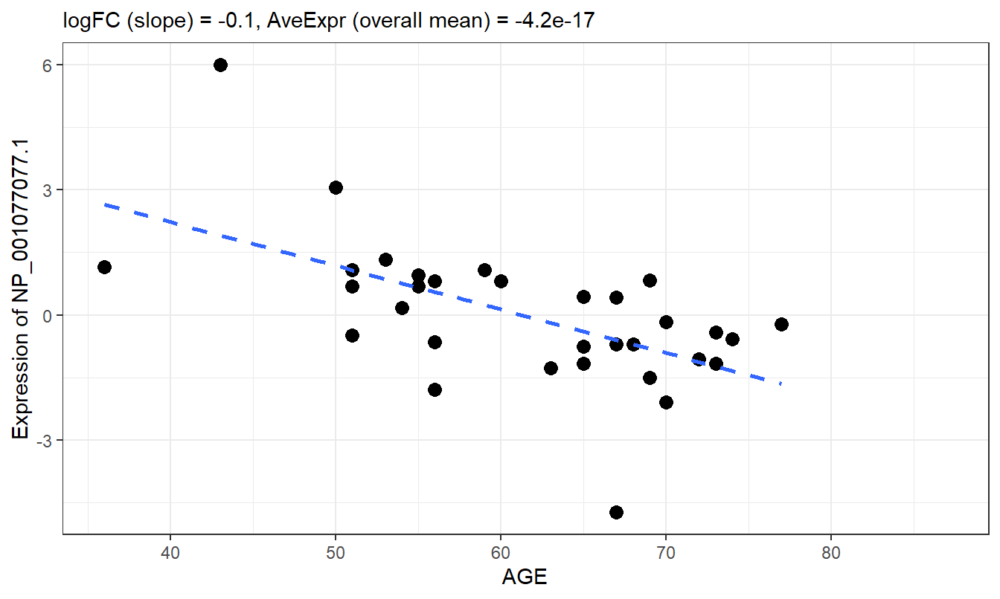

# Differential Expression Analysis {#DEA}

The overview goes here.


For this chapter, we will need the following packages.


```r
library(MSnSet.utils)
library(ggplot2)
library(dplyr)
library(tibble)
library(scales)

# Load the MSnSet
data("longitudinal_biomarker_study")
```


## DEA with limma

This section covers differential expression analysis with the limma package. The basic workflow for DEA with limma is to fit a linear model to each feature, then, empirical Bayesian methods are used to moderate the test statistics

The <a href="https://www.bioconductor.org/packages/devel/bioc/vignettes/limma/inst/doc/usersguide.pdf">limma user's guide</a> is an invaluable resource.

### Dichotomous Predictors


```r
res1 <- limma_a_b(longitudinal_biomarker_study, 
                  model.str = "~ Type",
                  coef.str = "Type")
```

### Continuous Predictors

### Reference Level Comparisons

### Custom Contrasts


## p-value Histograms


```r
hist(res1$P.Value, 
     breaks = seq(0, 1, 0.05), 
     main = "Histogram of Case vs Control p-values", 
     xlab = "p-value")
```


The histogram is fairly uniform, which means that only a few of the features are likely to be significant after adjustment.


```r
hist(res1$adj.P.Val, 
     breaks = seq(0, 1, 0.05), 
     main = "Histogram of Case vs Control Adjusted p-values", 
     xlab = "BH-adjusted p-value")
```



After adjustment, only 2 proteins are significantly-different between the case and control groups.

## Volcano Plots


```r
# Base volcano plot
plot_volcano(logFC = res1$logFC, significance = res1$P.Value)
```


```r
plot_data <- res1 %>%
        rownames_to_column("feature") %>%
        mutate(point_color = case_when(
                logFC >= 0 & P.Value < 0.05 ~ "Up",
                logFC < 0 & P.Value < 0.05 ~ "Down"))

features_to_label <- plot_data %>% 
        # Select top 3 most significant proteins in each group
        filter(point_color != "NS") %>%
        group_by(point_color) %>%
        slice_min(order_by = P.Value, n = 3) %>% 
        mutate(feature_label = feature)

plot_data <- left_join(plot_data, features_to_label)
```


```r
# Add significance cutoff line, color points based on significance
# and logFC, label the 3 most significant points for both positive 
# and negative logFC.
plot_volcano(logFC = plot_data$logFC, significance = plot_data$P.Value, 
             sig_threshold = 0.05, threshold_line_color = "black",
             point_color = plot_data$point_color, 
             feature_labels = plot_data$feature_label, 
             plot_theme = theme_bw(base_size = 14)) +
        # Modify point colors
        scale_color_manual(values = c("red3", "#5555ff"),
                           breaks = c("Up", "Down"), 
                           na.value = "grey70") +
        # Remove legend
        theme(legend.position = "none") +
        # Modify plot labels
        labs(x = expression(paste("log"[2],"(fold-change)")), 
             y = "Unadjusted p-value")
```


