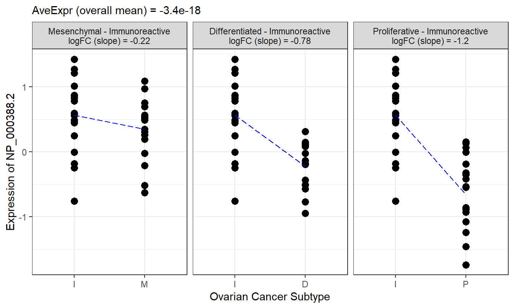
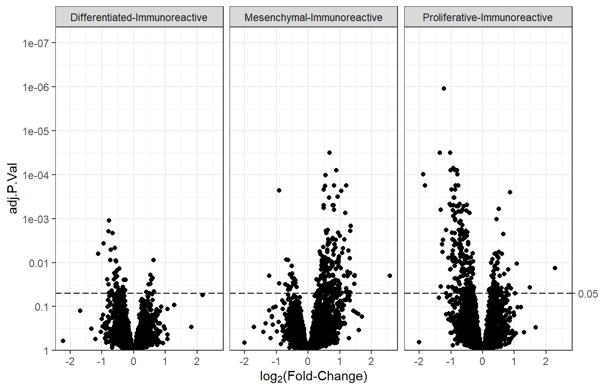
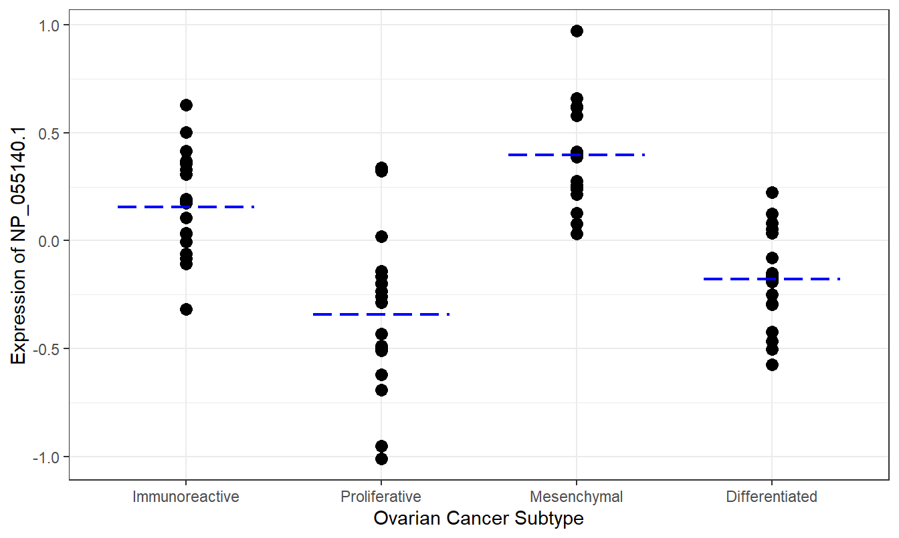

# Differential Analysis {#DEA}

The overview goes here.


```r
library(MSnSet.utils)
library(dplyr)
library(ggplot2)

# MSnSet
data("cptac_oca")
```


## Linear Regression


```r
res1 <- limma_a_b(oca.set, model.str = "~ AGE", coef.str = "AGE")
head(res1)
```

```
##                    logFC       AveExpr          t   P.Value adj.P.Val         B
## NP_000005.2  0.003758619 -1.672939e-17  0.4965363 0.6209622 0.9788087 -7.666191
## NP_000007.1 -0.005272805 -1.611154e-17 -0.9293255 0.3556895 0.9498588 -7.356355
## NP_000008.1  0.002761104  1.482832e-17  0.5570923 0.5791162 0.9762348 -7.634039
## NP_000009.1  0.005113709  6.653734e-18  1.1437048 0.2563683 0.9242520 -7.134774
## NP_000010.1  0.003634240 -4.752667e-18  0.5782844 0.5647973 0.9762348 -7.621921
## NP_000012.1 -0.001469325 -5.880419e-18 -0.3930499 0.6956459 0.9866972 -7.634142
```

## One-Way ANOVA


```r
res2 <- limma_gen(oca.set, model.str = "~ SUBTYPE", coef.str = "SUBTYPE")
head(res2)
```

```
##             SUBTYPEProliferative SUBTYPEMesenchymal SUBTYPEDifferentiated
## NP_000005.2          -0.15149043         0.05641954           -0.15057866
## NP_000007.1          -0.24732121        -0.15789692            0.08496949
## NP_000008.1          -0.15921805        -0.08113290           -0.20215369
## NP_000009.1           0.05017789         0.03855355            0.06446570
## NP_000010.1          -0.13569585        -0.47163526            0.22698229
## NP_000012.1           0.05628690         0.15846512            0.05044680
##                   AveExpr          F     P.Value  adj.P.Val
## NP_000005.2 -1.672939e-17 0.38687311 0.762774864 0.85488216
## NP_000007.1 -1.611154e-17 1.47040585 0.229634248 0.43978604
## NP_000008.1  1.482832e-17 0.66869230 0.573961618 0.72866828
## NP_000009.1  6.653734e-18 0.07665979 0.972406121 0.98383381
## NP_000010.1 -4.752667e-18 4.90988300 0.003650144 0.03431203
## NP_000012.1 -5.880419e-18 0.56550327 0.639900892 0.77495047
```


## t-tests

### One Comparison

`limma_a_b` is used when there are exactly two levels that are being compared. If the `coef.str` column of the phenotype data is a factor, the first level will be used as the reference. If the `coef.str` column is a character vector, the first unique category will be used as the reference.


```r
# Only two-groups
res3 <- limma_a_b(oca.set, model.str = "~ PLATINUM.STATUS", 
                  coef.str = "PLATINUM.STATUS")
head(res3)
```

```
##                    logFC     AveExpr           t     P.Value adj.P.Val
## NP_000005.2 -0.107374921 -0.01665020 -0.43146914 0.667868628 0.9869175
## NP_000007.1  0.492463553  0.05029281  2.74657864 0.008196829 0.9569777
## NP_000008.1  0.137635365  0.03187806  0.85183002 0.398122076 0.9780748
## NP_000009.1  0.085879347  0.03595808  0.56710194 0.573027180 0.9780748
## NP_000010.1  0.116989322 -0.04849702  0.56970627 0.571271928 0.9780748
## NP_000012.1 -0.009030939 -0.01768271 -0.07885814 0.937500866 0.9960390
##                     B
## NP_000005.2 -4.774314
## NP_000007.1 -3.618784
## NP_000008.1 -4.680735
## NP_000009.1 -4.750673
## NP_000010.1 -4.750157
## NP_000012.1 -4.771268
```

To count the number of significant features after adjustment, we can use `table` or `sum`.


```r
table(res3$adj.P.Val < 0.05)
```

```
## 
## FALSE 
##  8101
```

No features are significantly different between the RESISTANT and SENSITIVE `PLATINUM.STATUS` levels after adjustment.

### Multiple Comparisons

`limma_contrasts` is used to perform multiple t-tests at the same time. We can use the `paircomp` function to generate contrasts to be used with `paircomp`.


```r
# Pairwise contrasts
contrasts <- paircomp(oca.set$SUBTYPE, name = "SUBTYPE")
contrasts
```

```
## [1] "SUBTYPEProliferative-SUBTYPEImmunoreactive" 
## [2] "SUBTYPEMesenchymal-SUBTYPEImmunoreactive"   
## [3] "SUBTYPEDifferentiated-SUBTYPEImmunoreactive"
```

By default, `limma_contrasts` will generate diagnostic plots. We can prevent this by setting `plot` to `FALSE`.


```r
res4 <- limma_contrasts(oca.set, model.str = "~ 0 + SUBTYPE", 
                        coef.str = "SUBTYPE", contrasts = contrasts,
                        plot = FALSE)
head(arrange(res4, feature))
```

```
##        feature                      contrast      RefSeq       logFC
## 1: NP_000005.2  Proliferative-Immunoreactive NP_000005.2 -0.15149043
## 2: NP_000005.2    Mesenchymal-Immunoreactive NP_000005.2  0.05641954
## 3: NP_000005.2 Differentiated-Immunoreactive NP_000005.2 -0.15057866
## 4: NP_000007.1  Proliferative-Immunoreactive NP_000007.1 -0.24732121
## 5: NP_000007.1    Mesenchymal-Immunoreactive NP_000007.1 -0.15789692
## 6: NP_000007.1 Differentiated-Immunoreactive NP_000007.1  0.08496949
##          AveExpr          t   P.Value adj.P.Val         B
## 1: -1.672939e-17 -0.6468898 0.5197231 0.8364999 -6.021610
## 2: -1.672939e-17  0.2341331 0.8155341 0.9517088 -6.086486
## 3: -1.672939e-17 -0.6342478 0.5278928 0.8414233 -5.607632
## 4: -1.611154e-17 -1.4339934 0.1558248 0.5663793 -5.237105
## 5: -1.611154e-17 -0.8897083 0.3765321 0.7594979 -5.733156
## 6: -1.611154e-17  0.4859585 0.6284456 0.8846421 -5.683780
```

## p-value Histograms


```r
hist(res3$P.Value, 
     breaks = seq(0, 1, 0.05), 
     main = "Histogram of PLATINUM.STATUS ANOVA Results", 
     xlab = "p-value")
```


The histogram is uniform, which means it is unlikely that any features will be significantly different between any two `PLATINUM.STATUS` groups after adjustment for multiple comparisons. Indeed, when we check with `table(res3$adj.P.Val < 0.05)`, none of the features pass the significance threshold after Benjamini-Hochberg (BH) adjustment.


```r
# Histogram faceted by contrast
ggplot(res4) +
        geom_histogram(aes(x = P.Value), breaks = seq(0, 1, 0.05),
                       color = "black", fill = "grey") +
        facet_wrap(vars(contrast)) +
        theme_bw()
```



Based on the unadjusted p-values, it appears that there are more features that are significantly different between the Proliferative vs. Immunoreactive comparison than the other two comparisons. We can create a table of the number of features with adjusted p-values less than 0.05 in each comparison with the `table` function.


```r
table(res4$contrast, res4$adj.P.Val < 0.05)
```

```
##                                
##                                 FALSE TRUE
##   Differentiated-Immunoreactive  8056   47
##   Mesenchymal-Immunoreactive     7912  191
##   Proliferative-Immunoreactive   7855  248
```

## Volcano Plots


```r
# Basic volcano plot
plot_volcano(df = res4, logFC = "logFC", pvals = "adj.P.Val", 
             sig_threshold = 0.05) +
        facet_wrap(vars(contrast)) +
        labs(y = "BH-adjusted p-value")
```




It looks like there are more features that are significantly lower in the Proliferative group compared to the Immunoreactive group than there are features that are significantly higher. The Differentiated group appears to behave similarly, though with fewer features passing the significance cutoff of 0.05.

Below is an example of how to color points based on sign of the fold-change and whether they are significant.


```r
# Top 4 most significant features in each contrast
feature_labels <- res4 %>% 
        group_by(contrast) %>%
        slice_min(order_by = adj.P.Val, n = 4, with_ties = FALSE) %>% 
        mutate(feature_label = feature)

res4 <- res4 %>% 
        # Label 5 most significant features in each comparison group
        left_join(feature_labels) %>% 
        # Determine point colors based on significance and sign(logFC)
        mutate(point_color = case_when(
                adj.P.Val < 0.05 & logFC < 0 ~ "down",
                adj.P.Val < 0.05 & logFC > 0 ~ "up",
                TRUE ~ "NS"), 
               point_color_sub = ifelse(!is.na(feature_label), 
                                        point_color, NA))

# Color points
v1 <- plot_volcano(df = res4, logFC = "logFC", pvals = "adj.P.Val", 
                   sig_threshold = 0.05, 
                   point_args = list(mapping = aes(color = point_color))) +
        facet_wrap(vars(contrast))
v1
```


```r
# Change colors - do not include "NS"
v1 + scale_color_manual(values = c("#5555ff", "red3", NA), 
                        breaks = c("down", "up", "NS"), 
                        limits = c("down", "up"), 
                        na.value = "lightgrey") +
        theme(legend.position = "none") # do not show legend
```




```r
# Label top 4 significant features in each contrast
plot_volcano(df = res4, logFC = "logFC", pvals = "adj.P.Val", 
             sig_threshold = 0.05, label = "feature_label",
             num_features = nrow(res4),
             # Change point and label color
             label_args = list(mapping = aes(color = point_color),
                               size = 2.5, box.padding = 0.75, 
                               force_pull = 0, seed = 99), 
             point_args = list(mapping = aes(color = point_color),
                               alpha = 0.5)) +
        facet_wrap(vars(contrast)) +
        # Point colors
        scale_color_manual(values = c("#5555ff", "red3", NA), 
                           breaks = c("down", "up", "NS"), 
                           limits = c("down", "up"), 
                           na.value = "lightgrey") +
        theme_bw() +
        theme(legend.position = "none") # do not show legend
```


