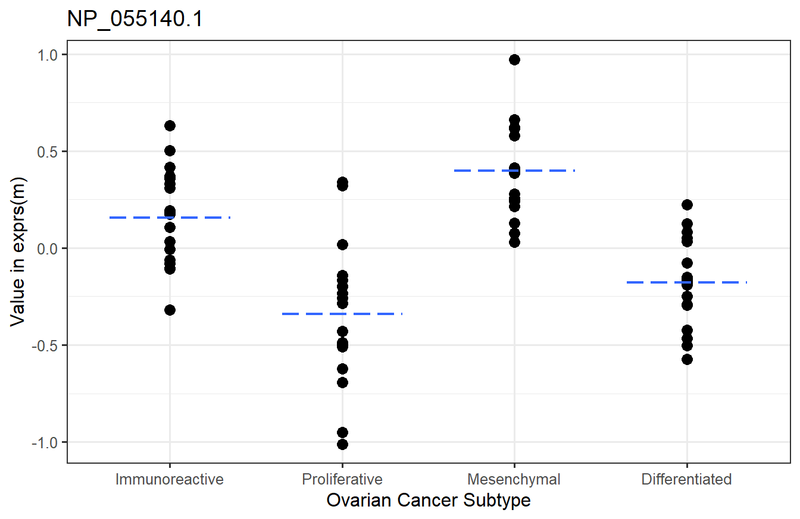
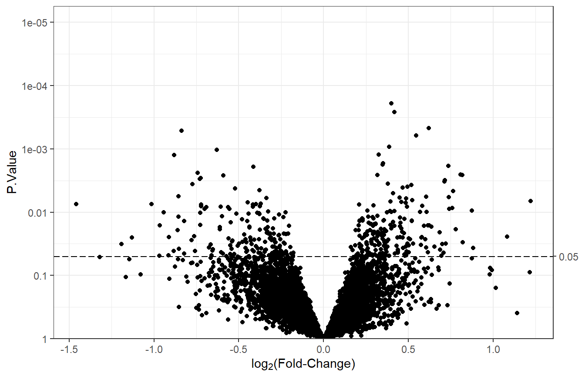
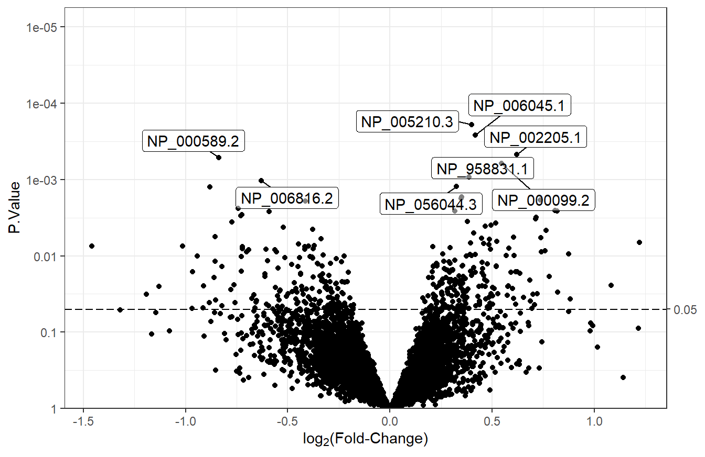
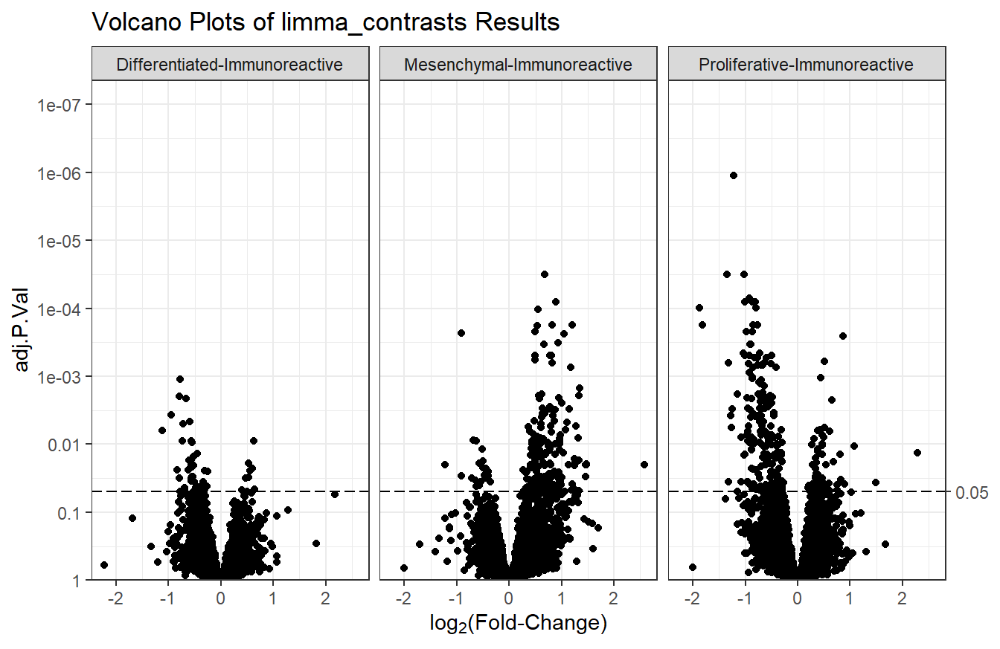

# Differential Expression Analysis {#DEA}

<!---
TODO:
* Add more information about LIMMA.
* Add section on UpSet plots
--->

In this section, we will use wrappers around functions from the <a href="https://bioconductor.org/packages/release/bioc/html/limma.html">limma</a> package to fit linear models (linear regression, t-test, and ANOVA) to proteomics data. While LIMMA was originally intended for use with microarray data, it is useful for other data types. When working with LIMMA, the <a href="https://www.bioconductor.org/packages/devel/bioc/vignettes/limma/inst/doc/usersguide.pdf">LIMMA User's Guide</a> is an invaluable resource.

<!---
, though it is not a required reading unless you intend to modify the wrapper functions in <a href="https://github.com/PNNL-Comp-Mass-Spec/MSnSet.utils">MSnSet.utils</a>; the `limma_*` functions will handle all the usual steps required to go from an MSnSet to a results table. Users should understand enough such that these wrappers are not black boxes, as that may result in incorrect usage and interpretation of results. When in doubt, read the function documentation, look at the code (`View(function_name)`), and/or ask for help.
--->

LIMMA makes use of empirical Bayes techniques to borrow information across all features being tested to increase the degrees of freedom available for the test statistics. This results in so-called "moderated" test statistics and improved ability to detect differential expression/abundance.

We will use the CPTAC ovarian cancer proteomics dataset for this section. The required packages are MSnSet.utils for the LIMMA wrappers and volcano plots, dplyr for data frame manipulation, and ggplot2 for p-value histograms and to further customize the volcano plots. We load the `cptac_oca` data and copy `oca.set` to `m`, which will be used in the examples.


```r
## Uncomment to install missing packages
# install.packages("remotes")
# remotes::install_github("PNNL-Comp-Mass-Spec/MSnSet.utils")
# install.packages("dplyr")
# install.packages("ggplot2")
library(MSnSet.utils)
library(dplyr)
library(ggplot2)

# MSnSet
data("cptac_oca")
m <- oca.set
```


## Multiple Comparisons {#mult-comp}

By default, the LIMMA wrappers from MSnSet.utils adjust the p-values to account for multiple comparisons using the Benjamini-Hochberg (BH) procedure. This controls the false discovery rate (FDR), and the resulting adjusted p-values are called q-values. To understand q-values, suppose we test whether there is a difference between the means of two groups. We do this for a set of 10,000 features. Suppose that, of these 10,000 tests, 1050 results in q-values less than $\alpha = 0.05$ (a typical threshold for statistical significance). We would say that these 1050 most significant features have an estimated FDR of 0.05. That is, we expect that at most $0.05 \cdot 1050 \approx 53$ of these results are false positives (features that are wrongly classified as significantly different between groups).


## Linear Regression {#linear-reg}

`limma_a_b` or `limma_gen` are used to perform linear regression, which models the linear relationship between a numeric predictor and the feature-wise values in the `exprs` slot of an `MSnSet`.

For this example, we will test the AGE column of `pData(m)`. The `model.str` is the full model that includes the variable of interest and any covariates. The `coef.str` argument is the variable of interest.


```r
lm_res <- limma_gen(m, model.str = "~ AGE", coef.str = "AGE")
head(arrange(lm_res, adj.P.Val)) # top 6 rows sorted by adjusted p-value
```

```
##                      logFC       AveExpr         t      P.Value adj.P.Val
## NP_001077077.1 -0.10468905 -4.163336e-17 -4.186740 0.0001865011 0.5982300
## NP_001138679.1  0.01185948  7.806256e-18  3.821284 0.0002953129 0.5982300
## NP_003286.1     0.01335415 -6.938894e-18  3.870673 0.0002292102 0.5982300
## NP_055336.1    -0.01819954  1.233581e-18 -3.986807 0.0002306581 0.5982300
## NP_000026.2    -0.01689006 -5.703200e-18 -2.847600 0.0056747708 0.8201268
## NP_000176.2    -0.02059760 -3.802134e-18 -3.055901 0.0031033317 0.8201268
##                           B
## NP_001077077.1  0.001863506
## NP_001138679.1 -1.049384099
## NP_003286.1    -0.880645496
## NP_055336.1    -0.598496581
## NP_000026.2    -3.895795433
## NP_000176.2    -3.338485703
```

The `logFC` column is the slope of the regression line, and the `AveExpr` column is the average of the values for that feature (same as `rowMeans(exprs(m), na.rm = TRUE)`). `AveExpr` can also be thought of as the y-intercept of the regression line when the predictor is mean-centered. The actual y-intercept is $\text{AveExpr} - avg(\text{AGE})\cdot\text{logFC}$. The other columns are

- `t` moderated t-statistic
- `P.Value` p-value
- `adj.P.Val` p-values adjusted with the Benjamini-Hocheberg procedure. Also called q-values.
- `B` log-odds of differential expression

Since the table was sorted by q-values, and the lowest q-value is ~ 0.6, none of the features have a significant linear relationship with AGE (after adjustment for multiple comparisons).

Below is a graphical representation of the results for a specific feature. This is not a required plot; it is just to visually explain the results.


To adjust for the presence of one or more covariates, such as accounting for batch differences, we modify the `model.str` argument. For this example, we will include Batch as a covariate. We add it *after* the variable being tested.


```r
# Include SUBTYPE as a covariate
lm_res_cov <- limma_gen(m, model.str = "~ AGE + Batch", coef.str = "AGE")
head(arrange(lm_res_cov, adj.P.Val))
```

```
##                   logFC       AveExpr         t      P.Value adj.P.Val
## NP_002104.2 -0.02214664 -9.315227e-18 -3.711539 4.238866e-04 0.5057768
## NP_002635.2 -0.05455354 -3.128810e-17 -4.266737 9.198715e-05 0.5057768
## NP_003286.1  0.01432046 -6.938894e-18  3.801188 3.156548e-04 0.5057768
## NP_005657.1 -0.02421416  8.935014e-18 -3.721088 4.108575e-04 0.5057768
## NP_006387.1  0.01887213 -1.368768e-17  3.637909 5.384586e-04 0.5057768
## NP_006535.1 -0.01271186 -3.041707e-18 -3.698719 4.420011e-04 0.5057768
##                      B
## NP_002104.2 -1.3815025
## NP_002635.2  0.3619802
## NP_003286.1 -1.1003103
## NP_005657.1 -1.3517595
## NP_006387.1 -1.6091557
## NP_006535.1 -1.4213571
```

When accounting for differences due to Batch, no features have a significant linear relationship with AGE. Again, we will show a graphical representation of the top feature.


## Two-Sample t-tests {#t-tests}

Two-sample t-tests are used to determine whether there is a significant difference between the means of two groups. The null hypothesis is that the group means are equal, and the alternative is that they are not equal. Written another way, the null hypothesis is that the difference in means is zero, and the alternative is that the difference is not zero.

<!---
MSnSet.utils has two functions that perform two-sample t-tests. The first function, `limma_a_b`, is used when there are exactly two groups. For example, the PLATINUM.STATUS column of `pData(m)` has exactly two categories: "SENSITIVE" and "RESISTANT". The second function, `limma_contrasts`, is used when there are more than two categories (for example, the SUBTYPE column) and we wish to test specific contrasts (usually when making comparisons against a reference). This results in separate t-statistics and p-values for each contrast, unlike `limma_gen`, which results in a single F statistic for all contrasts. We will begin with an example of how to use `limma_a_b`.

--->

`limma_a_b` and `limma_contrasts` can perform moderated two-sample t-tests.

### One comparison {#t-single}

If a factor only has two groups, we can use `limma_a_b`. We will test for differences between the "RESISTANT" and "TREATMENT" groups without accounting for any covariates.


```r
# Test RESISTANT - SENSITIVE = 0
t_res1 <- limma_a_b(eset = m, model.str = "~ PLATINUM.STATUS", 
                    coef.str = "PLATINUM.STATUS")
head(arrange(t_res1, adj.P.Val)) # top 6 rows sorted by adjusted p-value
```

```
##                  logFC      AveExpr         t     P.Value adj.P.Val         B
## NP_000007.1  0.4924636  0.050292811  2.746579 0.008196829 0.9569777 -3.618784
## NP_000013.2 -0.2221522  0.062925069 -1.373152 0.175457942 0.9569777 -4.484676
## NP_000030.1 -0.3525116 -0.051132133 -1.251127 0.216355370 0.9569777 -4.538114
## NP_000031.1 -0.3487920  0.046000375 -1.248196 0.217418216 0.9569777 -4.539343
## NP_000032.1 -0.3564539  0.003432085 -1.445320 0.154225965 0.9569777 -4.451000
## NP_000037.2 -0.2507794  0.041070595 -1.770298 0.087859482 0.9569777 -4.386374
```

The `logFC` column is the difference in means between the "RESISTANT" and "SENSITIVE" groups (the first level is always the reference; use `levels(m$PLATINUM.STATUS)` to check). The other columns are

- `AveExpr` overall mean (same as `rowMeans(exprs(m), na.rm = TRUE)`)
- `t` moderated t-statistic
- `P.Value` p-values
- `adj.P.Val` BH-adjusted p-values (q-values)
- `B` log-odds of differential expression/abundance

Below is a graphical representation of the results for a specific feature. This is not a required step. It is just to visually explain the results.


The next step would be to check the p-value histograms. If those look fine, we can tally the number of q-values that have an FDR of 0.05.


```r
# TRUE - significant, FALSE - not significant
table(t_res1$adj.P.Val < 0.05)
```

```
## 
## FALSE 
##  8101
```

None of the features are significantly different between the two PLATINUM.STATUS groups at the 0.05 FDR level.


### Multiple comparisons {#t-mult}

Now, we will move on to an example of how to use `limma_contrasts`, which is suited for **comparing groups against a reference**. We will treat "Immunoreactive" as the reference group for this example, though this does not really make sense in the context of this data. It would make more sense to do a one-way ANOVA with `limma_gen` (Section \@ref(anova)). This is just for example purposes.

We will test the following contrasts. Each level must begin with the variable name, or `limma_contrasts` will not work.


```r
# Contrasts to test
contrasts <- paircomp(x = m$SUBTYPE, name = "SUBTYPE", 
                      ref = "Immunoreactive")
contrasts
```

```
## [1] "SUBTYPEProliferative-SUBTYPEImmunoreactive" 
## [2] "SUBTYPEMesenchymal-SUBTYPEImmunoreactive"   
## [3] "SUBTYPEDifferentiated-SUBTYPEImmunoreactive"
```

By default, `limma_contrasts` generates diagnostic plots. For now, we will not make these plots. We also need to specify a no-intercept model by including 0 in `model.str`.


```r
# Test contrasts
t_res2 <- limma_contrasts(eset = m, model.str = "~ 0 + SUBTYPE", 
                          coef.str = "SUBTYPE", contrasts = contrasts,
                          trend = TRUE, robust = TRUE, # passed to eBayes
                          plot = FALSE)
head(arrange(t_res2, adj.P.Val)) # top 6 rows sorted by adjusted p-value
```

```
##           feature                     contrast         RefSeq      logFC
## 1:    NP_000388.2 Proliferative-Immunoreactive    NP_000388.2 -1.2232098
## 2:    NP_001944.1 Proliferative-Immunoreactive    NP_001944.1 -1.3465807
## 3:    NP_112092.1 Proliferative-Immunoreactive    NP_112092.1 -1.0268282
## 4:    NP_002323.2   Mesenchymal-Immunoreactive    NP_002323.2  0.6707465
## 5: NP_001120963.1 Proliferative-Immunoreactive NP_001120963.1 -0.9267318
## 6:    NP_009005.1 Proliferative-Immunoreactive    NP_009005.1 -1.0097220
##          AveExpr         t      P.Value    adj.P.Val         B
## 1: -3.421920e-18 -7.703025 4.549213e-11 1.105868e-06 14.750586
## 2: -5.322987e-18 -6.637345 4.520647e-09 3.191542e-05 10.463800
## 3: -9.315227e-18 -6.602133 5.251623e-09 3.191542e-05 10.323954
## 4:  3.564500e-18  6.698537 3.482606e-09 3.191542e-05 10.602125
## 5: -2.281280e-18 -6.358267 1.475334e-08 7.172780e-05  9.360149
## 6: -1.273715e-17 -6.243353 2.392300e-08 8.017389e-05  8.909146
```

In addition to the columns from the output of `limma_a_b`, `limma_contrasts` creates a column for the contrasts and includes all columns from `fData`. It is important to note that p-values in the `adj.P.Val` column have been adjusted across all features and contrasts, so testing more contrasts results in fewer significant features. It is best to test only a small number of related contrasts.

Below is a graphical representation of the results for a specific feature.


The next step would be to check the p-value histograms. If those look fine, we can tally the number of q-values that pass the threshold for statistical significance.


```r
# TRUE - significant, FALSE - not significant
table(t_res2$contrast, t_res2$adj.P.Val < 0.05)
```

```
##                                
##                                 FALSE TRUE
##   Differentiated-Immunoreactive  8052   51
##   Mesenchymal-Immunoreactive     7908  195
##   Proliferative-Immunoreactive   7848  255
```

If we take the 51, 195, and 255 features with the lowest q-values from the "Differentiated-Immunoreactive", "Mesenchymal-Immunoreactive", and "Proliferative-Immunoreactive" comparisons, respectively, the overall estimated FDR is at most 0.05. That is, we expect ~25 out of those 501 to be false positives.

More features are significantly different between the "Proliferative" and "Immunoreactive" groups than in the other comparisons.


## One-Way ANOVA {#anova}

A one-way ANOVA is a generalized version of the two-sample t-test that is used to determine whether there is a significant difference between the means of three or more groups. The null hypothesis is that all group means are equal, and the alternative is that at least one of the means is different from the rest. Written another way, the null hypothesis is that the difference between any two means is zero, and the alternative is that the difference between at least two means is not zero. 

<!---
**Hypotheses:**

$H_0: \mu_1 = \mu_2 = \mu_3 = ... = \mu_k \quad \text{or} \quad \mu_i - \mu_j = 0, \quad \forall i \neq j \in 1,2,3,...,k$

$H_A: \mu_i \neq \mu_j \quad \text{or} \quad \mu_i - \mu_j \neq 0, \quad \text{for some } i, j \in 1,2,3,...,k$
--->

**Note:** A one-way ANOVA does not tell us which means are different—only that a difference exists.

`MSnSet.utils::limma_gen` is a wrapper around functions from the limma package that performs one-way ANOVA. We will use it to test if there is a significant difference between any two levels of SUBTYPE: "Immunoreactive", "Proliferative",  "Mesenchymal", and "Differentiated". Since SUBTYPE is a factor, the first level ("Immunoreactive") will be used as the reference. That is, we will be testing whether the means of the "Proliferative", "Mesenchymal", or "Differentiated" groups are different from the mean of the "Immunoreactive" group for each feature in the MSnSet `m`.


```r
anova_res <- limma_gen(eset = m, model.str = "~ SUBTYPE", 
                       coef.str = "SUBTYPE")
head(arrange(anova_res, adj.P.Val)) # top 6 rows arranged by adjusted p-value
```

```
##             SUBTYPEProliferative SUBTYPEMesenchymal SUBTYPEDifferentiated
## NP_055140.1           -0.4979740         0.24131186            -0.3342889
## NP_000388.2           -1.2232098        -0.21980158            -0.7849428
## NP_009005.1           -1.0097220         0.04832193            -0.6224298
## NP_000878.2           -0.7633419         0.07176514            -0.5563074
## NP_001944.1           -1.3465807        -0.17808291            -0.9476618
## NP_115584.1           -0.2718495         0.93758021             0.1842301
##                   AveExpr        F      P.Value    adj.P.Val
## NP_055140.1  2.269399e-18 24.74128 3.642291e-11 2.951348e-07
## NP_000388.2 -3.421920e-18 23.63972 8.266856e-11 3.349317e-07
## NP_009005.1 -1.273715e-17 19.72001 1.784885e-09 4.820974e-06
## NP_000878.2 -1.710960e-18 18.89587 3.521123e-09 5.195885e-06
## NP_001944.1 -5.322987e-18 19.03216 3.144239e-09 5.195885e-06
## NP_115584.1  1.172771e-18 18.76318 4.488608e-09 5.195885e-06
```

The row names are the features that were tested, and the first three columns are the average log2 fold-changes for each contrast: "Proliferative - Immunoreactive",  "Mesenchymal - Immunoreactive", and "Differentiated - Immunoreactive". That is, a positive value indicates that the mean of the "Immunoreactive" group is lower than the mean of the other group, and a negative value indicates that the mean of the "Immunoreactive" group is higher than the mean of the other group. To find the logFC between the "Proliferative" and "Mesenchymal" groups for protein NP_055140.1, for example, we would take the difference between "SUBTYPEProliferative" and "SUBTYPEMesenchymal": -0.498 - 0.241 = -0.739. The other columns are

- `AveExpr` overall mean (same as `rowMeans(exprs(m), na.rm = TRUE)`)
- `F` moderated F-statistic
- `P.Value` p-value
- `adj.P.Val` BH-adjusted p-value (q-value)

Below is a graphical representation of the results for a specific feature. This is not a required step; it is just a visual explanation of the results.



<!---
The next step would be to check the p-value histograms. If those look fine, we can tally the number of adjusted p-values that pass the threshold for statistical significance. We will use $\alpha = 0.05$ for the significance cutoff. Since we use the BH adjustment, we say that the FDR of the features that pass the significance threshold after adjustment is at most $alpha$. For example, if 100 features are considered significant at the 0.05 level after adjustment, we expect at most 5 of them to be false positives.
--->

The next step would be to check the p-value histograms. If those look fine, we can tally the number of q-values with an FDR of 0.05.


```r
table(anova_res$adj.P.Val < 0.05)
```

```
## 
## FALSE  TRUE 
##  7049  1054
```

1054 features have q-values less than 0.05. Since the expected FDR is 0.05, we estimate that at most ~53 of these are false positives.

## p-value Histograms

A p-value histogram visualizes the distribution of p-values from a collection of hypothesis tests. It is used as a diagnostic tool to check the validity of results prior to multiple testing correction.

<!---
If the p-values follow a uniform distribution (Figure \@ref(fig:p-val-hist-1)), all of the null hypotheses are true (e.g. the slope is 0 in the case of linear regression or there is no difference in means for t-tests and ANOVA). Few, if any, features will pass the significance threshold after adjustment. If the p-values are anti-conservative (there is a peak close to 0), then some of the null hypotheses are false (the slope is not 0 or there are differences in means). Figure \@ref(fig:p-val-hist-2) is an example of an anti-conservative histogram.

**Note:** If the histogram is anti-conservative, but there are no interesting features after multiple testing correction, the experiment is underpowered, and we will not be able to detect differences even if they exist.
--->


```r
hist(t_res1$P.Value, 
     breaks = seq(0, 1, 0.05), 
     main = "Histogram of p-values from PLATINUM.STATUS t-test Results",
     xlab = "p-value")
```


The histogram is uniform, which means it is unlikely that any features will be significantly different between any two PLATINUM.STATUS groups after adjustment for multiple comparisons. Indeed, when we check with `sum(t_res1$adj.P.Val < 0.05)`, none of the features pass the significance threshold after BH adjustment.


```r
hist(anova_res$P.Value, 
     breaks = seq(0, 1, 0.05), 
     main = "Histogram of p-values from SUBTYPE ANOVA Results",
     xlab = "p-value")
```


There is a peak around 0 that indicates the null hypothesis is false for some of the tests. If plotting results from `limma_contrasts`, it is better to use the ggplot2 package to create separate histograms for each contrast.


```r
# Histogram faceted by contrast
ggplot(t_res2) +
        geom_histogram(aes(x = P.Value), breaks = seq(0, 1, 0.05),
                       color = "black", fill = "grey") +
        # Remove space between x-axis and min(y)
        scale_y_continuous(expand = expansion(c(0, 0.05))) +
        facet_wrap(vars(contrast)) + # separate plots
        theme_bw(base_size = 12)
```


Based on the p-values, it appears that there are more features that are significantly different between the "Proliferative" vs. "Immunoreactive" comparison than the other two comparisons. The counts were shown at the end of Section \@ref(t-mult).


## Volcano Plots {#volcano-plots}

Volcano plots are used to summarize the results of differential analysis. They are scatter plots that show log$_2$ fold-change vs statistical significance (p-values or q-values). The `plot_volcano` function in the MSnSet.utils package is used to create volcano plots. For ANOVA results, volcano plots will not be useful, since the p-values are based on two or more contrasts; the volcano plots would not display the characteristic "V" shape.

### Base plot

Unless the differential analysis results are from a one-sample t-test with a single comparison, volcano plots need to be made for each contrast, since there are multiple logFC values for each feature. For this example, we will make a volcano plot using the log$_2$ fold-changes from the `t_res1` table. We will set `sig_threshold` to 0.05, which will add a dashed horizontal line indicating the cutoff for statistical significance. Normally, the adjusted p-values would be used, though they are all extremely high in these results, so we will use the unadjusted p-values for the examples.


```r
plot_volcano(df = t_res1, logFC = "logFC", 
             pvals = "P.Value", sig_threshold = 0.05)
```



### Label top features

`plot_volcano` has an argument called `label` to label the top most significant features. By default, the top 8 features will be labelled. The column used for labeling must be in the data frame supplied to the `df` argument. In this case, we will need to create it using the row names.


```r
# Create RefSeq column for labeling
t_res1$RefSeq <- rownames(t_res1)

# Volcano plot with feature labels
plot_volcano(df = t_res1, logFC = "logFC", 
             pvals = "P.Value", sig_threshold = 0.05,
             label = "RefSeq") # label by RefSeq - top 8
```




### Label specific features

There may be cases when the features to label are not necessarily the top $n$. To label specific features, we need a column where everything but the labels are `NA`, and we need to set `num_features` to the number of rows in the data so that nothing is discarded. For this example, we will select a random group of 5 features to label.


```r
# 5 random RefSeqs to label
random_features <- sample(t_res1$RefSeq, size = 5)
# If RefSeq is not in the random group of 5, set it to NA
t_res1 <- mutate(t_res1, 
                 custom_labels = ifelse(RefSeq %in% random_features, 
                                        RefSeq, NA))
# Volcano plot with feature labels
plot_volcano(df = t_res1, logFC = "logFC", 
             pvals = "P.Value", sig_threshold = 0.05,
             # Custom labels
             label = "custom_labels", num_features = nrow(t_res1))
```


### Modify point colors

We will change the color of points to reflect their significance and the sign of the log$_2$ fold-change. We start by creating a point_color column with three groups: "down", "up" and "NS" (not-significant). Then, the `point_args` argument is modified so that the color of points depends on these groups.


```r
# Determine point colors based on significance and sign of the logFC
# We would normally use adj.P.Value instead of P.Value
t_res1 <- t_res1 %>% 
        mutate(point_color = case_when(
                P.Value < 0.05 & logFC < 0 ~ "down", # significantly down
                P.Value < 0.05 & logFC > 0 ~ "up", # significantly up
                TRUE ~ "NS") # not significant
        )

# Color points
v1 <- plot_volcano(df = t_res1, logFC = "logFC", 
                   pvals = "P.Value", sig_threshold = 0.05, 
                   # Change point color
                   point_args = list(mapping = aes(color = point_color)))
v1
```


We will change the default colors to be more informative. Points in the "down" group will be #5555ff (blue), points in the "up" group will be red3, and points in the "NS" group will be lightgrey. We will also remove the legend, since it doesn't add much information.


```r
# Change colors
v1 + scale_color_manual(values = c("#5555ff", "red3", "lightgrey"), 
                        breaks = c("down", "up", "NS")) +
        theme(legend.position = "none") # do not show legend
```


### Multiple volcano plots

For results generated by `limma_contrasts`, we should make separate plots for each comparison with `facet_wrap` or `facet_grid`.


```r
# Basic volcano plot
plot_volcano(df = t_res2, logFC = "logFC", pvals = "adj.P.Val", 
             sig_threshold = 0.05) + 
        facet_wrap(vars(contrast)) + # plot for each contrast
        labs(title = "Volcano Plots of limma_contrasts Results")
```



<!---
## UpSet Plots

"An UpSet plot is an alternative to a Venn Diagram" (R graph gallery).
--->


