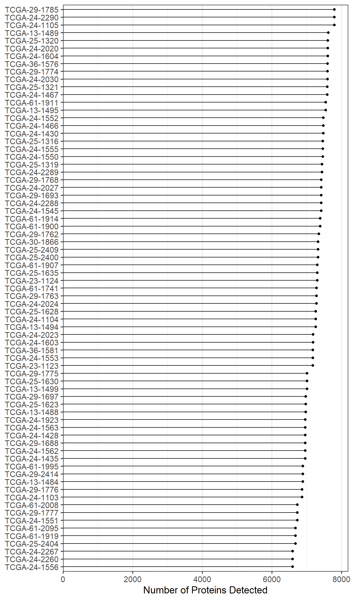
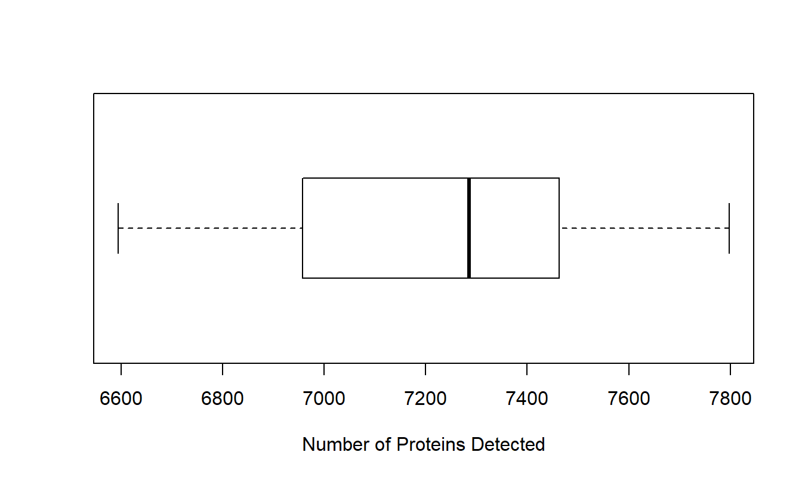
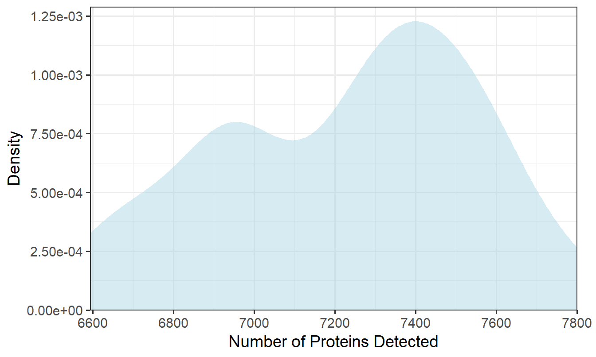
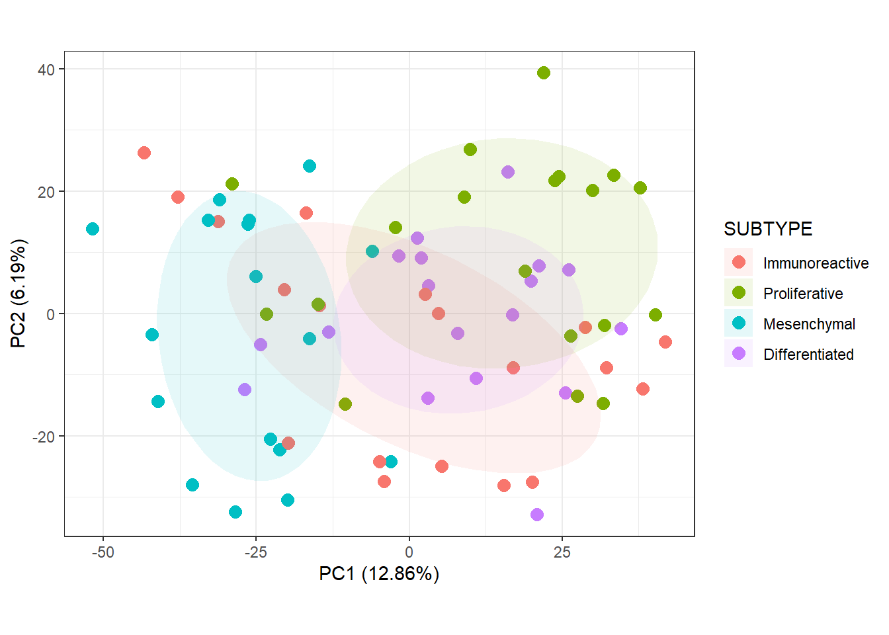
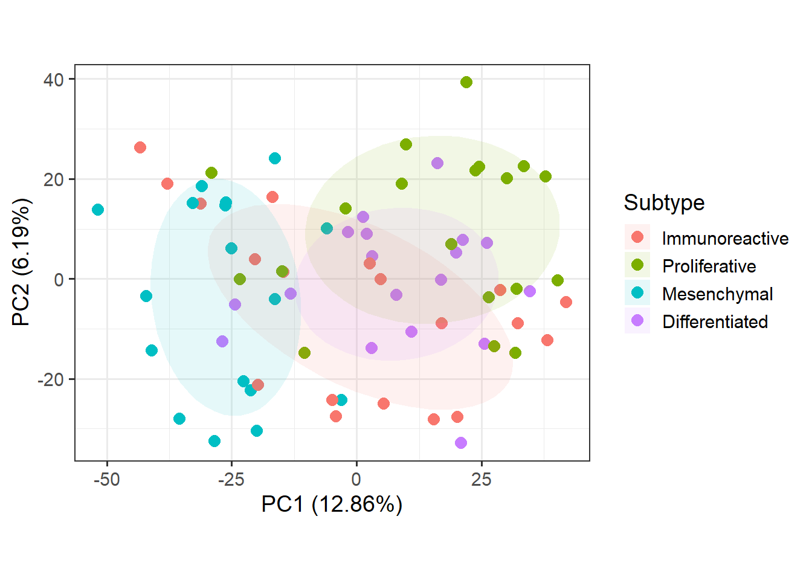

# Exploratory Data Analysis

* What is exploratory data analysis? Explain.


```r
library(MSnSet.utils)
library(ggplot2)
library(dplyr)
library(scales)

# Set the theme for all plots. Base text size is set to 14 pts.
theme_set(theme_bw(base_size = 14))

# Load the MSnSet
data(cptac_oca)
```


## Number of Features Identified in Each Sample

To count the number of features identified in each sample, we use `colSums` to tally the number of entries that are not `NA`.


```r
# Calculate the number of proteins 
# identified (not NA) in each sample
plot_data <- pData(oca.set) %>% 
  mutate(num_proteins = colSums(!is.na(exprs(oca.set)))) %>% 
  # For the lollipop plot, it is best to sort num_peptides
  # and preserve the ordering by converting the sample names
  # to a factor. This is how we can specify the order of categorical
  # variables in plots.
  arrange(num_proteins) %>% 
  mutate(sample_name = rownames(.),
         sample_name = factor(sample_name, levels = sample_name))

# Could also be accomplished with
# oca.set$num_proteins = colSums(!is.na(exprs(oca.set)))
# but we need to change the ordering for the lollipop plot
```

Three methods of visualizing this information are presented below. We begin with the lollipop plot.


### Lollipop Plot

Lollipop plots are similar to bar graphs, but they are composed of line segments terminating in points. They are a good alternative to bar graphs because they better minimize the amount of non-data ink. This doesn't matter too much when figures are only made for digital media, but it still reduces the visual clutter that comes with bars; however, it is not a good alternative to stacked bar graphs. In ggplot, we can construct lollipop plots by combining a `geom_segment()` and a `geom_point()` layer.


```r
# Lollipop plot
ggplot(plot_data) +
  geom_segment(aes(x = 0, xend = num_proteins, 
                   y = sample_name, yend = sample_name)) +
  geom_point(aes(x = num_proteins, y = sample_name)) +
  scale_x_continuous(name = "Number of Proteins Detected", 
                     # Remove space between data and y axis 
                     # (start lines at x = 0)
                     expand = expansion(mult = c(0, 0.05))) +
  # Remove unnecessary y-axis title and the major y-axis grid lines
  theme(axis.title.y = element_blank(),
        panel.grid.major.y = element_blank())
```



In this case, using a lollipop plot is not a very good use of space. Notice that the plot is lengthened so that all of the sample names are readable, and the number of proteins detected in each is about the same; a lot of the space is just taken up by lines. In this case, it would be better to use a table or another plot type like a boxplot.

### Boxplot

A boxplot is good for identifying and labeling potential outliers, but it is limited to displaying a summary of the data. We will be using `graphics::boxplot()` for this example, rather than the ggplot2 equivalent, because it is easier and the y-axis is uncluttered.


```r
# Boxplot
boxplot(plot_data$num_proteins, horizontal = TRUE,
        xlab = "Number of Proteins Detected", col = NA)
```



Notice that the boxplot takes up a lot less space, but it is less informative because we can not directly compare samples. Also, we lose a lot of the fine details of the shape of the distribution. To address the latter point, we can instead use a density plot.


### Density Plot

A density plot is like a smoothed histogram. In fact, one of the benefits over the histogram is that we don't have to deal with bins, as the choice of the number of bins can drastically change the overall shape of a histogram.


```r
ggplot(plot_data) +
  geom_density(aes(x = num_proteins), 
               # Change fill color, make it translucent, remove outline
               fill = "lightblue", alpha = 0.5, color = NA) +
  scale_x_continuous(name = "Number of Proteins Detected", 
                     # Remove space between data and y axis
                     expand = expansion(mult = 0),
                     limits = c(NA, 7800),
                     breaks = seq(6600, 7800, 200)) +
  scale_y_continuous(name = "Density",
                     # Remove space between data and x axis (start y axis at 0)
                     expand = expansion(mult = c(0, 0.05)),
                     # Use scientific notation for labels
                     labels = label_scientific()) +
  theme_bw(base_size = 14) +
  # Adjust plot margin so that the 7800 label is not cut off
  theme(plot.margin = unit(c(6, 16, 6, 6), units = "pt"))
```



While outliers in a boxplot appear as points beyond the whiskers, outliers in density plots will appear as small bumps in the tails of the distribution.
While there are no outliers, in this case, we can see that there are two peaks where the number of identified proteins are concentrated. This is not something that could be captured with a boxplot, so it is useful to try different plot types.

## Estimate Blood Contamination

* What are the major blood proteins?

* Hemoglobin alpha, beta, delta, gamma 1; fibrinogen alpha, beta, gamma; albumin, spectrin, 


```r
# NOTE: eval set to FALSE
blood_proteins <- "HBA_HUMAN HBB_HUMAN HBD_HUMAN HBG1_HUMAN FIBA_HUMAN
FIBB_HUMAN FIBG_HUMAN SPTB1_HUMAN THRB_HUMAN ALBU_HUMAN A1AG1_HUMAN
A1AG2_HUMAN CAH1_HUMAN GLPA_HUMAN GLPB_HUMAN GLPC_HUMAN"

blood_proteins <- gsub("\\s|\\n", "\\|", blood_proteins)

m1$blood_contamination <-
  apply(exprs(m1)[grepl(blood_proteins, featureNames(m1)), ],
        2, mean, na.rm = TRUE)
```


## PCA

### Overview

This is the overview for PCA.

### PCA Plots


```r
# Default plot
plot_pca_v3(oca.set, phenotype = "SUBTYPE")
```




```r
# New legend title
legend.title <- "Subtype"

plot_pca_v3(oca.set, phenotype = "SUBTYPE") +
  # Change the titles of the point color and ellipse fill legends
  guides(color = guide_legend(title = legend.title),
         # Do not include this line if show.ellipse = FALSE
         fill = guide_legend(title = legend.title)) +
  # Change base text size. theme_set() does not work here
  theme_bw(base_size = 14)
```

<div class="figure" style="text-align: center">

<p class="caption">(\#fig:pca-plot-pretty)This is the figure caption</p>
</div>

I am referencing Figure \@ref(fig:pca-plot-pretty).

### List Top-Contributing Features

In MSnSet.utils, there is a function that allows us to determine which features contribute the most to each principal component. This is the main part of the code to do this.


```r
# V is the matrix of eigenvectors that have been scaled to unit vectors.
cutoff <- sqrt(1 / nrow(V))

res <- apply(V, 2, function(w) {
    # Subset to values at least equal to the cutoff in magnitude
    x <- w[which(abs(w) >= cutoff)]
    # Order this subset by magnitude
    x[order(abs(x), decreasing = TRUE)]
  })
```


<!-- ## UMAP -->

<!-- ### Overview -->

<!-- Uniform Manifold Approximation and Projection (UMAP) is another dimensionality reduction technique "that can be used for visualization similarly to t-SNE" or for "general non-linear dimension reduction" ([https://umap-learn.readthedocs.io/en/latest/index.html](https://umap-learn.readthedocs.io/en/latest/index.html)). In comparison to t-SNE, UMAP boasts a "superior runtime" and "arguably preserves more of the global structure" of the high-dimensional data ([https://arxiv.org/abs/1802.03426](https://arxiv.org/abs/1802.03426)). -->

<!-- The two main UMAP hyperparameters that we should keep in mind are `n_neighbors` and `min_dist`. The former "controls how UMAP balances local versus global structure in the data," with low values causing UMAP to "concentrate on very local structure[s]" and high values leading to a loss of the "fine detail structure" in favor of a broader view of the data ([https://umap-learn.readthedocs.io/en/latest/parameters.html](https://umap-learn.readthedocs.io/en/latest/parameters.html)). When making UMAP plots, it is a good idea to try different values of `n_neighbors`. The other parameter, `min_dist`, determines the distance between a point and their nearest neighbor in the embedding. It is more of a graphical parameter, with smaller values producing denser clusters. -->

<!-- For more details on UMAP, please check out the [documentation](https://umap-learn.readthedocs.io/en/latest/index.html) by Leland McInnes (first author of the original UMAP paper)[.](https://umap-learn.readthedocs.io/en/latest/index.html) For an overview of t-SNE, please check out the [openTSNE](https://opentsne.readthedocs.io/en/latest/index.html) documentation. -->

<!-- ### Comparison with PCA -->

<!-- While PCA is faster than UMAP and requires no hyperparameter tuning, it is limited to defining linear relationships between predictors, and it is sensitive to the presence of outliers; in contrast, UMAP is non-linear and can actually be [used in conjunction with outlier detection methods](https://umap-learn.readthedocs.io/en/latest/outliers.html). -->

<!-- ### UMAP Scatterplots -->

<!-- The MSnSet.utils package provides a wrapper function around `umap::umap()` called `plot_umap()` that allows us to construct scatterplots from an MSnSet object. In these plots, the points are samples, and the UMAP components are constructed from the features. The default value of `n_neighbors` is the nearest integer to the square root of the number of samples while the default `min_dist` is 0.1 (nearest neighbors will be 0.1 units apart). -->

<!-- We will use `cptac_oca` for this example. First, we will take a look at the base UMAP plot of the samples. In this plot, points are not colored by a column in `pData(oca.set)`. Since there is a degree of randomness in the UMAP algorithm, it is a good idea to set the seed. There is an argument called `random_state` that allows us to do this. -->

<!-- ```{r umap_base} -->
<!-- library(MSnSet.utils) -->

<!-- # Load the MSnSet -->
<!-- data(cptac_oca) -->

<!-- # Base UMAP scatterplot of samples -->
<!-- plot_umap(oca.set, random_state = 99) -->
<!-- ``` -->


<!-- ```{r umap_color} -->
<!-- plot_umap(oca.set, phenotype = "SUBTYPE", random_state = 99) -->
<!-- ``` -->


<!-- We can also look at plots for other values of `n_neighbors`. We will make plots for 6, 9, 15, and 30 nearest neighbors. -->

<!-- ```{r umap_mult_k} -->
<!-- # Different number of nearest neighbors to try -->
<!-- k <- c(6, 9, 15, 30) -->

<!-- # UMAP plot for each value of k -->
<!-- plot_umap(oca.set, phenotype = "SUBTYPE",  -->
<!--           n_neighbors = k, random_state = 99) -->
<!-- ``` -->

<!-- Below is the same figure with some improvements to the appearance. -->

<!-- ```{r umap_mult_k_pretty, fig.height=4, fig.asp=1.1} -->
<!-- # Customize facet labels -->
<!-- facet_labs <- paste("k =", k) -->
<!-- names(facet_labs) <- k -->

<!-- plot_umap(oca.set, phenotype = "SUBTYPE",  -->
<!--           n_neighbors = k, random_state = 99, -->
<!--           # argument passed to facet_wrap: -->
<!--           labeller = labeller(n_neighbors = facet_labs)) + -->
<!--   ggtitle("UMAP Plots for Different Nearest Neighbors") + -->
<!--   # Change legend titles for the point color and ellipse fill. -->
<!--   guides(color = guide_legend(title = "Subtype"), -->
<!--          fill = guide_legend(title = "Subtype")) + -->
<!--   # Customize the facets and legend layout -->
<!--   theme( -->
<!--     # Move the legend to the bottom and  -->
<!--     # arrange labels horizontally -->
<!--     legend.position = "bottom",  -->
<!--     legend.direction = "horizontal",  -->
<!--     # Remove the facet label background and  -->
<!--     # increase label size relative to the -->
<!--     # base text size of the theme. -->
<!--     strip.background = element_blank(), -->
<!--     strip.text = element_text(size = rel(1.1)) -->
<!--   ) -->
<!-- ``` -->


