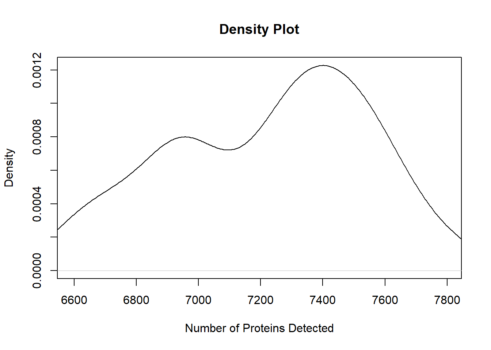

# Exploratory Data Analysis

Exploratory Data Analysis (EDA) is an important step before any sort of statistical analyses. The goal of EDA is to get a big picture view of the data and identify potential outlier samples and batch effects that need to be corrected. For this section, we need the MSnSet.utils package, which contains the `cptac_oca` data that we will use to illustrate these EDA approaches, as well as the `plot_pca` function for creating PCA plots of samples.


```r
## Install missing packages
if (!require("remotes", quietly = T)) install.packages("remotes")
if (!require("MSnSet.utils", quietly = T))
  remotes::install_github("PNNL-Comp-Mass-Spec/MSnSet.utils")
## ------------------------
library(MSnSet.utils)

# Load the example MSnSet
data(cptac_oca)
```

## Count Features in Samples

To count the number of features identified in each sample, we use `colSums` to tally the number of entries that are not `NA` in each column of `exprs(oca.set)`.


```r
# Calculate the number of proteins identified (not NA) in each sample
oca.set$num_proteins <- colSums(!is.na(exprs(oca.set)))
```

Now that we have a vector of the number of proteins detected in each sample stored in `pData(oca.set)`, there are a few ways to present it. The first is a simple summary, which is accomplished with the `summary` function. This outputs the average value, as well as a 5-number summary that includes the minimum, the 1st quartile, the median (2nd quartile), the 3rd quartile, and the maximum value.


```r
summary(oca.set$num_proteins)
```

```
##    Min. 1st Qu.  Median    Mean 3rd Qu.    Max. 
##    6594    6957    7286    7225    7463    7798
```

The 5-number summary can also be presented as a boxplot, which is typically more useful at a glance. Below is an example of how to create a horizontal boxplot.


```r
# Horizontal boxplot
boxplot(oca.set$num_proteins, horizontal = TRUE,
        xlab = "Number of Proteins Detected")
```


Boxplots are useful, but a lot of the finer details about the distribution are lost when summarizing. To remedy this, we could instead show a scatterplot of the individual values with the base `plot` function. We will change the point type with `pch` to plot solid circles and change the axis titles with `xlab` and `ylab`.


```r
plot(oca.set$num_proteins, pch = 19, xlab = "Sample Index", 
     ylab = "Number of Proteins Detected")
```


While harder to interpret at a glance than a boxplot, scatterplots are useful for identifying potential outliers and possible trends in the data. In the plot above, it doesn't appear than there are any samples with significantly fewer identifications.

The other plot type we could use balances the summary of the boxplot with the finer detail of the scatterplot: kernel density plots. We can use a combination of `stats::density` and `base::plot` to quickly create a density plot.


```r
# Kernel density plot
plot(density(oca.set$num_proteins, na.rm = TRUE), 
     xlim = range(oca.set$num_proteins, na.rm = TRUE),
     main = "Density Plot", xlab = "Number of Proteins Detected")
```



It looks like there are peaks around 6900-7000 and 7300-7500 proteins.

## Sample Boxplots


```r
boxplot(exprs(oca.set))
```


## Estimate Blood Contamination

Strong contamination of samples with blood may lead to the inability to identify low-abundant proteins, so it is important to estimate the level of blood contamination. We can search for major blood proteins with the `grepl` function and summarize their abundances within each sample to obtain reasonable estimates.

We will need to search for the blood protein identifiers that match the protein identifiers in the MSnSet. Since we are using the `cptac_oca` data for these examples, we will need to know the NCBI RefSeq protein IDs for the following blood proteins: hemoglobin, fibrinogen, albumin, and spectrin. Unfortunately, this means manually searching for these identifiers, which are provided in the list below.

-   hemoglobin
    -   subunit alpha 1: NP_000549.1

    -   subunit alpha 2: NP_000508.1

    -   subunit beta: NP_000509.1

    -   subunit gamma-1: NP_000550.2

    -   subunit gamma-2: NP_000175.1
-   albumin: NP_000468.1
-   fibrinogen
    -   alpha chain isoform alpha precursor: NP_068657.1

    -   alpha chain isoform alpha-E preprotein: NP_000499.1
-   spectrin
    -   alpha chain, erythrocytic 1: NP_003117.2

    -   beta chain, erythrocytic 1: NP_001342365.1

We need to create a vector of these blood protein IDs. We will use this to check if each feature is a blood protein. Doing so will create a logical vector that we can use to subset the data to the abundance values of those matches. With the subset data, we can then calculate the column (sample) averages with `colMeans` to get a single vector that estimates the average blood contamination of each sample.


```r
# Blood protein IDs
blood_prot <- c("NP_000549.1", "NP_000508.1", "NP_000509.1", "NP_000550.2",
                "NP_000175.1", "NP_000468.1", "NP_068657.1", "NP_000499.1",
                "NP_003117.2", "NP_001342365.1")

# Select entries that match one of the blood proteins
idx <- featureNames(oca.set) %in% blood_prot # indexing matches
blood_contam <- colMeans(exprs(oca.set)[idx, ], na.rm = TRUE) # sample means
```

We can visualize the blood contamination with any of the previously shown methods for visualizing the number of protein identifications. We will use a density plot.


```r
# Kernel density plot
plot(density(blood_contam, na.rm = TRUE), 
     xlim = range(blood_contam, na.rm = TRUE),
     main = "Blood Contamination", xlab = "Average Protein Abundance")
```


## PCA

Principal Component Analysis (PCA) is an unsupervised dimensionality reduction technique. It is useful for visualizing high-dimensional data in a lower-dimensional (usually 2D) space while retaining as much information from the original data as possible. It does this by creating linear combinations of features called principal components in such a way that that the first principal component (PC1) explains the most variation in the original data, PC2 explains the second most, and so on. Typically, we create scatterplots of PC1 vs PC2 to visualize relationships between samples with the `plot_pca` function from the `MSnSet.utils` package.

PCA plots are used to check for batch effects and sample differences due to variables of interest. If samples appear to separate by group or according to a continuous variable and the first two principal components explain a decent percentage of the variance in the original data, then we are fairly confident that the predictor affected the data in some way or is at least correlated to something that did.

Note that while there are PCA methods that allow some degree of missing data (see `pcaMethods::pca` for details), `plot_pca` makes use of the `prcomp` function, which does not. We do not need to filter data prior to running `plot_pca`, as it handles that and prints a message to tell us how many complete rows remained. If there are very few complete features, PCA will still work, but the results may not be very meaningful. In this case, it may be a good idea to impute missing values.

We will begin with the base plot. The axis titles show how much variance in the original data is explained by each component. This is built with the `ggplot2` package, so it can be customized with other functions in the package.


```r
# Default plot
plot_pca(oca.set)
```


Of the total 8103 features, 4738 were present in all 73 samples and used for PCA. Also notice that PC1 and PC2 explain less than 1/5 of the variance in the original data.

Now, we will color points according to their "SUBTYPE" group label and add a 50% Normal confidence ellipse for each group. We could remove the ellipse by setting `show_ellipse` to `FALSE`. We will also change the legend title to "Subtype".


```r
# Points colored by SUBTYPE
plot_pca(oca.set, phenotype = "SUBTYPE", legend_title = "Subtype")
```


It looks like samples slightly separate by SUBTYPE, and there may be features that are statistically different between the Proliferative and Mesenchymal groups. Something to keep in mind when performing differential analysis. Now, we will check for potential batch effects by coloring points by their "Batch" group.


```r
# Points colored by Batch
plot_pca(oca.set, phenotype = "Batch")
```


For the most part, it seems like all of the batches overlap and are somewhat centered on the origin (aside from batch X17). It is difficult to determine if there is a batch effect, so it may be a good idea to correct for it anyway. This is covered in a different section.

We can also use this function to identify the most influential features in PCA space with the `biplot` argument.


```r
plot_pca(oca.set, phenotype = "SUBTYPE", biplot = TRUE, 
         label_args = list(color = "black"))
```


From the biplot, we can see that proteins that begin with "NP_9976" are major drivers in the separation of the Mesenchymal and Proliferative samples. Similarly, we can see that there are a few blood proteins (hemoglobin subunits: NP000549.1 and NP_000550.2) that are major drivers of separation along PC2, though PC2 only explains about 6% of the variance in the original data. See `?plot_pca` for more customization options.

<!-- ## UMAP -->

<!-- ### Overview -->

<!-- Uniform Manifold Approximation and Projection (UMAP) is another dimensionality reduction technique "that can be used for visualization similarly to t-SNE" or for "general non-linear dimension reduction" ([https://umap-learn.readthedocs.io/en/latest/index.html](https://umap-learn.readthedocs.io/en/latest/index.html)). In comparison to t-SNE, UMAP boasts a "superior runtime" and "arguably preserves more of the global structure" of the high-dimensional data ([https://arxiv.org/abs/1802.03426](https://arxiv.org/abs/1802.03426)). -->

<!-- The two main UMAP hyperparameters that we should keep in mind are `n_neighbors` and `min_dist`. The former "controls how UMAP balances local versus global structure in the data," with low values causing UMAP to "concentrate on very local structure[s]" and high values leading to a loss of the "fine detail structure" in favor of a broader view of the data ([https://umap-learn.readthedocs.io/en/latest/parameters.html](https://umap-learn.readthedocs.io/en/latest/parameters.html)). When making UMAP plots, it is a good idea to try different values of `n_neighbors`. The other parameter, `min_dist`, determines the distance between a point and their nearest neighbor in the embedding. It is more of a graphical parameter, with smaller values producing denser clusters. -->

<!-- For more details on UMAP, please check out the [documentation](https://umap-learn.readthedocs.io/en/latest/index.html) by Leland McInnes (first author of the original UMAP paper)[.](https://umap-learn.readthedocs.io/en/latest/index.html) For an overview of t-SNE, please check out the [openTSNE](https://opentsne.readthedocs.io/en/latest/index.html) documentation. -->

<!-- ### Comparison with PCA -->

<!-- While PCA is faster than UMAP and requires no hyperparameter tuning, it is limited to defining linear relationships between predictors, and it is sensitive to the presence of outliers; in contrast, UMAP is non-linear and can actually be [used in conjunction with outlier detection methods](https://umap-learn.readthedocs.io/en/latest/outliers.html). -->

<!-- ### UMAP Scatterplots -->

<!-- The MSnSet.utils package provides a wrapper function around `umap::umap()` called `plot_umap()` that allows us to construct scatterplots from an MSnSet object. In these plots, the points are samples, and the UMAP components are constructed from the features. The default value of `n_neighbors` is the nearest integer to the square root of the number of samples while the default `min_dist` is 0.1 (nearest neighbors will be 0.1 units apart). -->

<!-- We will use `cptac_oca` for this example. First, we will take a look at the base UMAP plot of the samples. In this plot, points are not colored by a column in `pData(oca.set)`. Since there is a degree of randomness in the UMAP algorithm, it is a good idea to set the seed. There is an argument called `random_state` that allows us to do this. -->

<!-- ```{r umap_base} -->

<!-- library(MSnSet.utils) -->

<!-- # Load the MSnSet -->

<!-- data(cptac_oca) -->

<!-- # Base UMAP scatterplot of samples -->

<!-- plot_umap(oca.set, random_state = 99) -->

<!-- ``` -->

<!-- ```{r umap_color} -->

<!-- plot_umap(oca.set, phenotype = "SUBTYPE", random_state = 99) -->

<!-- ``` -->

<!-- We can also look at plots for other values of `n_neighbors`. We will make plots for 6, 9, 15, and 30 nearest neighbors. -->

<!-- ```{r umap_mult_k} -->

<!-- # Different number of nearest neighbors to try -->

<!-- k <- c(6, 9, 15, 30) -->

<!-- # UMAP plot for each value of k -->

<!-- plot_umap(oca.set, phenotype = "SUBTYPE",  -->

<!--           n_neighbors = k, random_state = 99) -->

<!-- ``` -->

<!-- Below is the same figure with some improvements to the appearance. -->

<!-- ```{r umap_mult_k_pretty, fig.height=4, fig.asp=1.1} -->

<!-- # Customize facet labels -->

<!-- facet_labs <- paste("k =", k) -->

<!-- names(facet_labs) <- k -->

<!-- plot_umap(oca.set, phenotype = "SUBTYPE",  -->

<!--           n_neighbors = k, random_state = 99, -->

<!--           # argument passed to facet_wrap: -->

<!--           labeller = labeller(n_neighbors = facet_labs)) + -->

<!--   ggtitle("UMAP Plots for Different Nearest Neighbors") + -->

<!--   # Change legend titles for the point color and ellipse fill. -->

<!--   guides(color = guide_legend(title = "Subtype"), -->

<!--          fill = guide_legend(title = "Subtype")) + -->

<!--   # Customize the facets and legend layout -->

<!--   theme( -->

<!--     # Move the legend to the bottom and  -->

<!--     # arrange labels horizontally -->

<!--     legend.position = "bottom",  -->

<!--     legend.direction = "horizontal",  -->

<!--     # Remove the facet label background and  -->

<!--     # increase label size relative to the -->

<!--     # base text size of the theme. -->

<!--     strip.background = element_blank(), -->

<!--     strip.text = element_text(size = rel(1.1)) -->

<!--   ) -->

<!-- ``` -->
