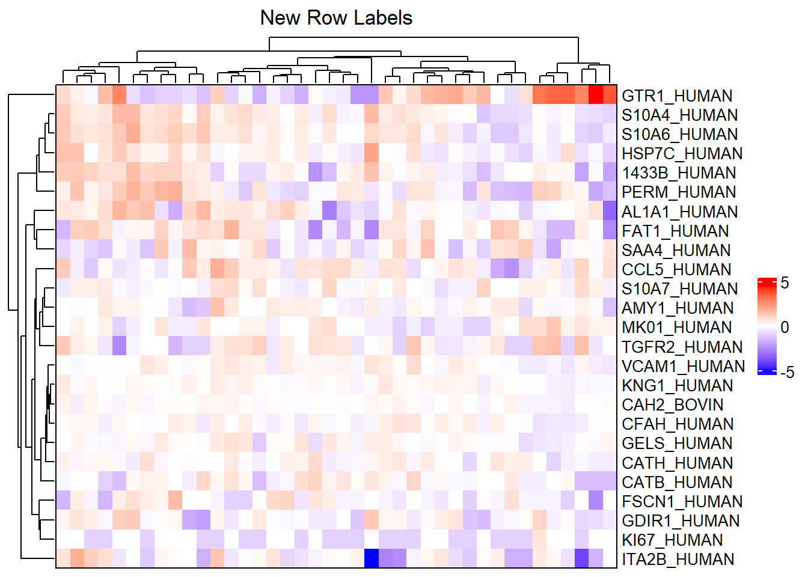

# Heatmaps

Heatmaps are graphical representations of matrices that use color to show differences in values. They are useful for detecting overall patterns in data, as they can show how features and samples relate to each other or how features change according to some phenotype of interest. In this section, we will explore how to create expression and correlation heatmaps from MSnSet objects, as well as how to improve the appearance of these heatmaps. We will need the following packages and MSnSet.


```r
library(MSnSet.utils) # complex_heatmap
library(circlize) # colorRamp2
library(ComplexHeatmap) # additional modifications
library(dplyr) # %>%

# Data
data("longitudinal_biomarker_study")
# Shorten name
m <- longitudinal_biomarker_study
```

## Expression Heatmaps

A heatmap of the expression matrix of an MSnSet with features as rows and samples as columns. The data is assumed to be zero-centered. By default, row and column names are not shown. See `?complex_heatmap` for how to change this.


```r
# Base expression heatmap
complex_heatmap(m)
```


```r
# Change color range to better detect patterns
complex_heatmap(m, color_range = c(-1.5, 1.5))
```


```r
# Change heatmap title and legend title
complex_heatmap(m, heatmap_title = "This is the heatmap title",
                heatmap_legend_title = "Legend\nTitle")
```


## Correlation Heatmaps

When the `heatmap_type` argument is (an abbreviation of) `"sample_correlation"` or `"feature_correlation"`, `complex_heatmap` constructs the matrix of correlations (default `cor_method = "pearson"`) between samples or features and generates a heatmap. Correlation heatmaps become even more useful when annotated (Section \@ref(heatmap-annotation)).

### Sample Correlation


```r
# Sample correlation heatmap
complex_heatmap(m, heatmap_type = "sample")
```


### Feature Correlation


```r
# Feature correlation heatmap
complex_heatmap(m, heatmap_type = "feature")
```


## Heatmap Annotation {#heatmap-annotation}

To annotate columns and rows of the heatmap, we use the `anno_column` and `anno_row` arguments, respectively. `anno_column` takes a vector of one or more strings that correspond to the names of columns in `pData`, and `anno_row` takes a vector of one or more strings that correspond to the names of column in `fData`. By default, `MSnSet.utils::jet2.colors` is used for character, factor, and logical values, and `circlize::colorRamp2` with a viridis color palette is used for numeric values. 

When annotating sample correlation heatmaps, only `anno_column` may be specified. Similarly, when annotating feature correlation heatmaps, only `anno_row` may be specified. Row or column annotations will be included along the other axis.

We will annotate the rows using values in the `"isSpike"` (logical) column of `fData(m)` and annotate rows using the values in the `"Type"` (factor) and `"Age"` (numeric) columns of `pData(m)`.


```r
# Expression heatmap with row and column annotation
complex_heatmap(m, anno_row = "isSpike", anno_column = c("Type", "Age"))
```


### Modifying Default Colors

We can change the colors of row and column annotations by passing lists to `anno_row_colors` and `anno_column_colors`, respectively. For example, we will change the colors of `"Type"` so that "Control" is a different shade of blue ("#414DBE") and "Case" is a dark yellow (#BEB241). We will also change the colors of `"Age"` so that the minimum value is white and the maximum value is dark red. Since age is a numeric column, we must use `circlize:colorRamp2`.

**Tip:** Use palettes from the RColorBrewer package, an interactive color wheel (like <a href="https://www.canva.com/colors/color-wheel/">this one from canva</a>), or a color palette generator (like <a href="https://www.canva.com/colors/color-palette-generator/">this one also from canva</a>) to find colors.


```r
# Modify colors for Type and Age
complex_heatmap(m, anno_column = c("Type", "Age"),
                anno_column_colors = list(
                  Type = c("#414DBE", "#BEB241"),
                  Age = circlize::colorRamp2(
                    breaks = range(m$Age, na.rm = TRUE),
                    colors = c("white", "darkred"))
                ))
```


## Modifications

`heatmap_args` and `anno_args` are used to modify the heatmaps: changing the row and column labels, labeling specific features, changing the colors of labels, changing font size, adding different types of annotations, splitting rows or columns into groups, etc. The <a href="https://jokergoo.github.io/ComplexHeatmap-reference/book/">ComplexHeatmap Complete Reference</a> goes more into detail about each of these modifications, but we will cover a few of them in this section.

We will use a random subset of the MSnSet to explore some of these modifications. This is just so we can see the row and column names more easily.


```r
set.seed(99)
# subset to 25 features and 40 samples
m_sub <- m[sample(1:nrow(m), size = 25), 
           sample(1:ncol(m), size = 40)]
```

### Row and column labels

By default, the row and column labels are the row and column names of the matrix passed to `Heatmap`. In the case of the default expression heatmap, the row names are the `featureNames` of the MSnSet and the column names are the `sampleNames`. We can instead use any column in `fData` and any column in `pData` to label the rows and columns, respectively. Duplicate labels are also allowed, which is especially useful if there are multiple peptides that map to the same protein, multiple proteins that map to the same gene, etc.


```r
# Default row labels - peptides
complex_heatmap(m_sub, show_row_names = TRUE, 
                heatmap_title = "Default Row Labels")
```


Suppose, for example, we want to label the rows by the Protein column of `fData(m_sub)`. We can do this by modifying the `row_labels` argument of `ComplexHeatmap::Heatmap` with the `heatmap_args` list. We will also reduce the font size of the labels so that they do not overlap.


```r
# Label rows with proteins and change font size
complex_heatmap(m_sub, show_row_names = TRUE, 
                heatmap_title = "New Row Labels",
                heatmap_args = list(row_labels = fData(m_sub)[["Protein"]],
                                    # Change font size of row labels
                                    row_names_gp = gpar(fontsize = 10)))
```




### Label colors


```r
# One color
complex_heatmap(m_sub, show_row_names = TRUE, 
                heatmap_args = list(row_names_gp = gpar(col = "orange")))
```


```r
# Multiple colors
# If peptide begins with "A", color it red
# If peptide begins with "G", color it blue
# Otherwise, color it black
row_colors <- featureNames(m_sub) %>% 
  {case_when(grepl("^A", .) ~ "red",
             grepl("^G", .) ~ "blue",
             TRUE ~ "black")}
complex_heatmap(m_sub, show_row_names = TRUE,
                heatmap_args = list(
                  row_names_gp = gpar(col = row_colors)))
```


### Label specific features

We can use mark annotation to label specific features or samples. For this example, we will label all non-human proteins. We need the indices of the proteins to label and the column in `fData` used to select these labels.


```r
# Indices of non-human proteins
idx <- which(!grepl("HUMAN", fData(m)[["Protein"]]))

# Row annotation object. The name can be anything, so we just use anno
ra <- rowAnnotation(anno = anno_mark(at = idx, 
                                     labels = fData(m)[["Protein"]][idx]))

# Heatmap with labels for select features
complex_heatmap(m, heatmap_args = list(row_labels = fData(m)[["Protein"]],
                                       right_annotation = ra))
```


<!---
### Split rows or columns


```r
# Split row dendrogram into 3 groups and column dengrogram into 2 groups
complex_heatmap(m, color_range = c(-1.5, 1.5), 
heatmap_args = list(row_split = 3, column_split = 2))
```


```r
# Do not label split groups
complex_heatmap(m, color_range = c(-1.5, 1.5), 
heatmap_args = list(
row_split = 3, column_split = 2, 
row_title = NULL, column_title = NULL))
```


--->

### Heatmap body color


```r
complex_heatmap(m, heatmap_args = list(col = circlize::colorRamp2(
  breaks = c(min(exprs(m), na.rm = TRUE), 0, 
             max(exprs(m), na.rm = TRUE)), 
  colors = c("purple", "white", "orange")
))
)
```


If changing the colors of the heatmap body, `color_range` will not work. Instead, the breaks and colors need to be modified so that the minimum value and the lower limit are the same color and the maximum value and the upper limit are the same color.


```r
complex_heatmap(m, heatmap_args = list(col = circlize::colorRamp2(
  breaks = c(min(exprs(m), na.rm = TRUE), 
             -1.5, 0, 1.5, # add color limits
             max(exprs(m), na.rm = TRUE)), 
  colors = c("purple", "purple", "white", "orange", "orange")
))
)
```


### Horizontal heatmaps

To create a horizontal heatmap, we need to take the transpose of the MSnSet. *This will switch the phenoData and featureData*. We will also reverse the order of the rows prior to the transpose so that the heatmap would appear to be rotated 90 degrees if samples were not clustered.


```r
# Rotate MSnSet
m_rot <- t(m[, ncol(m):1])
m_rot
```

```
## MSnSet (storageMode: lockedEnvironment)
## assayData: 236 features, 300 samples 
##   element names: exprs 
## protocolData: none
## phenoData
##   sampleNames: NTVISVFGASGDLAK TFPALFGLFR ... LLAEPVPGIK (300 total)
##   varLabels: Organism Protein Peptide isSpike
##   varMetadata: labelDescription
## featureData
##   featureNames: QC.24 QC.23 ... X03_C_B (236 total)
##   fvarLabels: Sample isQC ... Age (12 total)
##   fvarMetadata: labelDescription
## experimentData: use 'experimentData(object)'
## Annotation:  
## - - - Processing information - - -
## Subset [308,236][300,236] Fri Nov  9 15:22:49 2018 
## Subset [300,236][300,236] Fri May 27 21:19:56 2022 
## MSnSet transposed [Fri May 27 21:19:56 2022] 
##  MSnbase version: 2.7.11
```

We will annotate rows to show that it worked.


```r
# Horizontal heatmap with row annotations
complex_heatmap(m_rot, anno_row = "Age")
```


### Legends

Modifying legends with `draw_args`, `heatmap_args`, and `anno_args`. Below, we change the direction of the heatmap legend and continuous annotation legends to horizontal, change position of annotation titles to top left, and set the number of rows for discrete annotation legends to 1. We also change the width of the "Age" legend to 28 mm, move the legends to the bottom of the heatmap, and set the space between the legends to 10 mm.


```r
# Horizontal legends at the bottom
complex_heatmap(m, anno_column = c("Type", "Age"), 
                # horizontal heatmap legend
                heatmap_args = list(
                  heatmap_legend_param = list(direction = "horizontal")
                ),
                # horizontal annotation legend
                anno_args = list(
                  annotation_legend_param = list(
                    title_position = "lefttop",
                    legend_width = unit(28, "mm"),
                    direction = "horizontal", # for continuous legends
                    nrow = 1 # for discrete legends
                  )
                ),
                # Place legends at bottom of heatmap
                draw_args = list(heatmap_legend_side = "bottom",
                                 legend_gap = unit(10, "mm"))
)
```


