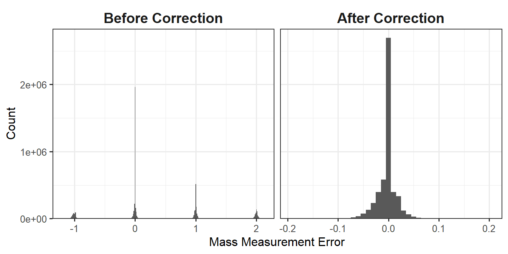

# Isobaric Quantification Pipelines {#isobaric-quantification-pipelines}

<!---
TODO:
* Overview of isobaric labeling
--->
<!---
Keep in mind that there are many other functions available in `PlexedPiper` and `MSnID` that will not be covered that can be used to add additional columns or further filter the results. This section just showcases the foundations of the pipelines.
--->


## Global Proteomics Data {#global-proteomics-data}

This pipeline shows how to process TMT data that is processed outside of PNNL's DMS. Section \@ref(phosphoproteomics-data) shows how to process data from the DMS. For convenience, the results of MS-GF+ and MASIC processing are provided in a companion `PlexedPiperTestData` package. In addition, we will need `PlexedPiper` for isobaric quantification, `dplyr` to manipulate data frames, and `MSnbase` to create MSnSet objects.


```r
# Setup
library(PlexedPiper)
library(PlexedPiperTestData)
library(dplyr)
```


The pipeline can be broken up into 4 major chunks: prepare MS/MS identifications, prepare reporter ion intensities, create a quantitative cross-tab, and create an MSnSet object.

### Read MS-GF+ Data

The first step in the preparation of the MS/MS identifications is to fetch the data. In this case, the data exists in the PlexedPiperTestData package in a local folder, so we use `system.file` to get the file path and `read_msgf_data` to read the MS-GF+ output.


```r
# Get file path
path_to_MSGF_results <- system.file("extdata/global/msgf_output", 
                                    package = "PlexedPiperTestData")
# Read MS-GF+ data from path
msnid <- read_msgf_data(path_to_MSGF_results)
```

Normally, this would display a progress bar in the console as the data is being fetched. However, the output was suppressed to save space. We can view a summary of the MSnID object with the `show()` function.


```r
show(msnid)
```

```
## MSnID object
## Working directory: "."
## #Spectrum Files:  48 
## #PSMs: 1156754 at 31 % FDR
## #peptides: 511617 at 61 % FDR
## #accessions: 128378 at 98 % FDR
```

This summary tells us that `msnid` consists of 4 spectrum files (datasets), and contains a total of 1,156,754 peptide-spectrum-matches (PSMs), 511,617 total peptides, and 128,378 total accessions (proteins). The reported FDR is the empirical **false-discovery rate**, which is calculated as the ratio of the number of false (decoy) PSMs, peptides, or accessions to their true (non-decoy) counterparts. Calculation of these counts and their FDRs is shown below.


```r
# How to calculate the counts and FDRs from the show() output
## Spectrum Files
# Count
psms(msnid) %>% 
  distinct(Dataset) %>%
  nrow() # 48

## PSMs
# Count
psms(msnid) %>% 
  distinct(Dataset, Scan, peptide, isDecoy) %>%
  # Assign intermediate to variable
  assign("x_psm", ., envir = globalenv()) %>% 
  nrow() # 1156754
# FDR
nrow(x_psm[x_psm$isDecoy == TRUE, ]) / 
  nrow(x_psm[x_psm$isDecoy == FALSE, ]) 
# 0.3127463 = 31%

## peptides
# Count
psms(msnid) %>% 
  distinct(peptide, isDecoy) %>% 
  assign("x_peptide", ., envir = globalenv()) %>%
  nrow() # 511617
# FDR
nrow(x_peptide[x_peptide$isDecoy == TRUE, ]) / 
  nrow(x_peptide[x_peptide$isDecoy == FALSE, ])
# 0.611245 = 61%

## accessions
# Count
length(accessions(msnid)) # or
psms(msnid) %>% 
  distinct(accession, isDecoy) %>% 
  assign("x_acc", ., envir = globalenv()) %>%
  nrow() # 128378
# FDR
nrow(x_acc[x_acc$isDecoy == TRUE, ]) / 
  nrow(x_acc[x_acc$isDecoy == FALSE, ])
# 0.9827024 = 98%
```

Now that we have an `MSnID` object, we need to process it. We begin by correcting for the isotope selection error.

### Correct Isotope Selection Error 

Carbon has two stable isotopes: $^{12}\text{C}$ and $^{13}\text{C}$, with natural abundances of 98.93% and 1.07%, respectively. That is, we expect that about 1 out of every 100 carbon atoms is naturally going to be a $^{13}\text{C}$, while the rest are $^{12}\text{C}$. In larger peptides with many carbon atoms, it is more likely that at least one atom will be a $^{13}\text{C}$ than all atoms will be $^{12}\text{C}$. In cases such as these, a non-monoisotopic ion will be selected by the instrument for fragmentation.

<div class="figure" style="text-align: center">

<p class="caption">(\#fig:MS1_peak)MS1 spectra with peak at non-monoisotopic precursor ion.</p>
</div>

In Figure \@ref(fig:MS1_peak), the monoisotopic ion (m/z of 1427.29) is not the most abundant, so it is not selected as the precursor. Instead, the ion with a $^{13}\text{C}$ in place of a $^{12}\text{C}$ is selected for fragmentation. We calculate the mass difference between these two ions as the difference between the mass-to-charge ratios multiplied by the ion charge. In this case, the mass difference is 1 Dalton, or about the difference between $^{13}\text{C}$ and $^{12}\text{C}$. (More accurately, the difference between these isotopes is 1.0033548378 Da.) While MS-GF+ is still capable of correctly identifying these peptides, the downstream calculations of mass measurement error need to be fixed because they are used for filtering later on (Section \@ref(global-peptide-filter)). The `correct_peak_selection` function corrects these mass measurement errors, and Figure \@ref(fig:mass-to-charge-diff) shows the distribution of the mass measurement errors before and after correction.


```r
# Correct for isotope selection error
msnid <- correct_peak_selection(msnid)
```

<div class="figure" style="text-align: center">

<p class="caption">(\#fig:mass-to-charge-diff)Histogram of mass measurement errors before and after correction.</p>
</div>


### Remove Contaminants 

Now, we will remove contaminants such as the trypsin that was used for protein digestion. We can use `grepl` to search for all accessions that contain the string `"Contaminant"`. Displaying these contaminants is not necessary during processing. This is just for demonstration purposes to see what will be removed.


```r
# All unique contaminants
accessions(msnid)[grepl("Contaminant", accessions(msnid))]
```

```
##  [1] "Contaminant_K2C1_HUMAN"      "Contaminant_K1C9_HUMAN"     
##  [3] "Contaminant_ALBU_HUMAN"      "Contaminant_ALBU_BOVIN"     
##  [5] "Contaminant_TRYP_PIG"        "Contaminant_K1C10_HUMAN"    
##  [7] "XXX_Contaminant_K1C9_HUMAN"  "Contaminant_K22E_HUMAN"     
##  [9] "Contaminant_Trypa3"          "Contaminant_Trypa5"         
## [11] "XXX_Contaminant_K1C10_HUMAN" "XXX_Contaminant_K22E_HUMAN" 
## [13] "XXX_Contaminant_K2C1_HUMAN"  "Contaminant_TRYP_BOVIN"     
## [15] "XXX_Contaminant_ALBU_HUMAN"  "XXX_Contaminant_ALBU_BOVIN" 
## [17] "XXX_Contaminant_TRYP_BOVIN"  "Contaminant_CTRB_BOVIN"     
## [19] "Contaminant_Trypa1"          "Contaminant_Trypa6"         
## [21] "Contaminant_CTRA_BOVIN"      "XXX_Contaminant_TRYP_PIG"   
## [23] "XXX_Contaminant_CTRB_BOVIN"  "XXX_Contaminant_CTRA_BOVIN" 
## [25] "Contaminant_Trypa2"
```

To remove contaminants, we use `apply_filter` with an appropriate character string that tells the function what rows to keep. In this case, we keep rows where the accession does not contain "Contaminant". We will use `show` to see how the counts change.


```r
# Remove contaminants
msnid <- apply_filter(msnid, "!grepl('Contaminant', accession)")
show(msnid)
```

```
## MSnID object
## Working directory: "."
## #Spectrum Files:  48 
## #PSMs: 1155442 at 31 % FDR
## #peptides: 511196 at 61 % FDR
## #accessions: 128353 at 98 % FDR
```

We can see that the number of PSMs decreased by about 1300, peptides by ~400, and proteins by 25 (the 25 contaminants that were displayed).

### MS/MS ID Filter: Peptide Level {#global-peptide-filter}

The next step is to filter the MS/MS identifications such that the empirical peptide-level FDR is less than some threshold and the number of MS/MS IDs is maximized. We will use the $-log_{10}$ of the `PepQValue` column as one of our filtering criteria and assign it to a new column in `psms(msnid)` called `msmsScore`. The `PepQValue` column is the MS-GF+ Spectrum E-value, which reflects how well the theoretical and experimental fragmentation spectra match; therefore, high values of `msmsScore` indicate a good match (see Figure \@ref(fig:plot-msmsScore)).

<div class="figure" style="text-align: center">

<p class="caption">(\#fig:plot-msmsScore)Density plot of msmsScore.</p>
</div>
</br>

The other filtering criteria is the absolute deviation of the mass measurement error of the precursor ions in parts-per-million (ppm), which is assigned to the `absParentMassErrorPPM` column in `psms(msnid)` (see Figure \@ref(fig:plot-mass-error)).

<div class="figure" style="text-align: center">

<p class="caption">(\#fig:plot-mass-error)Density plot of absParentMassErrorPPM.</p>
</div>

</br>

Now, we will filter the PSMs.


```r
# 1% FDR filter at the peptide level
msnid <- filter_msgf_data(msnid,
                          level = "peptide",
                          fdr.max = 0.01)
show(msnid)
```

```
## MSnID object
## Working directory: "."
## #Spectrum Files:  48 
## #PSMs: 464474 at 0.45 % FDR
## #peptides: 96485 at 1 % FDR
## #accessions: 27119 at 9.2 % FDR
```

We can see that filtering drastically reduces the number of PSMs, and the empirical peptide-level FDR is now 1%. However, notice that the empirical protein-level FDR is still fairly high.

### MS/MS ID Filter: Protein Level 

Now, we need to filter proteins so that the FDR is at most 1%. A while ago, the proteomics field established the hard-and-fast two-peptides-per-protein rule. That is, the confident identification of a protein requires the confident identification of at least 2 peptides. This rule penalizes short proteins and doesn't consider that there are some very long proteins (e.g. Titin 3.8 MDa) that easily have more then two matching peptides even in the reversed sequence. Thus, we propose to normalize the number of peptides per protein length and use that as a filtering criterion (Figure \@ref(fig:plot-num-pep)).

In order to get the protein lengths, we need the FASTA (pronounced FAST-AYE) file that contains the protein sequences used in the database search. The first three entries of the FASTA file are shown in Figure \@ref(fig:fasta-ex).

<div class="figure" style="text-align: center">

<p class="caption">(\#fig:fasta-ex)First three entries of the FASTA file.</p>
</div>

</br>

For each protein, we divide the number of associated peptides by the length of that protein and multiply this value by 1000. This new `peptides_per_1000aa` column is used as the filter criteria.


```r
# Get path to FASTA file
path_to_FASTA <- system.file(
  "extdata/Rattus_norvegicus_NCBI_RefSeq_2018-04-10.fasta.gz", 
  package = "PlexedPiperTestData"
)

# Compute number of peptides per 1000 amino acids
msnid <- compute_num_peptides_per_1000aa(msnid, path_to_FASTA)
```

<div class="figure" style="text-align: center">

<p class="caption">(\#fig:plot-num-pep)Density plot of peptides_per_1000aa. The plot area has been zoomed in.</p>
</div>
</br>

Now, we filter the proteins to 1% FDR.


```r
# 1% FDR filter at the protein level
msnid <- filter_msgf_data(msnid,
                          level = "accession",
                          fdr.max = 0.01)
show(msnid)
```

```
## MSnID object
## Working directory: "."
## #Spectrum Files:  48 
## #PSMs: 458090 at 0.16 % FDR
## #peptides: 92036 at 0.32 % FDR
## #accessions: 15630 at 1 % FDR
```


### Inference of Parsimonious Protein Set 

The situation when a certain peptide sequence matches multiple proteins adds complication to the downstream quantitative analysis, as it is not clear which protein this peptide is originating from. There are common ways for dealing with this. One is to simply retain uniquely matching peptides and discard shared peptides (`unique_only = TRUE`). Alternatively, assign the shared peptides to the proteins with the larger number of uniquely mapping peptides (`unique_only = FALSE`). If there is a choice between multiple proteins with equal numbers of uniquely mapping peptides, the shared peptides are assigned to the first protein according to alphanumeric order (Figure \@ref(fig:parsimony)). 

<!---
This step could be done prior to filtering at the accession level, but if peptides are assigned to a low-confidence protein, and that protein is removed during filtering, those peptides will be lost. Instead, it is better to filter to the set of confidently-identified proteins and then determine the parsimonious set.
--->

<div class="figure" style="text-align: center">

<p class="caption">(\#fig:parsimony)Visual explanation of the inference of the parsimonious protein set.</p>
</div>

</br>


```r
# Inference of parsimonious protein set
msnid <- infer_parsimonious_accessions(msnid, unique_only = FALSE)
show(msnid)
```

```
## MSnID object
## Working directory: "."
## #Spectrum Files:  48 
## #PSMs: 444999 at 0.15 % FDR
## #peptides: 90478 at 0.27 % FDR
## #accessions: 5251 at 1.1 % FDR
```

Notice that the protein-level FDR increased slightly above the 1% threshold. In this case, the difference isn't significant, so we can ignore it. 

*Note:*

If the peptide or accession-level FDR increases significantly above 1% after inference of the parsimonious protein set, consider lowering the FDR cutoff (for example, to 0.9%) and redoing the previous processing steps. Filtering at the peptide and accession level should each be done a single time.


### Remove Decoy PSMs

The final step in preparing the MS/MS identifications is to remove the decoy PSMs. We use the `apply_filter` function again and only keep entries where `isDecoy` is `FALSE`.


```r
# Remove Decoy PSMs
msnid <- apply_filter(msnid, "!isDecoy")
show(msnid)
```

```
## MSnID object
## Working directory: "."
## #Spectrum Files:  48 
## #PSMs: 444338 at 0 % FDR
## #peptides: 90232 at 0 % FDR
## #accessions: 5196 at 0 % FDR
```

After processing, we are left with 444,345 PSMs, 90,232 peptides, and 5,196 proteins. Table \@ref(tab:global-msnid-table) shows the first 6 rows of the processed MS-GF+ output.

<table class="table table-hover table-condensed" style="font-size: 12px; width: auto !important; margin-left: auto; margin-right: auto;">
<caption style="font-size: initial !important;">(\#tab:global-msnid-table)<left>First 6 rows of the processed MS-GF+ results.</left>
</caption>
 <thead>
  <tr>
   <th style="text-align:left;"> Dataset </th>
   <th style="text-align:right;"> ResultID </th>
   <th style="text-align:right;"> Scan </th>
   <th style="text-align:left;"> FragMethod </th>
   <th style="text-align:right;"> SpecIndex </th>
   <th style="text-align:right;"> Charge </th>
   <th style="text-align:right;"> PrecursorMZ </th>
   <th style="text-align:right;"> DelM </th>
   <th style="text-align:right;"> DelM_PPM </th>
   <th style="text-align:right;"> MH </th>
   <th style="text-align:left;"> peptide </th>
   <th style="text-align:left;"> Protein </th>
   <th style="text-align:right;"> NTT </th>
   <th style="text-align:right;"> DeNovoScore </th>
   <th style="text-align:right;"> MSGFScore </th>
   <th style="text-align:right;"> MSGFDB_SpecEValue </th>
   <th style="text-align:right;"> Rank_MSGFDB_SpecEValue </th>
   <th style="text-align:right;"> EValue </th>
   <th style="text-align:right;"> QValue </th>
   <th style="text-align:right;"> PepQValue </th>
   <th style="text-align:right;"> IsotopeError </th>
   <th style="text-align:left;"> accession </th>
   <th style="text-align:right;"> calculatedMassToCharge </th>
   <th style="text-align:right;"> chargeState </th>
   <th style="text-align:right;"> experimentalMassToCharge </th>
   <th style="text-align:left;"> isDecoy </th>
   <th style="text-align:left;"> spectrumFile </th>
   <th style="text-align:right;"> spectrumID </th>
   <th style="text-align:left;"> pepSeq </th>
   <th style="text-align:right;"> msmsScore </th>
   <th style="text-align:right;"> absParentMassErrorPPM </th>
   <th style="text-align:right;"> peptides_per_1000aa </th>
  </tr>
 </thead>
<tbody>
  <tr>
   <td style="text-align:left;"> MoTrPAC_Pilot_TMT_W_S1_07_12Oct17_Elm_AQ-17-09-02 </td>
   <td style="text-align:right;"> 1862 </td>
   <td style="text-align:right;"> 27707 </td>
   <td style="text-align:left;"> HCD </td>
   <td style="text-align:right;"> 324 </td>
   <td style="text-align:right;"> 2 </td>
   <td style="text-align:right;"> 928.541 </td>
   <td style="text-align:right;"> -0.001 </td>
   <td style="text-align:right;"> -0.526 </td>
   <td style="text-align:right;"> 1856.075 </td>
   <td style="text-align:left;"> R.AAAAAAAAAAAAAAGAAGK.E </td>
   <td style="text-align:left;"> NP_113986.1 </td>
   <td style="text-align:right;"> 2 </td>
   <td style="text-align:right;"> 285 </td>
   <td style="text-align:right;"> 282 </td>
   <td style="text-align:right;"> 0 </td>
   <td style="text-align:right;"> 1 </td>
   <td style="text-align:right;"> 0 </td>
   <td style="text-align:right;"> 0.000 </td>
   <td style="text-align:right;"> 0.000 </td>
   <td style="text-align:right;"> 0 </td>
   <td style="text-align:left;"> NP_113986.1 </td>
   <td style="text-align:right;"> 928.541 </td>
   <td style="text-align:right;"> 2 </td>
   <td style="text-align:right;"> 928.541 </td>
   <td style="text-align:left;"> FALSE </td>
   <td style="text-align:left;"> MoTrPAC_Pilot_TMT_W_S1_07_12Oct17_Elm_AQ-17-09-02 </td>
   <td style="text-align:right;"> 27707 </td>
   <td style="text-align:left;"> AAAAAAAAAAAAAAGAAGK </td>
   <td style="text-align:right;"> Inf </td>
   <td style="text-align:right;"> 0.589 </td>
   <td style="text-align:right;"> 25.769 </td>
  </tr>
  <tr>
   <td style="text-align:left;"> MoTrPAC_Pilot_TMT_W_S1_07_12Oct17_Elm_AQ-17-09-02 </td>
   <td style="text-align:right;"> 4192 </td>
   <td style="text-align:right;"> 27684 </td>
   <td style="text-align:left;"> HCD </td>
   <td style="text-align:right;"> 906 </td>
   <td style="text-align:right;"> 3 </td>
   <td style="text-align:right;"> 619.363 </td>
   <td style="text-align:right;"> -0.002 </td>
   <td style="text-align:right;"> -0.887 </td>
   <td style="text-align:right;"> 1856.075 </td>
   <td style="text-align:left;"> R.AAAAAAAAAAAAAAGAAGK.E </td>
   <td style="text-align:left;"> NP_113986.1 </td>
   <td style="text-align:right;"> 2 </td>
   <td style="text-align:right;"> 156 </td>
   <td style="text-align:right;"> 144 </td>
   <td style="text-align:right;"> 0 </td>
   <td style="text-align:right;"> 1 </td>
   <td style="text-align:right;"> 0 </td>
   <td style="text-align:right;"> 0.000 </td>
   <td style="text-align:right;"> 0.000 </td>
   <td style="text-align:right;"> 0 </td>
   <td style="text-align:left;"> NP_113986.1 </td>
   <td style="text-align:right;"> 619.363 </td>
   <td style="text-align:right;"> 3 </td>
   <td style="text-align:right;"> 619.363 </td>
   <td style="text-align:left;"> FALSE </td>
   <td style="text-align:left;"> MoTrPAC_Pilot_TMT_W_S1_07_12Oct17_Elm_AQ-17-09-02 </td>
   <td style="text-align:right;"> 27684 </td>
   <td style="text-align:left;"> AAAAAAAAAAAAAAGAAGK </td>
   <td style="text-align:right;"> Inf </td>
   <td style="text-align:right;"> 0.991 </td>
   <td style="text-align:right;"> 25.769 </td>
  </tr>
  <tr>
   <td style="text-align:left;"> MoTrPAC_Pilot_TMT_W_S2_06_12Oct17_Elm_AQ-17-09-02 </td>
   <td style="text-align:right;"> 26263 </td>
   <td style="text-align:right;"> 27336 </td>
   <td style="text-align:left;"> HCD </td>
   <td style="text-align:right;"> 5187 </td>
   <td style="text-align:right;"> 3 </td>
   <td style="text-align:right;"> 619.363 </td>
   <td style="text-align:right;"> 0.000 </td>
   <td style="text-align:right;"> 0.197 </td>
   <td style="text-align:right;"> 1856.075 </td>
   <td style="text-align:left;"> R.AAAAAAAAAAAAAAGAAGK.E </td>
   <td style="text-align:left;"> NP_113986.1 </td>
   <td style="text-align:right;"> 2 </td>
   <td style="text-align:right;"> 118 </td>
   <td style="text-align:right;"> 85 </td>
   <td style="text-align:right;"> 0 </td>
   <td style="text-align:right;"> 1 </td>
   <td style="text-align:right;"> 0 </td>
   <td style="text-align:right;"> 0.000 </td>
   <td style="text-align:right;"> 0.000 </td>
   <td style="text-align:right;"> 0 </td>
   <td style="text-align:left;"> NP_113986.1 </td>
   <td style="text-align:right;"> 619.363 </td>
   <td style="text-align:right;"> 3 </td>
   <td style="text-align:right;"> 619.363 </td>
   <td style="text-align:left;"> FALSE </td>
   <td style="text-align:left;"> MoTrPAC_Pilot_TMT_W_S2_06_12Oct17_Elm_AQ-17-09-02 </td>
   <td style="text-align:right;"> 27336 </td>
   <td style="text-align:left;"> AAAAAAAAAAAAAAGAAGK </td>
   <td style="text-align:right;"> Inf </td>
   <td style="text-align:right;"> 0.091 </td>
   <td style="text-align:right;"> 25.769 </td>
  </tr>
  <tr>
   <td style="text-align:left;"> MoTrPAC_Pilot_TMT_W_S2_07_12Oct17_Elm_AQ-17-09-02 </td>
   <td style="text-align:right;"> 1471 </td>
   <td style="text-align:right;"> 27096 </td>
   <td style="text-align:left;"> HCD </td>
   <td style="text-align:right;"> 415 </td>
   <td style="text-align:right;"> 3 </td>
   <td style="text-align:right;"> 619.363 </td>
   <td style="text-align:right;"> -0.001 </td>
   <td style="text-align:right;"> -0.591 </td>
   <td style="text-align:right;"> 1856.075 </td>
   <td style="text-align:left;"> R.AAAAAAAAAAAAAAGAAGK.E </td>
   <td style="text-align:left;"> NP_113986.1 </td>
   <td style="text-align:right;"> 2 </td>
   <td style="text-align:right;"> 157 </td>
   <td style="text-align:right;"> 156 </td>
   <td style="text-align:right;"> 0 </td>
   <td style="text-align:right;"> 1 </td>
   <td style="text-align:right;"> 0 </td>
   <td style="text-align:right;"> 0.000 </td>
   <td style="text-align:right;"> 0.000 </td>
   <td style="text-align:right;"> 0 </td>
   <td style="text-align:left;"> NP_113986.1 </td>
   <td style="text-align:right;"> 619.363 </td>
   <td style="text-align:right;"> 3 </td>
   <td style="text-align:right;"> 619.363 </td>
   <td style="text-align:left;"> FALSE </td>
   <td style="text-align:left;"> MoTrPAC_Pilot_TMT_W_S2_07_12Oct17_Elm_AQ-17-09-02 </td>
   <td style="text-align:right;"> 27096 </td>
   <td style="text-align:left;"> AAAAAAAAAAAAAAGAAGK </td>
   <td style="text-align:right;"> Inf </td>
   <td style="text-align:right;"> 0.684 </td>
   <td style="text-align:right;"> 25.769 </td>
  </tr>
  <tr>
   <td style="text-align:left;"> MoTrPAC_Pilot_TMT_W_S2_05_12Oct17_Elm_AQ-17-09-02 </td>
   <td style="text-align:right;"> 28664 </td>
   <td style="text-align:right;"> 10441 </td>
   <td style="text-align:left;"> HCD </td>
   <td style="text-align:right;"> 4849 </td>
   <td style="text-align:right;"> 2 </td>
   <td style="text-align:right;"> 586.832 </td>
   <td style="text-align:right;"> -0.001 </td>
   <td style="text-align:right;"> -0.728 </td>
   <td style="text-align:right;"> 1172.659 </td>
   <td style="text-align:left;"> R.AAAAADLANR.S </td>
   <td style="text-align:left;"> NP_001007804.1 </td>
   <td style="text-align:right;"> 2 </td>
   <td style="text-align:right;"> 124 </td>
   <td style="text-align:right;"> 124 </td>
   <td style="text-align:right;"> 0 </td>
   <td style="text-align:right;"> 1 </td>
   <td style="text-align:right;"> 0 </td>
   <td style="text-align:right;"> 0.002 </td>
   <td style="text-align:right;"> 0.003 </td>
   <td style="text-align:right;"> 0 </td>
   <td style="text-align:left;"> NP_001007804.1 </td>
   <td style="text-align:right;"> 586.833 </td>
   <td style="text-align:right;"> 2 </td>
   <td style="text-align:right;"> 586.832 </td>
   <td style="text-align:left;"> FALSE </td>
   <td style="text-align:left;"> MoTrPAC_Pilot_TMT_W_S2_05_12Oct17_Elm_AQ-17-09-02 </td>
   <td style="text-align:right;"> 10441 </td>
   <td style="text-align:left;"> AAAAADLANR </td>
   <td style="text-align:right;"> 2.480 </td>
   <td style="text-align:right;"> 0.746 </td>
   <td style="text-align:right;"> 34.755 </td>
  </tr>
  <tr>
   <td style="text-align:left;"> MoTrPAC_Pilot_TMT_W_S1_24_12Oct17_Elm_AQ-17-09-02 </td>
   <td style="text-align:right;"> 41775 </td>
   <td style="text-align:right;"> 8033 </td>
   <td style="text-align:left;"> HCD </td>
   <td style="text-align:right;"> 7889 </td>
   <td style="text-align:right;"> 2 </td>
   <td style="text-align:right;"> 831.447 </td>
   <td style="text-align:right;"> 0.000 </td>
   <td style="text-align:right;"> 0.000 </td>
   <td style="text-align:right;"> 1661.886 </td>
   <td style="text-align:left;"> G.AAAAAEAESGGGGGK.K </td>
   <td style="text-align:left;"> NP_001128630.1 </td>
   <td style="text-align:right;"> 1 </td>
   <td style="text-align:right;"> 176 </td>
   <td style="text-align:right;"> 76 </td>
   <td style="text-align:right;"> 0 </td>
   <td style="text-align:right;"> 1 </td>
   <td style="text-align:right;"> 0 </td>
   <td style="text-align:right;"> 0.001 </td>
   <td style="text-align:right;"> 0.003 </td>
   <td style="text-align:right;"> 0 </td>
   <td style="text-align:left;"> NP_001128630.1 </td>
   <td style="text-align:right;"> 831.447 </td>
   <td style="text-align:right;"> 2 </td>
   <td style="text-align:right;"> 831.447 </td>
   <td style="text-align:left;"> FALSE </td>
   <td style="text-align:left;"> MoTrPAC_Pilot_TMT_W_S1_24_12Oct17_Elm_AQ-17-09-02 </td>
   <td style="text-align:right;"> 8033 </td>
   <td style="text-align:left;"> AAAAAEAESGGGGGK </td>
   <td style="text-align:right;"> 2.583 </td>
   <td style="text-align:right;"> 0.106 </td>
   <td style="text-align:right;"> 580.844 </td>
  </tr>
</tbody>
</table>

</br>


### Read MASIC Output 

MASIC is a tool for extracting ion intensities. With proper parameter settings, it can be used for extracting TMT (or iTRAQ) reporter ion intensities. In addition, it reports a number of other helpful metrics. Notably, the interference score at the precursor ion level and the signal-to-noise ratio (S/N) at the reporter ion level (computed by Thermo software). The interference score reflects the proportion of the ion population that was isolated for fragmentation that is due to the targeted ion. In other words, `1 - InterferenceScore` is due to co-isolated species that have similar elution time and precursor ion m/z. The first step in the preparation of the reporter ion intensity data is to read the MASIC results. We use a local file path and the `read_masic_data` function. By default, the interference score is not included, so we need to set that argument to `TRUE` in order to filter the results.


```r
# Path to MASIC data
path_to_MASIC_results <- system.file("extdata/global/masic_output", 
                                     package = "PlexedPiperTestData")

# Read MASIC data
masic_data <- read_masic_data(path_to_MASIC_results, interference_score = TRUE)
```

Normally, this would display progress bars in the console as the data is being fetched. However, the output was suppressed to save space.

<table class="table table-hover table-condensed" style="font-size: 12px; width: auto !important; margin-left: auto; margin-right: auto;">
<caption style="font-size: initial !important;">(\#tab:global-masic-table)<left>First 6 rows of the MASIC data.</left>
</caption>
 <thead>
  <tr>
   <th style="text-align:left;"> Dataset </th>
   <th style="text-align:right;"> ScanNumber </th>
   <th style="text-align:left;"> Collision.Mode </th>
   <th style="text-align:right;"> ParentIonMZ </th>
   <th style="text-align:right;"> BasePeakIntensity </th>
   <th style="text-align:right;"> BasePeakMZ </th>
   <th style="text-align:right;"> ReporterIonIntensityMax </th>
   <th style="text-align:right;"> Ion_126.128 </th>
   <th style="text-align:right;"> Ion_127.125 </th>
   <th style="text-align:right;"> Ion_127.131 </th>
   <th style="text-align:right;"> Ion_128.128 </th>
   <th style="text-align:right;"> Ion_128.134 </th>
   <th style="text-align:right;"> Ion_129.131 </th>
   <th style="text-align:right;"> Ion_129.138 </th>
   <th style="text-align:right;"> Ion_130.135 </th>
   <th style="text-align:right;"> Ion_130.141 </th>
   <th style="text-align:right;"> Ion_131.138 </th>
   <th style="text-align:right;"> Weighted.Avg.Pct.Intensity.Correction </th>
   <th style="text-align:right;"> Ion_126.128_SignalToNoise </th>
   <th style="text-align:right;"> Ion_127.125_SignalToNoise </th>
   <th style="text-align:right;"> Ion_127.131_SignalToNoise </th>
   <th style="text-align:right;"> Ion_128.128_SignalToNoise </th>
   <th style="text-align:right;"> Ion_128.134_SignalToNoise </th>
   <th style="text-align:right;"> Ion_129.131_SignalToNoise </th>
   <th style="text-align:right;"> Ion_129.138_SignalToNoise </th>
   <th style="text-align:right;"> Ion_130.135_SignalToNoise </th>
   <th style="text-align:right;"> Ion_130.141_SignalToNoise </th>
   <th style="text-align:right;"> Ion_131.138_SignalToNoise </th>
   <th style="text-align:right;"> Ion_126.128_Resolution </th>
   <th style="text-align:right;"> Ion_127.125_Resolution </th>
   <th style="text-align:right;"> Ion_127.131_Resolution </th>
   <th style="text-align:right;"> Ion_128.128_Resolution </th>
   <th style="text-align:right;"> Ion_128.134_Resolution </th>
   <th style="text-align:right;"> Ion_129.131_Resolution </th>
   <th style="text-align:right;"> Ion_129.138_Resolution </th>
   <th style="text-align:right;"> Ion_130.135_Resolution </th>
   <th style="text-align:right;"> Ion_130.141_Resolution </th>
   <th style="text-align:right;"> Ion_131.138_Resolution </th>
   <th style="text-align:right;"> ParentIonIndex </th>
   <th style="text-align:right;"> MZ </th>
   <th style="text-align:right;"> SurveyScanNumber </th>
   <th style="text-align:right;"> OptimalPeakApexScanNumber </th>
   <th style="text-align:right;"> PeakApexOverrideParentIonIndex </th>
   <th style="text-align:right;"> CustomSICPeak </th>
   <th style="text-align:right;"> PeakScanStart </th>
   <th style="text-align:right;"> PeakScanEnd </th>
   <th style="text-align:right;"> PeakScanMaxIntensity </th>
   <th style="text-align:right;"> PeakMaxIntensity </th>
   <th style="text-align:right;"> PeakSignalToNoiseRatio </th>
   <th style="text-align:right;"> FWHMInScans </th>
   <th style="text-align:right;"> PeakArea </th>
   <th style="text-align:right;"> ParentIonIntensity </th>
   <th style="text-align:right;"> PeakBaselineNoiseLevel </th>
   <th style="text-align:right;"> PeakBaselineNoiseStDev </th>
   <th style="text-align:right;"> PeakBaselinePointsUsed </th>
   <th style="text-align:right;"> StatMomentsArea </th>
   <th style="text-align:right;"> CenterOfMassScan </th>
   <th style="text-align:right;"> PeakStDev </th>
   <th style="text-align:right;"> PeakSkew </th>
   <th style="text-align:right;"> PeakKSStat </th>
   <th style="text-align:right;"> StatMomentsDataCountUsed </th>
   <th style="text-align:right;"> InterferenceScore </th>
  </tr>
 </thead>
<tbody>
  <tr>
   <td style="text-align:left;"> MoTrPAC_Pilot_TMT_W_S1_01_12Oct17_Elm_AQ-17-09-02 </td>
   <td style="text-align:right;"> 2 </td>
   <td style="text-align:left;"> hcd </td>
   <td style="text-align:right;"> 407.74 </td>
   <td style="text-align:right;"> 227695.44 </td>
   <td style="text-align:right;"> 407.741 </td>
   <td style="text-align:right;"> 92236.87 </td>
   <td style="text-align:right;"> 70562.39 </td>
   <td style="text-align:right;"> 24864.62 </td>
   <td style="text-align:right;"> 17165.80 </td>
   <td style="text-align:right;"> 35625.00 </td>
   <td style="text-align:right;"> 92236.87 </td>
   <td style="text-align:right;"> 9640.23 </td>
   <td style="text-align:right;"> 8578.05 </td>
   <td style="text-align:right;"> 6996.69 </td>
   <td style="text-align:right;"> 11833.07 </td>
   <td style="text-align:right;"> 32281.34 </td>
   <td style="text-align:right;"> 0 </td>
   <td style="text-align:right;"> 71.47 </td>
   <td style="text-align:right;"> 25.17 </td>
   <td style="text-align:right;"> 17.38 </td>
   <td style="text-align:right;"> 36.04 </td>
   <td style="text-align:right;"> 93.32 </td>
   <td style="text-align:right;"> 9.75 </td>
   <td style="text-align:right;"> 8.67 </td>
   <td style="text-align:right;"> 7.07 </td>
   <td style="text-align:right;"> 11.96 </td>
   <td style="text-align:right;"> 32.71 </td>
   <td style="text-align:right;"> 44102 </td>
   <td style="text-align:right;"> 42700 </td>
   <td style="text-align:right;"> 42100 </td>
   <td style="text-align:right;"> 41800 </td>
   <td style="text-align:right;"> 44404 </td>
   <td style="text-align:right;"> 40500 </td>
   <td style="text-align:right;"> 39500 </td>
   <td style="text-align:right;"> 36800 </td>
   <td style="text-align:right;"> 41100 </td>
   <td style="text-align:right;"> 42302 </td>
   <td style="text-align:right;"> 0 </td>
   <td style="text-align:right;"> 407.742 </td>
   <td style="text-align:right;"> 1 </td>
   <td style="text-align:right;"> 12 </td>
   <td style="text-align:right;"> -1 </td>
   <td style="text-align:right;"> 0 </td>
   <td style="text-align:right;"> 1 </td>
   <td style="text-align:right;"> 19 </td>
   <td style="text-align:right;"> 12 </td>
   <td style="text-align:right;"> 2901600 </td>
   <td style="text-align:right;"> 211.000 </td>
   <td style="text-align:right;"> 5 </td>
   <td style="text-align:right;"> 50422000 </td>
   <td style="text-align:right;"> 2579600 </td>
   <td style="text-align:right;"> 13750 </td>
   <td style="text-align:right;"> 97562 </td>
   <td style="text-align:right;"> 10113 </td>
   <td style="text-align:right;"> 47031000 </td>
   <td style="text-align:right;"> 11 </td>
   <td style="text-align:right;"> 5.68 </td>
   <td style="text-align:right;"> -0.189 </td>
   <td style="text-align:right;"> 0.353 </td>
   <td style="text-align:right;"> 10 </td>
   <td style="text-align:right;"> 0.996 </td>
  </tr>
  <tr>
   <td style="text-align:left;"> MoTrPAC_Pilot_TMT_W_S1_01_12Oct17_Elm_AQ-17-09-02 </td>
   <td style="text-align:right;"> 3 </td>
   <td style="text-align:left;"> hcd </td>
   <td style="text-align:right;"> 396.72 </td>
   <td style="text-align:right;"> 59127.97 </td>
   <td style="text-align:right;"> 529.294 </td>
   <td style="text-align:right;"> 34294.90 </td>
   <td style="text-align:right;"> 23706.89 </td>
   <td style="text-align:right;"> 13559.32 </td>
   <td style="text-align:right;"> 5856.83 </td>
   <td style="text-align:right;"> 16322.71 </td>
   <td style="text-align:right;"> 34294.90 </td>
   <td style="text-align:right;"> 4853.11 </td>
   <td style="text-align:right;"> 7938.24 </td>
   <td style="text-align:right;"> 0.00 </td>
   <td style="text-align:right;"> 1465.03 </td>
   <td style="text-align:right;"> 18182.27 </td>
   <td style="text-align:right;"> 0 </td>
   <td style="text-align:right;"> 26.12 </td>
   <td style="text-align:right;"> 14.94 </td>
   <td style="text-align:right;"> 6.45 </td>
   <td style="text-align:right;"> 17.97 </td>
   <td style="text-align:right;"> 37.77 </td>
   <td style="text-align:right;"> 5.34 </td>
   <td style="text-align:right;"> 8.74 </td>
   <td style="text-align:right;"> NA </td>
   <td style="text-align:right;"> 1.61 </td>
   <td style="text-align:right;"> 19.93 </td>
   <td style="text-align:right;"> 42702 </td>
   <td style="text-align:right;"> 41100 </td>
   <td style="text-align:right;"> 37000 </td>
   <td style="text-align:right;"> 40400 </td>
   <td style="text-align:right;"> 43404 </td>
   <td style="text-align:right;"> 36400 </td>
   <td style="text-align:right;"> 39700 </td>
   <td style="text-align:right;"> NA </td>
   <td style="text-align:right;"> 29800 </td>
   <td style="text-align:right;"> 41802 </td>
   <td style="text-align:right;"> 1 </td>
   <td style="text-align:right;"> 396.718 </td>
   <td style="text-align:right;"> 1 </td>
   <td style="text-align:right;"> 12 </td>
   <td style="text-align:right;"> -1 </td>
   <td style="text-align:right;"> 0 </td>
   <td style="text-align:right;"> 1 </td>
   <td style="text-align:right;"> 19 </td>
   <td style="text-align:right;"> 12 </td>
   <td style="text-align:right;"> 2181900 </td>
   <td style="text-align:right;"> 19.690 </td>
   <td style="text-align:right;"> 5 </td>
   <td style="text-align:right;"> 34508000 </td>
   <td style="text-align:right;"> 1690600 </td>
   <td style="text-align:right;"> 110841 </td>
   <td style="text-align:right;"> 1120000 </td>
   <td style="text-align:right;"> 10166 </td>
   <td style="text-align:right;"> 31578000 </td>
   <td style="text-align:right;"> 11 </td>
   <td style="text-align:right;"> 5.59 </td>
   <td style="text-align:right;"> -0.217 </td>
   <td style="text-align:right;"> 0.347 </td>
   <td style="text-align:right;"> 10 </td>
   <td style="text-align:right;"> 0.993 </td>
  </tr>
  <tr>
   <td style="text-align:left;"> MoTrPAC_Pilot_TMT_W_S1_01_12Oct17_Elm_AQ-17-09-02 </td>
   <td style="text-align:right;"> 4 </td>
   <td style="text-align:left;"> hcd </td>
   <td style="text-align:right;"> 438.23 </td>
   <td style="text-align:right;"> 110444.82 </td>
   <td style="text-align:right;"> 362.224 </td>
   <td style="text-align:right;"> 14053.40 </td>
   <td style="text-align:right;"> 12459.86 </td>
   <td style="text-align:right;"> 11785.91 </td>
   <td style="text-align:right;"> 10932.51 </td>
   <td style="text-align:right;"> 10653.32 </td>
   <td style="text-align:right;"> 12328.62 </td>
   <td style="text-align:right;"> 5959.86 </td>
   <td style="text-align:right;"> 9905.82 </td>
   <td style="text-align:right;"> 8387.04 </td>
   <td style="text-align:right;"> 11166.70 </td>
   <td style="text-align:right;"> 14053.40 </td>
   <td style="text-align:right;"> 0 </td>
   <td style="text-align:right;"> 12.40 </td>
   <td style="text-align:right;"> 11.75 </td>
   <td style="text-align:right;"> 10.90 </td>
   <td style="text-align:right;"> 10.64 </td>
   <td style="text-align:right;"> 12.31 </td>
   <td style="text-align:right;"> 5.96 </td>
   <td style="text-align:right;"> 9.91 </td>
   <td style="text-align:right;"> 8.40 </td>
   <td style="text-align:right;"> 11.18 </td>
   <td style="text-align:right;"> 14.13 </td>
   <td style="text-align:right;"> 42006 </td>
   <td style="text-align:right;"> 40702 </td>
   <td style="text-align:right;"> 41402 </td>
   <td style="text-align:right;"> 40700 </td>
   <td style="text-align:right;"> 40400 </td>
   <td style="text-align:right;"> 38800 </td>
   <td style="text-align:right;"> 40200 </td>
   <td style="text-align:right;"> 38900 </td>
   <td style="text-align:right;"> 40400 </td>
   <td style="text-align:right;"> 41002 </td>
   <td style="text-align:right;"> 2 </td>
   <td style="text-align:right;"> 438.227 </td>
   <td style="text-align:right;"> 1 </td>
   <td style="text-align:right;"> 131 </td>
   <td style="text-align:right;"> 18 </td>
   <td style="text-align:right;"> 0 </td>
   <td style="text-align:right;"> 1 </td>
   <td style="text-align:right;"> 114 </td>
   <td style="text-align:right;"> 107 </td>
   <td style="text-align:right;"> 8255600 </td>
   <td style="text-align:right;"> 9.465 </td>
   <td style="text-align:right;"> 44 </td>
   <td style="text-align:right;"> 444610000 </td>
   <td style="text-align:right;"> 658727 </td>
   <td style="text-align:right;"> 872195 </td>
   <td style="text-align:right;"> 2620000 </td>
   <td style="text-align:right;"> 10129 </td>
   <td style="text-align:right;"> 343470000 </td>
   <td style="text-align:right;"> 82 </td>
   <td style="text-align:right;"> 22.80 </td>
   <td style="text-align:right;"> -0.626 </td>
   <td style="text-align:right;"> 1.099 </td>
   <td style="text-align:right;"> 89 </td>
   <td style="text-align:right;"> 1.000 </td>
  </tr>
  <tr>
   <td style="text-align:left;"> MoTrPAC_Pilot_TMT_W_S1_01_12Oct17_Elm_AQ-17-09-02 </td>
   <td style="text-align:right;"> 5 </td>
   <td style="text-align:left;"> hcd </td>
   <td style="text-align:right;"> 481.50 </td>
   <td style="text-align:right;"> 37082.72 </td>
   <td style="text-align:right;"> 206.466 </td>
   <td style="text-align:right;"> 0.00 </td>
   <td style="text-align:right;"> 0.00 </td>
   <td style="text-align:right;"> 0.00 </td>
   <td style="text-align:right;"> 0.00 </td>
   <td style="text-align:right;"> 0.00 </td>
   <td style="text-align:right;"> 0.00 </td>
   <td style="text-align:right;"> 0.00 </td>
   <td style="text-align:right;"> 0.00 </td>
   <td style="text-align:right;"> 0.00 </td>
   <td style="text-align:right;"> 0.00 </td>
   <td style="text-align:right;"> 0.00 </td>
   <td style="text-align:right;"> 0 </td>
   <td style="text-align:right;"> NA </td>
   <td style="text-align:right;"> NA </td>
   <td style="text-align:right;"> NA </td>
   <td style="text-align:right;"> NA </td>
   <td style="text-align:right;"> NA </td>
   <td style="text-align:right;"> NA </td>
   <td style="text-align:right;"> NA </td>
   <td style="text-align:right;"> NA </td>
   <td style="text-align:right;"> NA </td>
   <td style="text-align:right;"> NA </td>
   <td style="text-align:right;"> NA </td>
   <td style="text-align:right;"> NA </td>
   <td style="text-align:right;"> NA </td>
   <td style="text-align:right;"> NA </td>
   <td style="text-align:right;"> NA </td>
   <td style="text-align:right;"> NA </td>
   <td style="text-align:right;"> NA </td>
   <td style="text-align:right;"> NA </td>
   <td style="text-align:right;"> NA </td>
   <td style="text-align:right;"> NA </td>
   <td style="text-align:right;"> 3 </td>
   <td style="text-align:right;"> 481.505 </td>
   <td style="text-align:right;"> 1 </td>
   <td style="text-align:right;"> 23 </td>
   <td style="text-align:right;"> -1 </td>
   <td style="text-align:right;"> 0 </td>
   <td style="text-align:right;"> 1 </td>
   <td style="text-align:right;"> 52 </td>
   <td style="text-align:right;"> 23 </td>
   <td style="text-align:right;"> 401824 </td>
   <td style="text-align:right;"> 27.990 </td>
   <td style="text-align:right;"> 23 </td>
   <td style="text-align:right;"> 16244000 </td>
   <td style="text-align:right;"> 344491 </td>
   <td style="text-align:right;"> 14356 </td>
   <td style="text-align:right;"> 65777 </td>
   <td style="text-align:right;"> 10109 </td>
   <td style="text-align:right;"> 14899000 </td>
   <td style="text-align:right;"> 26 </td>
   <td style="text-align:right;"> 14.10 </td>
   <td style="text-align:right;"> 0.054 </td>
   <td style="text-align:right;"> 0.504 </td>
   <td style="text-align:right;"> 39 </td>
   <td style="text-align:right;"> 1.000 </td>
  </tr>
  <tr>
   <td style="text-align:left;"> MoTrPAC_Pilot_TMT_W_S1_01_12Oct17_Elm_AQ-17-09-02 </td>
   <td style="text-align:right;"> 6 </td>
   <td style="text-align:left;"> hcd </td>
   <td style="text-align:right;"> 549.28 </td>
   <td style="text-align:right;"> 21077.05 </td>
   <td style="text-align:right;"> 128.129 </td>
   <td style="text-align:right;"> 21077.05 </td>
   <td style="text-align:right;"> 0.00 </td>
   <td style="text-align:right;"> 10998.67 </td>
   <td style="text-align:right;"> 0.00 </td>
   <td style="text-align:right;"> 21077.05 </td>
   <td style="text-align:right;"> 2725.50 </td>
   <td style="text-align:right;"> 0.00 </td>
   <td style="text-align:right;"> 0.00 </td>
   <td style="text-align:right;"> 0.00 </td>
   <td style="text-align:right;"> 0.00 </td>
   <td style="text-align:right;"> 6800.70 </td>
   <td style="text-align:right;"> 0 </td>
   <td style="text-align:right;"> NA </td>
   <td style="text-align:right;"> 9.19 </td>
   <td style="text-align:right;"> NA </td>
   <td style="text-align:right;"> 17.57 </td>
   <td style="text-align:right;"> 2.27 </td>
   <td style="text-align:right;"> NA </td>
   <td style="text-align:right;"> NA </td>
   <td style="text-align:right;"> NA </td>
   <td style="text-align:right;"> NA </td>
   <td style="text-align:right;"> 5.66 </td>
   <td style="text-align:right;"> NA </td>
   <td style="text-align:right;"> 40302 </td>
   <td style="text-align:right;"> NA </td>
   <td style="text-align:right;"> 42102 </td>
   <td style="text-align:right;"> 46600 </td>
   <td style="text-align:right;"> NA </td>
   <td style="text-align:right;"> NA </td>
   <td style="text-align:right;"> NA </td>
   <td style="text-align:right;"> NA </td>
   <td style="text-align:right;"> 40300 </td>
   <td style="text-align:right;"> 4 </td>
   <td style="text-align:right;"> 549.279 </td>
   <td style="text-align:right;"> 1 </td>
   <td style="text-align:right;"> 15 </td>
   <td style="text-align:right;"> -1 </td>
   <td style="text-align:right;"> 0 </td>
   <td style="text-align:right;"> 1 </td>
   <td style="text-align:right;"> 16 </td>
   <td style="text-align:right;"> 15 </td>
   <td style="text-align:right;"> 363656 </td>
   <td style="text-align:right;"> 0.700 </td>
   <td style="text-align:right;"> 5 </td>
   <td style="text-align:right;"> 5941200 </td>
   <td style="text-align:right;"> 347071 </td>
   <td style="text-align:right;"> 519640 </td>
   <td style="text-align:right;"> 1990000 </td>
   <td style="text-align:right;"> 10109 </td>
   <td style="text-align:right;"> 2528900 </td>
   <td style="text-align:right;"> 15 </td>
   <td style="text-align:right;"> 2.49 </td>
   <td style="text-align:right;"> -0.583 </td>
   <td style="text-align:right;"> 0.430 </td>
   <td style="text-align:right;"> 5 </td>
   <td style="text-align:right;"> 1.000 </td>
  </tr>
  <tr>
   <td style="text-align:left;"> MoTrPAC_Pilot_TMT_W_S1_01_12Oct17_Elm_AQ-17-09-02 </td>
   <td style="text-align:right;"> 8 </td>
   <td style="text-align:left;"> hcd </td>
   <td style="text-align:right;"> 388.72 </td>
   <td style="text-align:right;"> 40605.85 </td>
   <td style="text-align:right;"> 356.719 </td>
   <td style="text-align:right;"> 8087.76 </td>
   <td style="text-align:right;"> 6166.82 </td>
   <td style="text-align:right;"> 1371.27 </td>
   <td style="text-align:right;"> 2418.35 </td>
   <td style="text-align:right;"> 8087.76 </td>
   <td style="text-align:right;"> 5485.35 </td>
   <td style="text-align:right;"> 0.00 </td>
   <td style="text-align:right;"> 0.00 </td>
   <td style="text-align:right;"> 1543.48 </td>
   <td style="text-align:right;"> 1943.96 </td>
   <td style="text-align:right;"> 7436.60 </td>
   <td style="text-align:right;"> 0 </td>
   <td style="text-align:right;"> 6.92 </td>
   <td style="text-align:right;"> 1.54 </td>
   <td style="text-align:right;"> 2.71 </td>
   <td style="text-align:right;"> 9.04 </td>
   <td style="text-align:right;"> 6.13 </td>
   <td style="text-align:right;"> NA </td>
   <td style="text-align:right;"> NA </td>
   <td style="text-align:right;"> 1.72 </td>
   <td style="text-align:right;"> 2.16 </td>
   <td style="text-align:right;"> 8.26 </td>
   <td style="text-align:right;"> 40000 </td>
   <td style="text-align:right;"> 26400 </td>
   <td style="text-align:right;"> 30400 </td>
   <td style="text-align:right;"> 40400 </td>
   <td style="text-align:right;"> 44300 </td>
   <td style="text-align:right;"> NA </td>
   <td style="text-align:right;"> NA </td>
   <td style="text-align:right;"> 28800 </td>
   <td style="text-align:right;"> 28500 </td>
   <td style="text-align:right;"> 38700 </td>
   <td style="text-align:right;"> 5 </td>
   <td style="text-align:right;"> 388.720 </td>
   <td style="text-align:right;"> 7 </td>
   <td style="text-align:right;"> 12 </td>
   <td style="text-align:right;"> -1 </td>
   <td style="text-align:right;"> 0 </td>
   <td style="text-align:right;"> 1 </td>
   <td style="text-align:right;"> 30 </td>
   <td style="text-align:right;"> 12 </td>
   <td style="text-align:right;"> 478135 </td>
   <td style="text-align:right;"> 28.710 </td>
   <td style="text-align:right;"> 19 </td>
   <td style="text-align:right;"> 10718000 </td>
   <td style="text-align:right;"> 291189 </td>
   <td style="text-align:right;"> 16653 </td>
   <td style="text-align:right;"> 142562 </td>
   <td style="text-align:right;"> 10142 </td>
   <td style="text-align:right;"> 9961100 </td>
   <td style="text-align:right;"> 16 </td>
   <td style="text-align:right;"> 8.60 </td>
   <td style="text-align:right;"> -0.051 </td>
   <td style="text-align:right;"> 0.283 </td>
   <td style="text-align:right;"> 18 </td>
   <td style="text-align:right;"> 0.969 </td>
  </tr>
</tbody>
</table>

</br>

Table \@ref(tab:global-masic-table) shows the first 6 rows of `masic_data`.


### Filter MASIC Data 

The only other step in reporter ion intensity data preparation is to filter the results. Currently, we recommend keeping entries where at least 50% of the ion population is due to the targeted ion (interference score $\geq$ 0.5) and not filtering by S/N.


```r
# Filter MASIC data
masic_data <- filter_masic_data(masic_data, 
                                interference_score_threshold = 0.5,
                                s2n_threshold = 0)
```

### Create Study Design Tables {#fetch-study-design-tables}

To convert from PSMs and reporter ion intensities to meaningful quantitative data, it is necessary to know what are the samples in the reporter channels and what is the intended reference channel (or combination of channels). The entire study design is captured by three tables - fractions, samples, references. With newly processed data, these typically do not exist, and must be created. The next sections show how to create these tables.

### Fractions 

The fractions table consists of two columns: `Dataset` and `PlexID`. The `Dataset` column contains all of the unique datasets from `msnid$Dataset` or `masic_data$Dataset`. The `PlexID` column contains the plex ID associated with each dataset, and is typically an "S" followed by a number ("S1", "S2", etc.). We can extract the plex ID from the datasets. In this case, the plex ID always comes after "_W_", so we can use a regular expression (regex) to capture it (the first argument of `gsub`). The regex below says to capture an "S" followed by a single digit that appears after "_W_" and before an underscore.


```r
# Create fractions table
fractions <- data.frame(Dataset = unique(masic_data$Dataset)) %>% 
  mutate(PlexID = gsub(".*_W_(S\\d{1})_.*", "\\1", Dataset))
```

<table class="table table-hover table-condensed" style="font-size: 12px; width: auto !important; margin-left: auto; margin-right: auto;">
<caption style="font-size: initial !important;">(\#tab:fractions-table)<left>First 10 rows of the fractions table.</left>
</caption>
 <thead>
  <tr>
   <th style="text-align:left;"> Dataset </th>
   <th style="text-align:left;"> PlexID </th>
  </tr>
 </thead>
<tbody>
  <tr>
   <td style="text-align:left;"> MoTrPAC_Pilot_TMT_W_S1_01_12Oct17_Elm_AQ-17-09-02 </td>
   <td style="text-align:left;"> S1 </td>
  </tr>
  <tr>
   <td style="text-align:left;"> MoTrPAC_Pilot_TMT_W_S1_02_12Oct17_Elm_AQ-17-09-02 </td>
   <td style="text-align:left;"> S1 </td>
  </tr>
  <tr>
   <td style="text-align:left;"> MoTrPAC_Pilot_TMT_W_S1_03_12Oct17_Elm_AQ-17-09-02 </td>
   <td style="text-align:left;"> S1 </td>
  </tr>
  <tr>
   <td style="text-align:left;"> MoTrPAC_Pilot_TMT_W_S1_04_12Oct17_Elm_AQ-17-09-02 </td>
   <td style="text-align:left;"> S1 </td>
  </tr>
  <tr>
   <td style="text-align:left;"> MoTrPAC_Pilot_TMT_W_S1_05_12Oct17_Elm_AQ-17-09-02 </td>
   <td style="text-align:left;"> S1 </td>
  </tr>
  <tr>
   <td style="text-align:left;"> MoTrPAC_Pilot_TMT_W_S1_06_12Oct17_Elm_AQ-17-09-02 </td>
   <td style="text-align:left;"> S1 </td>
  </tr>
  <tr>
   <td style="text-align:left;"> MoTrPAC_Pilot_TMT_W_S1_07_12Oct17_Elm_AQ-17-09-02 </td>
   <td style="text-align:left;"> S1 </td>
  </tr>
  <tr>
   <td style="text-align:left;"> MoTrPAC_Pilot_TMT_W_S1_08_12Oct17_Elm_AQ-17-09-02 </td>
   <td style="text-align:left;"> S1 </td>
  </tr>
  <tr>
   <td style="text-align:left;"> MoTrPAC_Pilot_TMT_W_S1_09_12Oct17_Elm_AQ-17-09-02 </td>
   <td style="text-align:left;"> S1 </td>
  </tr>
  <tr>
   <td style="text-align:left;"> MoTrPAC_Pilot_TMT_W_S1_10_12Oct17_Elm_AQ-17-09-02 </td>
   <td style="text-align:left;"> S1 </td>
  </tr>
</tbody>
</table>

</br>

Table \@ref(tab:fractions-table) shows the first 10 rows of `fractions`.


### Samples 

The samples table contains columns `PlexID`, `QuantBlock`, `ReporterName`, `ReporterAlias`, and `MeasurementName`. The plex ID must be the same as the plex ID in the `fractions` table. `ReporterName` is the reporter ion name ("126", "127N", "127C", etc.). `ReporterAlias` is the intermediate between `ReporterName` and `MeasurementName` and is used for defining the reference. `MeasurementName` determines the column names for the final cross-tab, and must be unique and begin with a letter. Finally, `QuantBlock` can be thought of as a way of defining sub-plex. In a typical TMT experiment, `QuantBlock` is always 1. In case of 5 pairwise comparisons within TMT10, there will be 5 QuantBlocks (1-5) with a reference for each `QuantBlock`.

For this experiment, channel 131 will serve as the reference, so we set `MeasurementName` to `NA` when `ReporterName` is `"131"`. This will make the reference channel absent from the quantitative cross-tab. In cases where reporter ion intensities are not normalized by a reference channel (reference = 1) or they are normalized by the average of select channels, do not set any `MeasurementName` to `NA`.


```r
# Create samples table
samples <- read.delim("data/MoTrPAC_pilot_TMT_labeling.txt") %>% 
  dplyr::rename(ReporterName = TMT10_channel, 
                ReporterAlias = sample_ID) %>% 
  mutate(QuantBlock = 1,
         MeasurementName = ifelse(ReporterAlias == "ref", NA, ReporterAlias))
```

<table class="table table-hover table-condensed" style="font-size: 12px; width: auto !important; margin-left: auto; margin-right: auto;">
<caption style="font-size: initial !important;">(\#tab:samples-table)<left>First 10 rows of the samples table.</left>
</caption>
 <thead>
  <tr>
   <th style="text-align:left;"> ReporterAlias </th>
   <th style="text-align:left;"> ReporterName </th>
   <th style="text-align:left;"> PlexID </th>
   <th style="text-align:right;"> QuantBlock </th>
   <th style="text-align:left;"> MeasurementName </th>
  </tr>
 </thead>
<tbody>
  <tr>
   <td style="text-align:left;"> S_01 </td>
   <td style="text-align:left;"> 129C </td>
   <td style="text-align:left;"> S1 </td>
   <td style="text-align:right;"> 1 </td>
   <td style="text-align:left;"> S_01 </td>
  </tr>
  <tr>
   <td style="text-align:left;"> S_02 </td>
   <td style="text-align:left;"> 129N </td>
   <td style="text-align:left;"> S1 </td>
   <td style="text-align:right;"> 1 </td>
   <td style="text-align:left;"> S_02 </td>
  </tr>
  <tr>
   <td style="text-align:left;"> S_03 </td>
   <td style="text-align:left;"> 130C </td>
   <td style="text-align:left;"> S1 </td>
   <td style="text-align:right;"> 1 </td>
   <td style="text-align:left;"> S_03 </td>
  </tr>
  <tr>
   <td style="text-align:left;"> S_04 </td>
   <td style="text-align:left;"> 130N </td>
   <td style="text-align:left;"> S1 </td>
   <td style="text-align:right;"> 1 </td>
   <td style="text-align:left;"> S_04 </td>
  </tr>
  <tr>
   <td style="text-align:left;"> S_05 </td>
   <td style="text-align:left;"> 126 </td>
   <td style="text-align:left;"> S2 </td>
   <td style="text-align:right;"> 1 </td>
   <td style="text-align:left;"> S_05 </td>
  </tr>
  <tr>
   <td style="text-align:left;"> S_06 </td>
   <td style="text-align:left;"> 127C </td>
   <td style="text-align:left;"> S2 </td>
   <td style="text-align:right;"> 1 </td>
   <td style="text-align:left;"> S_06 </td>
  </tr>
  <tr>
   <td style="text-align:left;"> S_07 </td>
   <td style="text-align:left;"> 127N </td>
   <td style="text-align:left;"> S2 </td>
   <td style="text-align:right;"> 1 </td>
   <td style="text-align:left;"> S_07 </td>
  </tr>
  <tr>
   <td style="text-align:left;"> S_08 </td>
   <td style="text-align:left;"> 128C </td>
   <td style="text-align:left;"> S2 </td>
   <td style="text-align:right;"> 1 </td>
   <td style="text-align:left;"> S_08 </td>
  </tr>
  <tr>
   <td style="text-align:left;"> S_09 </td>
   <td style="text-align:left;"> 128N </td>
   <td style="text-align:left;"> S2 </td>
   <td style="text-align:right;"> 1 </td>
   <td style="text-align:left;"> S_09 </td>
  </tr>
  <tr>
   <td style="text-align:left;"> ref </td>
   <td style="text-align:left;"> 131 </td>
   <td style="text-align:left;"> S1 </td>
   <td style="text-align:right;"> 1 </td>
   <td style="text-align:left;"> NA </td>
  </tr>
</tbody>
</table>

</br>

Table \@ref(tab:samples-table) shows the first 10 rows of `samples`.


### References 

Reference can be a certain channel, average of multiple channels, or 1. The general form is an expression with `ReporterAlias` names as variables. It is evaluated for each `PlexID`/`QuantBlock` combination and applied to divide reporter ion intensities within corresponding `PlexID`/`QuantBlock`.


```r
# Create references table
references <- samples %>% 
  # Filter to reference channel (ReporterName == "131", ReporterAlias == "ref")
  filter(ReporterName == "131") %>% 
  # Select required columns and rename ReporterAlias to Reference
  select(PlexID, Reference = ReporterAlias, QuantBlock)
```

<table class="table table-hover table-condensed" style="font-size: 12px; width: auto !important; margin-left: auto; margin-right: auto;">
<caption style="font-size: initial !important;">(\#tab:references-table)<left>References table.</left>
</caption>
 <thead>
  <tr>
   <th style="text-align:left;"> PlexID </th>
   <th style="text-align:left;"> Reference </th>
   <th style="text-align:right;"> QuantBlock </th>
  </tr>
 </thead>
<tbody>
  <tr>
   <td style="text-align:left;"> S1 </td>
   <td style="text-align:left;"> ref </td>
   <td style="text-align:right;"> 1 </td>
  </tr>
  <tr>
   <td style="text-align:left;"> S2 </td>
   <td style="text-align:left;"> ref </td>
   <td style="text-align:right;"> 1 </td>
  </tr>
</tbody>
</table>

</br>

Table \@ref(tab:references-table) shows the first 10 rows of `references`. The code to use the geometric average instead of a single channel as the reference is shown below. The geometric average is the product of the reporter ion channels to the power of (1/number of channels). For each `PlexID` group, collapse the vector of reporter ion names with `*`, surround them in parentheses, and raise to the power of (1/number of channels).


```r
# Use geometric average as reference
references <- samples %>%
  group_by(PlexID, QuantBlock) %>%
  summarise(Reference = sprintf("(%s)^(1/%d)", 
                                paste(ReporterAlias, collapse = "*"), n()))

# Do not normalize by reference channel (use 1 as the reference)
references <- samples %>% 
  distinct(PlexID, QuantBlock) %>% 
  mutate(Reference = 1)
```

Now that we have the three study design tables, we should save them.

<!---
TODO:
Explain how to add the study design tables to the DMS.
--->


```r
# Save study design tables
write.table(fractions, file = "data/fractions.txt",
            sep = "\t", quote = FALSE, row.names = FALSE)
write.table(samples, file = "data/samples.txt",
            sep = "\t", quote = FALSE, row.names = FALSE)
write.table(references, file = "data/references.txt",
            sep = "\t", quote = FALSE, row.names = FALSE)
```


### Create Quantitative Cross-tab {#global-quant-crosstab}

This is the step where MS/MS IDs and reporter ions are linked together and aggregated to the peptide or accession (i.e. protein) level. To retain protein IDs while aggregating to peptide level, set `aggregation_level <- c("accession","peptide")`. The abundances are converted to relative abundances by dividing by the reference and then $log_2$-transformed.


```r
# Set aggregation level
aggregation_level <- c("accession")
# Create cross-tab
crosstab <- create_crosstab(msnid, masic_data,
                            aggregation_level = aggregation_level,
                            fractions, samples, references)
```

<table class="table table-hover table-condensed" style="font-size: 12px; width: auto !important; margin-left: auto; margin-right: auto;">
<caption style="font-size: initial !important;">(\#tab:unnamed-chunk-21)<left>First 6 rows of the global quantitative cross-tab.</left>
</caption>
 <thead>
  <tr>
   <th style="text-align:left;">   </th>
   <th style="text-align:right;"> R_01 </th>
   <th style="text-align:right;"> R_02 </th>
   <th style="text-align:right;"> R_03 </th>
   <th style="text-align:right;"> R_04 </th>
   <th style="text-align:right;"> R_05 </th>
   <th style="text-align:right;"> R_06 </th>
   <th style="text-align:right;"> R_07 </th>
   <th style="text-align:right;"> R_08 </th>
   <th style="text-align:right;"> R_09 </th>
   <th style="text-align:right;"> S_01 </th>
   <th style="text-align:right;"> S_02 </th>
   <th style="text-align:right;"> S_03 </th>
   <th style="text-align:right;"> S_04 </th>
   <th style="text-align:right;"> S_05 </th>
   <th style="text-align:right;"> S_06 </th>
   <th style="text-align:right;"> S_07 </th>
   <th style="text-align:right;"> S_08 </th>
   <th style="text-align:right;"> S_09 </th>
  </tr>
 </thead>
<tbody>
  <tr>
   <td style="text-align:left;"> AP_004893.1 </td>
   <td style="text-align:right;"> 0.1419768 </td>
   <td style="text-align:right;"> 0.7628195 </td>
   <td style="text-align:right;"> 0.1653552 </td>
   <td style="text-align:right;"> 0.8662554 </td>
   <td style="text-align:right;"> 0.9453172 </td>
   <td style="text-align:right;"> -0.8794712 </td>
   <td style="text-align:right;"> -0.1912097 </td>
   <td style="text-align:right;"> 0.3964607 </td>
   <td style="text-align:right;"> -0.2440478 </td>
   <td style="text-align:right;"> -0.6460065 </td>
   <td style="text-align:right;"> -1.9294467 </td>
   <td style="text-align:right;"> -0.4321433 </td>
   <td style="text-align:right;"> -1.2831873 </td>
   <td style="text-align:right;"> -1.0271227 </td>
   <td style="text-align:right;"> -0.9390945 </td>
   <td style="text-align:right;"> 0.4883309 </td>
   <td style="text-align:right;"> -1.7148628 </td>
   <td style="text-align:right;"> -0.7029685 </td>
  </tr>
  <tr>
   <td style="text-align:left;"> AP_004894.1 </td>
   <td style="text-align:right;"> 0.8092676 </td>
   <td style="text-align:right;"> -0.0976095 </td>
   <td style="text-align:right;"> -0.3113350 </td>
   <td style="text-align:right;"> 0.3215692 </td>
   <td style="text-align:right;"> 0.2171255 </td>
   <td style="text-align:right;"> -1.3515366 </td>
   <td style="text-align:right;"> -0.7462995 </td>
   <td style="text-align:right;"> -0.8338103 </td>
   <td style="text-align:right;"> -0.2227493 </td>
   <td style="text-align:right;"> -0.3678781 </td>
   <td style="text-align:right;"> -0.1638689 </td>
   <td style="text-align:right;"> -0.6696829 </td>
   <td style="text-align:right;"> -1.2039041 </td>
   <td style="text-align:right;"> -0.5124954 </td>
   <td style="text-align:right;"> -0.2364175 </td>
   <td style="text-align:right;"> -0.4428327 </td>
   <td style="text-align:right;"> -1.3730408 </td>
   <td style="text-align:right;"> -0.6711809 </td>
  </tr>
  <tr>
   <td style="text-align:left;"> AP_004895.1 </td>
   <td style="text-align:right;"> 0.2078433 </td>
   <td style="text-align:right;"> -0.2867209 </td>
   <td style="text-align:right;"> -0.6089756 </td>
   <td style="text-align:right;"> -0.1162062 </td>
   <td style="text-align:right;"> -0.3840271 </td>
   <td style="text-align:right;"> -0.6780284 </td>
   <td style="text-align:right;"> -0.6102404 </td>
   <td style="text-align:right;"> -0.3896190 </td>
   <td style="text-align:right;"> -0.1548544 </td>
   <td style="text-align:right;"> -1.1240967 </td>
   <td style="text-align:right;"> -0.6908468 </td>
   <td style="text-align:right;"> -0.6652575 </td>
   <td style="text-align:right;"> -0.7140383 </td>
   <td style="text-align:right;"> 0.2717217 </td>
   <td style="text-align:right;"> -0.1448289 </td>
   <td style="text-align:right;"> -0.1200736 </td>
   <td style="text-align:right;"> -0.6435709 </td>
   <td style="text-align:right;"> -0.4287771 </td>
  </tr>
  <tr>
   <td style="text-align:left;"> AP_004896.1 </td>
   <td style="text-align:right;"> -0.1494849 </td>
   <td style="text-align:right;"> -0.3664339 </td>
   <td style="text-align:right;"> -0.7314368 </td>
   <td style="text-align:right;"> -0.1742391 </td>
   <td style="text-align:right;"> -0.5352280 </td>
   <td style="text-align:right;"> -0.6543311 </td>
   <td style="text-align:right;"> -0.6741064 </td>
   <td style="text-align:right;"> -0.3994149 </td>
   <td style="text-align:right;"> -0.0441485 </td>
   <td style="text-align:right;"> -1.2945071 </td>
   <td style="text-align:right;"> -1.0372327 </td>
   <td style="text-align:right;"> -0.7060783 </td>
   <td style="text-align:right;"> -0.8299749 </td>
   <td style="text-align:right;"> 0.1939540 </td>
   <td style="text-align:right;"> -0.2274358 </td>
   <td style="text-align:right;"> -0.1688422 </td>
   <td style="text-align:right;"> -0.5251264 </td>
   <td style="text-align:right;"> -0.4222698 </td>
  </tr>
  <tr>
   <td style="text-align:left;"> AP_004898.1 </td>
   <td style="text-align:right;"> 0.0362964 </td>
   <td style="text-align:right;"> 0.7497227 </td>
   <td style="text-align:right;"> 0.4252227 </td>
   <td style="text-align:right;"> 0.4913660 </td>
   <td style="text-align:right;"> 1.1580326 </td>
   <td style="text-align:right;"> -1.8439756 </td>
   <td style="text-align:right;"> -0.1774225 </td>
   <td style="text-align:right;"> -1.1083199 </td>
   <td style="text-align:right;"> -0.4175363 </td>
   <td style="text-align:right;"> 0.1211536 </td>
   <td style="text-align:right;"> -0.3640632 </td>
   <td style="text-align:right;"> -0.3019505 </td>
   <td style="text-align:right;"> -0.8291744 </td>
   <td style="text-align:right;"> -0.8407749 </td>
   <td style="text-align:right;"> -0.2796091 </td>
   <td style="text-align:right;"> -0.4130732 </td>
   <td style="text-align:right;"> -1.5747761 </td>
   <td style="text-align:right;"> -0.9449498 </td>
  </tr>
  <tr>
   <td style="text-align:left;"> AP_004899.1 </td>
   <td style="text-align:right;"> 0.7140968 </td>
   <td style="text-align:right;"> -0.1781542 </td>
   <td style="text-align:right;"> -0.3732752 </td>
   <td style="text-align:right;"> 0.3494902 </td>
   <td style="text-align:right;"> -0.0615626 </td>
   <td style="text-align:right;"> -1.0482424 </td>
   <td style="text-align:right;"> -0.8052899 </td>
   <td style="text-align:right;"> -0.6675429 </td>
   <td style="text-align:right;"> -0.3959923 </td>
   <td style="text-align:right;"> -2.1679002 </td>
   <td style="text-align:right;"> -0.8550940 </td>
   <td style="text-align:right;"> -0.9026145 </td>
   <td style="text-align:right;"> -1.4519278 </td>
   <td style="text-align:right;"> -0.3158081 </td>
   <td style="text-align:right;"> -0.4056811 </td>
   <td style="text-align:right;"> -0.4644758 </td>
   <td style="text-align:right;"> -0.2805080 </td>
   <td style="text-align:right;"> -0.9023044 </td>
  </tr>
</tbody>
</table>

</br>

Now that we have the cross-tab, we should save it.


```r
# Save cross-tab
write.table(crosstab, file = "data/global_quant_crosstab.txt",
            sep = "\t", quote = FALSE, row.names = TRUE)
```

We will also save the proteins (row names) of this cross-tab in order to demonstrate prioritized inference in Section \@ref(phosphoproteomics-data).


```r
# Save global proteins
global_proteins <- rownames(crosstab)
save(global_proteins, file = "data/3442_global_proteins.RData")
```

### Create MSnSet Object

The final step is to create an MSnSet object, which is necessary for downstream data analysis tools such as the `plot_pca_*` or `limma_*` functions in MSnSet.utils. An MSnSet combines three tables into one object: `exprs`, `fData`, and `pData.` `exprs` is a matrix of protein abundance data with proteins as rows and samples as columns. `fData` is used to convert between different feature IDs such as RefSeq, UniProt accession, Entrez gene ID, gene symbol, etc. It is optional, but the rownames of `fData` must be the same as the row names of `exprs`. Lastly, `pData` contains the metadata with samples as rows, and the row names must be the same as the column names of `exprs` (same order as well). For this example, we don't have an actual metadata table. We just know group assignment from the sample names. Samples with an "R" are part of the exeRcised group, while samples with an "S" are part of the Sedentary group. We can make a metadata table with a single column called `group`.


```r
metadata <- data.frame(group = gsub("([RS]).*", "\\1", colnames(crosstab))) %>% 
  mutate(group = ifelse(group == "R", "exercised", "sedentary"))
rownames(metadata) <- colnames(crosstab)
```

<table class="table table-hover table-condensed" style="font-size: 12px; width: auto !important; margin-left: auto; margin-right: auto;">
<caption style="font-size: initial !important;">(\#tab:unnamed-chunk-25)<left>Metadata for MSnSet.</left>
</caption>
 <thead>
  <tr>
   <th style="text-align:left;">   </th>
   <th style="text-align:left;"> group </th>
  </tr>
 </thead>
<tbody>
  <tr>
   <td style="text-align:left;"> R_01 </td>
   <td style="text-align:left;"> exercised </td>
  </tr>
  <tr>
   <td style="text-align:left;"> R_02 </td>
   <td style="text-align:left;"> exercised </td>
  </tr>
  <tr>
   <td style="text-align:left;"> R_03 </td>
   <td style="text-align:left;"> exercised </td>
  </tr>
  <tr>
   <td style="text-align:left;"> R_04 </td>
   <td style="text-align:left;"> exercised </td>
  </tr>
  <tr>
   <td style="text-align:left;"> R_05 </td>
   <td style="text-align:left;"> exercised </td>
  </tr>
  <tr>
   <td style="text-align:left;"> R_06 </td>
   <td style="text-align:left;"> exercised </td>
  </tr>
  <tr>
   <td style="text-align:left;"> R_07 </td>
   <td style="text-align:left;"> exercised </td>
  </tr>
  <tr>
   <td style="text-align:left;"> R_08 </td>
   <td style="text-align:left;"> exercised </td>
  </tr>
  <tr>
   <td style="text-align:left;"> R_09 </td>
   <td style="text-align:left;"> exercised </td>
  </tr>
  <tr>
   <td style="text-align:left;"> S_01 </td>
   <td style="text-align:left;"> sedentary </td>
  </tr>
  <tr>
   <td style="text-align:left;"> S_02 </td>
   <td style="text-align:left;"> sedentary </td>
  </tr>
  <tr>
   <td style="text-align:left;"> S_03 </td>
   <td style="text-align:left;"> sedentary </td>
  </tr>
  <tr>
   <td style="text-align:left;"> S_04 </td>
   <td style="text-align:left;"> sedentary </td>
  </tr>
  <tr>
   <td style="text-align:left;"> S_05 </td>
   <td style="text-align:left;"> sedentary </td>
  </tr>
  <tr>
   <td style="text-align:left;"> S_06 </td>
   <td style="text-align:left;"> sedentary </td>
  </tr>
  <tr>
   <td style="text-align:left;"> S_07 </td>
   <td style="text-align:left;"> sedentary </td>
  </tr>
  <tr>
   <td style="text-align:left;"> S_08 </td>
   <td style="text-align:left;"> sedentary </td>
  </tr>
  <tr>
   <td style="text-align:left;"> S_09 </td>
   <td style="text-align:left;"> sedentary </td>
  </tr>
</tbody>
</table>

Since we used the sample data to create the metadata, everything is in the right order; however, we usually need to reorder the rows of the metadata. We can do this with


```r
# Reorder rows of metadata to match sample order in crosstab
# Need to add drop = FALSE if the metadata is a single column
metadata <- metadata[colnames(crosstab), , drop = FALSE]
```

We have the metadata and protein abundance data, so we can now create the MSnSet. We will call it `m1` and we should save it as an .RData file.


```r
# Create MSnSet
m1 <- MSnbase::MSnSet(exprs = as.matrix(crosstab), pData = metadata)
validObject(m1)
```

```
## [1] TRUE
```

If we type the name of the MSnSet in the console, a summary will be displayed. This will show information about each of the tables, and the MSnSet will keep track of all processing done such as filtering at the bottom under "Processing information".


```r
# Display summary
m1
```

```
## MSnSet (storageMode: lockedEnvironment)
## assayData: 5178 features, 18 samples 
##   element names: exprs 
## protocolData: none
## phenoData
##   sampleNames: R_01 R_02 ... S_09 (18 total)
##   varLabels: group
##   varMetadata: labelDescription
## featureData: none
## experimentData: use 'experimentData(object)'
## Annotation:  
## - - - Processing information - - -
##  MSnbase version: 2.18.0
```


```r
# Save unprocessed MSnSet
save(m1, file = "data/global_msnset.RData")
```


## Phosphoproteomics Data {#phosphoproteomics-data}

This pipeline shows how to process phosphoproteomics data from the DMS. Phosphoproteomics deals with proteins that have been phosphorylated. Phosphorylation is a type of reversible post-translational modification (PTM; a protein modification that occurs after protein synthesis) in which a protein kinase attaches a phosphate group to an amino acid residue. This change in a protein's structure can completely alter aspects such as its biological activity and protein-protein interactions, and "abnormal phosphorylation is now recognized as a cause or consequence of many human diseases" [@cohen_origins_2002]. The most commonly phosphorylated amino acids are serine (S), threonine (T), and tyrosine (Y).

For this section, we will use data package number `3626`. We will need the `PlexedPiper` package for isobaric quantification and `PNNL.DMS.utils` to interface with the DMS. Also, details will be omitted if they were already provided in Section \@ref(global-proteomics-data).


```r
# Setup
library(PNNL.DMS.utils)
library(PlexedPiper)
library(Biostrings)
library(dplyr) # %>%
library(MSnbase)
```


### Read MS-GF+ Output 


```r
# Read MS-GF+ data
data_package_num <- 3626
msnid <- read_msgf_data_from_DMS(data_package_num)
```


```r
show(msnid)
```

```
## MSnID object
## Working directory: "."
## #Spectrum Files:  23 
## #PSMs: 612667 at 55 % FDR
## #peptides: 396540 at 75 % FDR
## #accessions: 121521 at 98 % FDR
```


### Correct Isotope Selection Error 


```r
# Correct for isotope selection error
msnid <- correct_peak_selection(msnid)
```


### Remove Non-Phosphorylated Peptides 

In this case, the phosphorylation of an amino acid is marked by a `*` inserted into the sequence after said amino acid. We will not consider unmodified peptides, so we can filter out peptides that do not contain this symbol with `apply_filter`. The `*` is a special character that must be escaped with backslashes, and the backslashes must also be escaped, since they are enclosed within a nested string (`"''"`).


```r
# Remove non-phosphorylated peptides
# (peptides that do not contain a *)
msnid <- apply_filter(msnid, "grepl('\\\\*', peptide)")
show(msnid)
```

```
## MSnID object
## Working directory: "."
## #Spectrum Files:  23 
## #PSMs: 537749 at 57 % FDR
## #peptides: 353634 at 76 % FDR
## #accessions: 118817 at 98 % FDR
```


### Remove Contaminants 


```r
# Remove contaminants
msnid <- apply_filter(msnid, "!grepl('Contaminant', accession)")
show(msnid)
```

```
## MSnID object
## Working directory: "."
## #Spectrum Files:  23 
## #PSMs: 537572 at 57 % FDR
## #peptides: 353489 at 76 % FDR
## #accessions: 118797 at 98 % FDR
```


### Improve Phosphosite Localization

Phospho datasets involve AScore jobs for improving phosphosite localization. There should be one AScore job per data package. If the AScore job does not exist, see <a href="https://prismwiki.pnl.gov/wiki/AScore_Job_Creation">AScore Job Creation</a> for how to set it up. The fetched object is a data.frame that links datasets, scans and original PTM localization to newly suggested locations. Importantly, it contains `AScore` column that signifies the confidence of PTM assignment. AScore > 17 is considered confident.


```r
# Filter PTMs by Ascore
ascore <- get_AScore_results(data_package_num)
msnid <- best_PTM_location_by_ascore(msnid, ascore)
```

<!---
Why are some of the original sequences in ascore not phosphorylated? (AScore = -1)
--->


```r
show(msnid)
```

```
## MSnID object
## Working directory: "."
## #Spectrum Files:  23 
## #PSMs: 188791 at 30 % FDR
## #peptides: 101873 at 53 % FDR
## #accessions: 90677 at 93 % FDR
```


### MS/MS ID Filter: Peptide Level 


```r
# 1% FDR filter at the peptide level
msnid <- filter_msgf_data(msnid,
                          level = "peptide",
                          fdr.max = 0.01)
show(msnid)
```

```
## MSnID object
## Working directory: "."
## #Spectrum Files:  23 
## #PSMs: 76103 at 0.49 % FDR
## #peptides: 23378 at 1 % FDR
## #accessions: 16090 at 4.7 % FDR
```

### MS/MS ID Filter: Protein Level 


```r
# Get path to FASTA file
path_to_FASTA <- path_to_FASTA_used_by_DMS(data_package_num)

# Compute number of peptides per 1000 amino acids
msnid <- compute_num_peptides_per_1000aa(msnid, path_to_FASTA)

# 1% FDR filter at the protein level
msnid <- filter_msgf_data(msnid,
                          level = "accession",
                          fdr.max = 0.01)
show(msnid)
```

```
## MSnID object
## Working directory: "."
## #Spectrum Files:  23 
## #PSMs: 72481 at 0.12 % FDR
## #peptides: 21266 at 0.26 % FDR
## #accessions: 9424 at 0.98 % FDR
```

### Inference of Parsimonious Protein Set 

<!---
TODO:
* Talk about using prior information from global cross-tab to improve inference of the parsimonious protein set for phospho data.
--->


```r
# Load proteins from global crosstab
global_proteins <- readRDS("data/3442_global_protein_names.rds")
# Inference of parsimonious protein set
msnid <- infer_parsimonious_accessions(msnid, unique_only = FALSE,
                                       prior = global_proteins)
show(msnid)
```

```
## MSnID object
## Working directory: "."
## #Spectrum Files:  23 
## #PSMs: 72481 at 0.12 % FDR
## #peptides: 21266 at 0.26 % FDR
## #accessions: 2895 at 1.6 % FDR
```

### Remove Decoy PSMs


```r
# Remove Decoy PSMs
msnid <- apply_filter(msnid, "!isDecoy")
show(msnid)
```

```
## MSnID object
## Working directory: "."
## #Spectrum Files:  23 
## #PSMs: 72391 at 0 % FDR
## #peptides: 21211 at 0 % FDR
## #accessions: 2849 at 0 % FDR
```

### Map Sites to Protein Sequences 

Prepare FASTA to make sure entry names in FASTA file match MSnID accessions. The plan is to make this conversion automatic. `map_mod_sites` creates a number of columns describing mapping of the sites onto the protein sequences. The most important for the user is `SiteID`.


```r
# Create AAStringSet
fst <- readAAStringSet(path_to_FASTA)
# Remove contaminants
fst <- fst[!grepl("Contaminant", names(fst)), ]
# First 6 names
head(names(fst))
```

```
## [1] "NP_783171.2 cathepsin R precursor [Rattus norvegicus]"                    
## [2] "NP_001101862.2 zinc finger protein ZIC 2 [Rattus norvegicus]"             
## [3] "NP_113721.4 UDP-glucuronosyltransferase 2B2 precursor [Rattus norvegicus]"
## [4] "NP_714948.1 Ly-49 stimulatory receptor 3 [Rattus norvegicus]"             
## [5] "NP_001000704.1 olfactory receptor Olr931 [Rattus norvegicus]"             
## [6] "NP_001000638.1 olfactory receptor Olr652 [Rattus norvegicus]"
```


```r
# Modify names to match accessions(msnid)
names(fst) <- strsplit(names(fst), split = " ") %>% 
  # Select text before first space
  lapply(function(x) x[1]) %>% 
  unlist()
# First 6 names
head(names(fst))
```

```
## [1] "NP_783171.2"    "NP_001101862.2" "NP_113721.4"    "NP_714948.1"   
## [5] "NP_001000704.1" "NP_001000638.1"
```


```r
# Main mapping call
msnid <- map_mod_sites(object = msnid, fasta = fst, 
                       accession_col = "accession", 
                       peptide_mod_col = "peptide", 
                       mod_char = "*",
                       site_delimiter = "lower")
```

<table class="table table-hover table-condensed" style="font-size: 12px; width: auto !important; margin-left: auto; margin-right: auto;">
<caption style="font-size: initial !important;">(\#tab:phospho-msnid-table)<left>First 6 rows of the processed MS-GF+ results.</left>
</caption>
 <thead>
  <tr>
   <th style="text-align:left;"> Dataset </th>
   <th style="text-align:right;"> ResultID </th>
   <th style="text-align:right;"> Scan </th>
   <th style="text-align:left;"> FragMethod </th>
   <th style="text-align:right;"> SpecIndex </th>
   <th style="text-align:right;"> Charge </th>
   <th style="text-align:right;"> PrecursorMZ </th>
   <th style="text-align:right;"> DelM </th>
   <th style="text-align:right;"> DelM_PPM </th>
   <th style="text-align:right;"> MH </th>
   <th style="text-align:left;"> OriginalPeptide </th>
   <th style="text-align:left;"> Protein </th>
   <th style="text-align:right;"> NTT </th>
   <th style="text-align:right;"> DeNovoScore </th>
   <th style="text-align:right;"> MSGFScore </th>
   <th style="text-align:right;"> MSGFDB_SpecEValue </th>
   <th style="text-align:right;"> Rank_MSGFDB_SpecEValue </th>
   <th style="text-align:right;"> EValue </th>
   <th style="text-align:right;"> QValue </th>
   <th style="text-align:right;"> PepQValue </th>
   <th style="text-align:right;"> IsotopeError </th>
   <th style="text-align:left;"> accession </th>
   <th style="text-align:right;"> calculatedMassToCharge </th>
   <th style="text-align:right;"> chargeState </th>
   <th style="text-align:right;"> experimentalMassToCharge </th>
   <th style="text-align:left;"> isDecoy </th>
   <th style="text-align:left;"> spectrumFile </th>
   <th style="text-align:right;"> spectrumID </th>
   <th style="text-align:left;"> pepSeq </th>
   <th style="text-align:left;"> peptide </th>
   <th style="text-align:right;"> maxAScore </th>
   <th style="text-align:right;"> msmsScore </th>
   <th style="text-align:right;"> absParentMassErrorPPM </th>
   <th style="text-align:right;"> peptides_per_1000aa </th>
   <th style="text-align:left;"> First_AA </th>
   <th style="text-align:left;"> Last_AA </th>
   <th style="text-align:right;"> First_AA_First </th>
   <th style="text-align:right;"> Last_AA_First </th>
   <th style="text-align:right;"> ProtLen </th>
   <th style="text-align:left;"> ModShift </th>
   <th style="text-align:left;"> ModAAs </th>
   <th style="text-align:left;"> SiteLoc </th>
   <th style="text-align:left;"> Site </th>
   <th style="text-align:left;"> SiteCollapsed </th>
   <th style="text-align:left;"> SiteCollapsedFirst </th>
   <th style="text-align:left;"> SiteID </th>
  </tr>
 </thead>
<tbody>
  <tr>
   <td style="text-align:left;"> MoTrPAC_Pilot_TMT_P_S1_06_DIL_28Oct17_Elm_AQ-17-10-03 </td>
   <td style="text-align:right;"> 12697 </td>
   <td style="text-align:right;"> 27321 </td>
   <td style="text-align:left;"> HCD </td>
   <td style="text-align:right;"> 2256 </td>
   <td style="text-align:right;"> 3 </td>
   <td style="text-align:right;"> 1045.124 </td>
   <td style="text-align:right;"> 0.003 </td>
   <td style="text-align:right;"> 0.858 </td>
   <td style="text-align:right;"> 3131.346 </td>
   <td style="text-align:left;"> A.AAAAAGDS\*DS\*WDADTFSMEDPVRK.V </td>
   <td style="text-align:left;"> NP_001071138.1 </td>
   <td style="text-align:right;"> 1 </td>
   <td style="text-align:right;"> 146 </td>
   <td style="text-align:right;"> 58 </td>
   <td style="text-align:right;"> 0 </td>
   <td style="text-align:right;"> 1 </td>
   <td style="text-align:right;"> 0 </td>
   <td style="text-align:right;"> 0 </td>
   <td style="text-align:right;"> 0 </td>
   <td style="text-align:right;"> 2 </td>
   <td style="text-align:left;"> NP_001071138.1 </td>
   <td style="text-align:right;"> 1044.454 </td>
   <td style="text-align:right;"> 3 </td>
   <td style="text-align:right;"> 1044.455 </td>
   <td style="text-align:left;"> FALSE </td>
   <td style="text-align:left;"> MoTrPAC_Pilot_TMT_P_S1_06_DIL_28Oct17_Elm_AQ-17-10-03 </td>
   <td style="text-align:right;"> 27321 </td>
   <td style="text-align:left;"> AAAAAGDSDSWDADTFSMEDPVRK </td>
   <td style="text-align:left;"> A.AAAAAGDSDS\*WDADT\*FSMEDPVRK.V </td>
   <td style="text-align:right;"> 0.000 </td>
   <td style="text-align:right;"> Inf </td>
   <td style="text-align:right;"> 1.057 </td>
   <td style="text-align:right;"> 7.722 </td>
   <td style="text-align:left;"> 5 </td>
   <td style="text-align:left;"> 28 </td>
   <td style="text-align:right;"> 5 </td>
   <td style="text-align:right;"> 28 </td>
   <td style="text-align:right;"> 259 </td>
   <td style="text-align:left;"> 9, 14 </td>
   <td style="text-align:left;"> S, T </td>
   <td style="text-align:left;"> 14, 19 </td>
   <td style="text-align:left;"> S14, T19 </td>
   <td style="text-align:left;"> S14,T19 </td>
   <td style="text-align:left;"> S14,T19 </td>
   <td style="text-align:left;"> NP_001071138.1-S14sT19t </td>
  </tr>
  <tr>
   <td style="text-align:left;"> MoTrPAC_Pilot_TMT_P_S1_07_DIL_28Oct17_Elm_AQ-17-10-03 </td>
   <td style="text-align:right;"> 875 </td>
   <td style="text-align:right;"> 23519 </td>
   <td style="text-align:left;"> HCD </td>
   <td style="text-align:right;"> 264 </td>
   <td style="text-align:right;"> 3 </td>
   <td style="text-align:right;"> 952.144 </td>
   <td style="text-align:right;"> 0.004 </td>
   <td style="text-align:right;"> 1.538 </td>
   <td style="text-align:right;"> 2854.412 </td>
   <td style="text-align:left;"> R.AAAASAAEAGIAT\*PGTEDSDDALLK.M </td>
   <td style="text-align:left;"> XP_006232986.1 </td>
   <td style="text-align:right;"> 2 </td>
   <td style="text-align:right;"> 165 </td>
   <td style="text-align:right;"> 129 </td>
   <td style="text-align:right;"> 0 </td>
   <td style="text-align:right;"> 1 </td>
   <td style="text-align:right;"> 0 </td>
   <td style="text-align:right;"> 0 </td>
   <td style="text-align:right;"> 0 </td>
   <td style="text-align:right;"> 0 </td>
   <td style="text-align:left;"> XP_006232986.1 </td>
   <td style="text-align:right;"> 952.142 </td>
   <td style="text-align:right;"> 3 </td>
   <td style="text-align:right;"> 952.144 </td>
   <td style="text-align:left;"> FALSE </td>
   <td style="text-align:left;"> MoTrPAC_Pilot_TMT_P_S1_07_DIL_28Oct17_Elm_AQ-17-10-03 </td>
   <td style="text-align:right;"> 23519 </td>
   <td style="text-align:left;"> AAAASAAEAGIATPGTEDSDDALLK </td>
   <td style="text-align:left;"> R.AAAASAAEAGIAT\*PGTEDSDDALLK.M </td>
   <td style="text-align:right;"> 52.349 </td>
   <td style="text-align:right;"> Inf </td>
   <td style="text-align:right;"> 1.625 </td>
   <td style="text-align:right;"> 5.305 </td>
   <td style="text-align:left;"> 238 </td>
   <td style="text-align:left;"> 262 </td>
   <td style="text-align:right;"> 238 </td>
   <td style="text-align:right;"> 262 </td>
   <td style="text-align:right;"> 377 </td>
   <td style="text-align:left;"> 12 </td>
   <td style="text-align:left;"> T </td>
   <td style="text-align:left;"> 250 </td>
   <td style="text-align:left;"> T250 </td>
   <td style="text-align:left;"> T250 </td>
   <td style="text-align:left;"> T250 </td>
   <td style="text-align:left;"> XP_006232986.1-T250t </td>
  </tr>
  <tr>
   <td style="text-align:left;"> MoTrPAC_Pilot_TMT_P_S1_07_DIL_28Oct17_Elm_AQ-17-10-03 </td>
   <td style="text-align:right;"> 12873 </td>
   <td style="text-align:right;"> 23508 </td>
   <td style="text-align:left;"> HCD </td>
   <td style="text-align:right;"> 2213 </td>
   <td style="text-align:right;"> 4 </td>
   <td style="text-align:right;"> 714.360 </td>
   <td style="text-align:right;"> 0.007 </td>
   <td style="text-align:right;"> 2.392 </td>
   <td style="text-align:right;"> 2854.412 </td>
   <td style="text-align:left;"> R.AAAASAAEAGIAT\*PGTEDSDDALLK.M </td>
   <td style="text-align:left;"> XP_006232986.1 </td>
   <td style="text-align:right;"> 2 </td>
   <td style="text-align:right;"> 122 </td>
   <td style="text-align:right;"> 81 </td>
   <td style="text-align:right;"> 0 </td>
   <td style="text-align:right;"> 1 </td>
   <td style="text-align:right;"> 0 </td>
   <td style="text-align:right;"> 0 </td>
   <td style="text-align:right;"> 0 </td>
   <td style="text-align:right;"> 0 </td>
   <td style="text-align:left;"> XP_006232986.1 </td>
   <td style="text-align:right;"> 714.358 </td>
   <td style="text-align:right;"> 4 </td>
   <td style="text-align:right;"> 714.360 </td>
   <td style="text-align:left;"> FALSE </td>
   <td style="text-align:left;"> MoTrPAC_Pilot_TMT_P_S1_07_DIL_28Oct17_Elm_AQ-17-10-03 </td>
   <td style="text-align:right;"> 23508 </td>
   <td style="text-align:left;"> AAAASAAEAGIATPGTEDSDDALLK </td>
   <td style="text-align:left;"> R.AAAASAAEAGIAT\*PGTEDSDDALLK.M </td>
   <td style="text-align:right;"> 17.480 </td>
   <td style="text-align:right;"> Inf </td>
   <td style="text-align:right;"> 2.472 </td>
   <td style="text-align:right;"> 5.305 </td>
   <td style="text-align:left;"> 238 </td>
   <td style="text-align:left;"> 262 </td>
   <td style="text-align:right;"> 238 </td>
   <td style="text-align:right;"> 262 </td>
   <td style="text-align:right;"> 377 </td>
   <td style="text-align:left;"> 12 </td>
   <td style="text-align:left;"> T </td>
   <td style="text-align:left;"> 250 </td>
   <td style="text-align:left;"> T250 </td>
   <td style="text-align:left;"> T250 </td>
   <td style="text-align:left;"> T250 </td>
   <td style="text-align:left;"> XP_006232986.1-T250t </td>
  </tr>
  <tr>
   <td style="text-align:left;"> MoTrPAC_Pilot_TMT_P_S2_07_3Nov17_Elm_AQ-17-10-03 </td>
   <td style="text-align:right;"> 2731 </td>
   <td style="text-align:right;"> 23697 </td>
   <td style="text-align:left;"> HCD </td>
   <td style="text-align:right;"> 502 </td>
   <td style="text-align:right;"> 4 </td>
   <td style="text-align:right;"> 714.610 </td>
   <td style="text-align:right;"> 0.002 </td>
   <td style="text-align:right;"> 0.706 </td>
   <td style="text-align:right;"> 2854.412 </td>
   <td style="text-align:left;"> R.AAAASAAEAGIAT\*PGTEDSDDALLK.M </td>
   <td style="text-align:left;"> XP_006232986.1 </td>
   <td style="text-align:right;"> 2 </td>
   <td style="text-align:right;"> 135 </td>
   <td style="text-align:right;"> 104 </td>
   <td style="text-align:right;"> 0 </td>
   <td style="text-align:right;"> 1 </td>
   <td style="text-align:right;"> 0 </td>
   <td style="text-align:right;"> 0 </td>
   <td style="text-align:right;"> 0 </td>
   <td style="text-align:right;"> 1 </td>
   <td style="text-align:left;"> XP_006232986.1 </td>
   <td style="text-align:right;"> 714.358 </td>
   <td style="text-align:right;"> 4 </td>
   <td style="text-align:right;"> 714.359 </td>
   <td style="text-align:left;"> FALSE </td>
   <td style="text-align:left;"> MoTrPAC_Pilot_TMT_P_S2_07_3Nov17_Elm_AQ-17-10-03 </td>
   <td style="text-align:right;"> 23697 </td>
   <td style="text-align:left;"> AAAASAAEAGIATPGTEDSDDALLK </td>
   <td style="text-align:left;"> R.AAAASAAEAGIAT\*PGTEDSDDALLK.M </td>
   <td style="text-align:right;"> 26.295 </td>
   <td style="text-align:right;"> Inf </td>
   <td style="text-align:right;"> 0.780 </td>
   <td style="text-align:right;"> 5.305 </td>
   <td style="text-align:left;"> 238 </td>
   <td style="text-align:left;"> 262 </td>
   <td style="text-align:right;"> 238 </td>
   <td style="text-align:right;"> 262 </td>
   <td style="text-align:right;"> 377 </td>
   <td style="text-align:left;"> 12 </td>
   <td style="text-align:left;"> T </td>
   <td style="text-align:left;"> 250 </td>
   <td style="text-align:left;"> T250 </td>
   <td style="text-align:left;"> T250 </td>
   <td style="text-align:left;"> T250 </td>
   <td style="text-align:left;"> XP_006232986.1-T250t </td>
  </tr>
  <tr>
   <td style="text-align:left;"> MoTrPAC_Pilot_TMT_P_S1_07_DIL_28Oct17_Elm_AQ-17-10-03 </td>
   <td style="text-align:right;"> 4877 </td>
   <td style="text-align:right;"> 21265 </td>
   <td style="text-align:left;"> HCD </td>
   <td style="text-align:right;"> 935 </td>
   <td style="text-align:right;"> 4 </td>
   <td style="text-align:right;"> 800.403 </td>
   <td style="text-align:right;"> 0.006 </td>
   <td style="text-align:right;"> 1.871 </td>
   <td style="text-align:right;"> 3196.577 </td>
   <td style="text-align:left;"> R.AAAASAAEAGIAT\*PGTEGERDSDDALLK.M </td>
   <td style="text-align:left;"> NP_112621.1 </td>
   <td style="text-align:right;"> 2 </td>
   <td style="text-align:right;"> 194 </td>
   <td style="text-align:right;"> 114 </td>
   <td style="text-align:right;"> 0 </td>
   <td style="text-align:right;"> 1 </td>
   <td style="text-align:right;"> 0 </td>
   <td style="text-align:right;"> 0 </td>
   <td style="text-align:right;"> 0 </td>
   <td style="text-align:right;"> 2 </td>
   <td style="text-align:left;"> NP_112621.1 </td>
   <td style="text-align:right;"> 799.900 </td>
   <td style="text-align:right;"> 4 </td>
   <td style="text-align:right;"> 799.901 </td>
   <td style="text-align:left;"> FALSE </td>
   <td style="text-align:left;"> MoTrPAC_Pilot_TMT_P_S1_07_DIL_28Oct17_Elm_AQ-17-10-03 </td>
   <td style="text-align:right;"> 21265 </td>
   <td style="text-align:left;"> AAAASAAEAGIATPGTEGERDSDDALLK </td>
   <td style="text-align:left;"> R.AAAASAAEAGIATPGT\*EGERDSDDALLK.M </td>
   <td style="text-align:right;"> 6.213 </td>
   <td style="text-align:right;"> Inf </td>
   <td style="text-align:right;"> 1.902 </td>
   <td style="text-align:right;"> 10.526 </td>
   <td style="text-align:left;"> 238 </td>
   <td style="text-align:left;"> 265 </td>
   <td style="text-align:right;"> 238 </td>
   <td style="text-align:right;"> 265 </td>
   <td style="text-align:right;"> 380 </td>
   <td style="text-align:left;"> 15 </td>
   <td style="text-align:left;"> T </td>
   <td style="text-align:left;"> 253 </td>
   <td style="text-align:left;"> T253 </td>
   <td style="text-align:left;"> T253 </td>
   <td style="text-align:left;"> T253 </td>
   <td style="text-align:left;"> NP_112621.1-T253t </td>
  </tr>
  <tr>
   <td style="text-align:left;"> MoTrPAC_Pilot_TMT_P_S1_07_DIL_28Oct17_Elm_AQ-17-10-03 </td>
   <td style="text-align:right;"> 6826 </td>
   <td style="text-align:right;"> 21280 </td>
   <td style="text-align:left;"> HCD </td>
   <td style="text-align:right;"> 1251 </td>
   <td style="text-align:right;"> 3 </td>
   <td style="text-align:right;"> 1066.532 </td>
   <td style="text-align:right;"> 0.000 </td>
   <td style="text-align:right;"> -0.095 </td>
   <td style="text-align:right;"> 3196.577 </td>
   <td style="text-align:left;"> R.AAAASAAEAGIATPGT\*EGERDSDDALLK.M </td>
   <td style="text-align:left;"> NP_112621.1 </td>
   <td style="text-align:right;"> 2 </td>
   <td style="text-align:right;"> 200 </td>
   <td style="text-align:right;"> 94 </td>
   <td style="text-align:right;"> 0 </td>
   <td style="text-align:right;"> 1 </td>
   <td style="text-align:right;"> 0 </td>
   <td style="text-align:right;"> 0 </td>
   <td style="text-align:right;"> 0 </td>
   <td style="text-align:right;"> 1 </td>
   <td style="text-align:left;"> NP_112621.1 </td>
   <td style="text-align:right;"> 1066.197 </td>
   <td style="text-align:right;"> 3 </td>
   <td style="text-align:right;"> 1066.197 </td>
   <td style="text-align:left;"> FALSE </td>
   <td style="text-align:left;"> MoTrPAC_Pilot_TMT_P_S1_07_DIL_28Oct17_Elm_AQ-17-10-03 </td>
   <td style="text-align:right;"> 21280 </td>
   <td style="text-align:left;"> AAAASAAEAGIATPGTEGERDSDDALLK </td>
   <td style="text-align:left;"> R.AAAASAAEAGIATPGT\*EGERDSDDALLK.M </td>
   <td style="text-align:right;"> 0.000 </td>
   <td style="text-align:right;"> Inf </td>
   <td style="text-align:right;"> 0.043 </td>
   <td style="text-align:right;"> 10.526 </td>
   <td style="text-align:left;"> 238 </td>
   <td style="text-align:left;"> 265 </td>
   <td style="text-align:right;"> 238 </td>
   <td style="text-align:right;"> 265 </td>
   <td style="text-align:right;"> 380 </td>
   <td style="text-align:left;"> 15 </td>
   <td style="text-align:left;"> T </td>
   <td style="text-align:left;"> 253 </td>
   <td style="text-align:left;"> T253 </td>
   <td style="text-align:left;"> T253 </td>
   <td style="text-align:left;"> T253 </td>
   <td style="text-align:left;"> NP_112621.1-T253t </td>
  </tr>
</tbody>
</table>

</br>

Table \@ref(tab:phospho-msnid-table) shows the first 6 rows of the processed MS-GF+ output.


### Read MASIC Output 


```r
# Read MASIC data
masic_data <- read_masic_data_from_DMS(data_package_num, 
                                       interference_score = TRUE)
```

### Filter MASIC Data 


```r
# Filter MASIC data
masic_data <- filter_masic_data(masic_data, 
                                interference_score_threshold = 0.5,
                                s2n_threshold = 0)
```


### Create Study Design Tables

If study design tables are on the DMS, they can be accessed in the following way.


```r
# Read study design tables from DMS
study_design <- read_study_design_from_DMS(data_package_num)
fractions <- study_design$fractions
samples <- study_design$samples
references <- study_design$references
```

While the study design tables are not on the DMS, we already created them in Section \@ref(fetch-study-design-tables). We just need to recreate the fractions table because the dataset names are different.


```r
# Read tables from folder
samples <- read.delim("data/samples.txt")
references <- read.delim("data/references.txt")
fractions <- data.frame(Dataset = unique(masic_data$Dataset)) %>% 
  mutate(PlexID = gsub(".*_P_(S\\d{1})_.*", "\\1", Dataset))
```


### Create Quantitative Cross-tab {#phospho-create-crosstab}


```r
# Set aggregation level
aggregation_level <- c("SiteID")
# Create cross-tab
crosstab <- create_crosstab(msnid, masic_data,
                            aggregation_level = aggregation_level,
                            fractions, samples, references)
```

<table class="table table-hover table-condensed" style="font-size: 12px; margin-left: auto; margin-right: auto;">
<caption style="font-size: initial !important;">(\#tab:unnamed-chunk-50)<left>First 6 rows of the phospho quantitative cross-tab.</left>
</caption>
 <thead>
  <tr>
   <th style="text-align:left;">   </th>
   <th style="text-align:right;"> R_01 </th>
   <th style="text-align:right;"> R_02 </th>
   <th style="text-align:right;"> R_03 </th>
   <th style="text-align:right;"> R_04 </th>
   <th style="text-align:right;"> R_05 </th>
   <th style="text-align:right;"> R_06 </th>
   <th style="text-align:right;"> R_07 </th>
   <th style="text-align:right;"> R_08 </th>
   <th style="text-align:right;"> R_09 </th>
   <th style="text-align:right;"> S_01 </th>
   <th style="text-align:right;"> S_02 </th>
   <th style="text-align:right;"> S_03 </th>
   <th style="text-align:right;"> S_04 </th>
   <th style="text-align:right;"> S_05 </th>
   <th style="text-align:right;"> S_06 </th>
   <th style="text-align:right;"> S_07 </th>
   <th style="text-align:right;"> S_08 </th>
   <th style="text-align:right;"> S_09 </th>
  </tr>
 </thead>
<tbody>
  <tr>
   <td style="text-align:left;"> NP_001000283.1-Y132yS137s </td>
   <td style="text-align:right;"> NA </td>
   <td style="text-align:right;"> NA </td>
   <td style="text-align:right;"> NA </td>
   <td style="text-align:right;"> NA </td>
   <td style="text-align:right;"> NA </td>
   <td style="text-align:right;"> -0.7653521 </td>
   <td style="text-align:right;"> -0.5428785 </td>
   <td style="text-align:right;"> -0.2119856 </td>
   <td style="text-align:right;"> -0.1239261 </td>
   <td style="text-align:right;"> NA </td>
   <td style="text-align:right;"> NA </td>
   <td style="text-align:right;"> NA </td>
   <td style="text-align:right;"> NA </td>
   <td style="text-align:right;"> 0.0038421 </td>
   <td style="text-align:right;"> -0.2425074 </td>
   <td style="text-align:right;"> -0.7416622 </td>
   <td style="text-align:right;"> -0.7497171 </td>
   <td style="text-align:right;"> -0.4879016 </td>
  </tr>
  <tr>
   <td style="text-align:left;"> NP_001001064.1-Y129y </td>
   <td style="text-align:right;"> NA </td>
   <td style="text-align:right;"> NA </td>
   <td style="text-align:right;"> NA </td>
   <td style="text-align:right;"> NA </td>
   <td style="text-align:right;"> NA </td>
   <td style="text-align:right;"> -1.0408865 </td>
   <td style="text-align:right;"> -0.2976259 </td>
   <td style="text-align:right;"> -0.7301538 </td>
   <td style="text-align:right;"> -0.1385762 </td>
   <td style="text-align:right;"> NA </td>
   <td style="text-align:right;"> NA </td>
   <td style="text-align:right;"> NA </td>
   <td style="text-align:right;"> NA </td>
   <td style="text-align:right;"> 0.1594274 </td>
   <td style="text-align:right;"> -0.6587720 </td>
   <td style="text-align:right;"> 0.1932351 </td>
   <td style="text-align:right;"> -0.6370354 </td>
   <td style="text-align:right;"> -0.4461276 </td>
  </tr>
  <tr>
   <td style="text-align:left;"> NP_001001512.2-S241s </td>
   <td style="text-align:right;"> -0.5441083 </td>
   <td style="text-align:right;"> -0.0291611 </td>
   <td style="text-align:right;"> -0.5540885 </td>
   <td style="text-align:right;"> -0.1812456 </td>
   <td style="text-align:right;"> -0.5675833 </td>
   <td style="text-align:right;"> NA </td>
   <td style="text-align:right;"> NA </td>
   <td style="text-align:right;"> NA </td>
   <td style="text-align:right;"> NA </td>
   <td style="text-align:right;"> -0.0427948 </td>
   <td style="text-align:right;"> -0.803056 </td>
   <td style="text-align:right;"> -0.5236890 </td>
   <td style="text-align:right;"> -1.0398773 </td>
   <td style="text-align:right;"> NA </td>
   <td style="text-align:right;"> NA </td>
   <td style="text-align:right;"> NA </td>
   <td style="text-align:right;"> NA </td>
   <td style="text-align:right;"> NA </td>
  </tr>
  <tr>
   <td style="text-align:left;"> NP_001001512.2-S242s </td>
   <td style="text-align:right;"> -0.2806018 </td>
   <td style="text-align:right;"> -0.2939827 </td>
   <td style="text-align:right;"> -0.3923442 </td>
   <td style="text-align:right;"> -0.3242804 </td>
   <td style="text-align:right;"> -0.6512914 </td>
   <td style="text-align:right;"> -1.3958746 </td>
   <td style="text-align:right;"> -0.6640721 </td>
   <td style="text-align:right;"> -0.7046127 </td>
   <td style="text-align:right;"> -0.3091972 </td>
   <td style="text-align:right;"> -0.4914234 </td>
   <td style="text-align:right;"> -1.210593 </td>
   <td style="text-align:right;"> -0.6421375 </td>
   <td style="text-align:right;"> -0.8869142 </td>
   <td style="text-align:right;"> -0.3079991 </td>
   <td style="text-align:right;"> -0.8072458 </td>
   <td style="text-align:right;"> -0.4801256 </td>
   <td style="text-align:right;"> -0.4458455 </td>
   <td style="text-align:right;"> -0.7588038 </td>
  </tr>
  <tr>
   <td style="text-align:left;"> NP_001001512.2-S699s </td>
   <td style="text-align:right;"> NA </td>
   <td style="text-align:right;"> NA </td>
   <td style="text-align:right;"> NA </td>
   <td style="text-align:right;"> NA </td>
   <td style="text-align:right;"> NA </td>
   <td style="text-align:right;"> -0.8584401 </td>
   <td style="text-align:right;"> -0.4918316 </td>
   <td style="text-align:right;"> -0.2745069 </td>
   <td style="text-align:right;"> 0.2867235 </td>
   <td style="text-align:right;"> NA </td>
   <td style="text-align:right;"> NA </td>
   <td style="text-align:right;"> NA </td>
   <td style="text-align:right;"> NA </td>
   <td style="text-align:right;"> -0.7930334 </td>
   <td style="text-align:right;"> -1.2173509 </td>
   <td style="text-align:right;"> -0.4608541 </td>
   <td style="text-align:right;"> -1.2596689 </td>
   <td style="text-align:right;"> -0.8004630 </td>
  </tr>
  <tr>
   <td style="text-align:left;"> NP_001001512.2-S746s </td>
   <td style="text-align:right;"> NA </td>
   <td style="text-align:right;"> NA </td>
   <td style="text-align:right;"> NA </td>
   <td style="text-align:right;"> NA </td>
   <td style="text-align:right;"> NA </td>
   <td style="text-align:right;"> NA </td>
   <td style="text-align:right;"> -1.5981389 </td>
   <td style="text-align:right;"> -2.4732843 </td>
   <td style="text-align:right;"> -0.4736739 </td>
   <td style="text-align:right;"> NA </td>
   <td style="text-align:right;"> NA </td>
   <td style="text-align:right;"> NA </td>
   <td style="text-align:right;"> NA </td>
   <td style="text-align:right;"> -1.4611181 </td>
   <td style="text-align:right;"> -2.2975481 </td>
   <td style="text-align:right;"> -1.6828088 </td>
   <td style="text-align:right;"> -2.3039510 </td>
   <td style="text-align:right;"> -1.8632844 </td>
  </tr>
</tbody>
</table>

</br>

We will save the cross-tab for later sections.


```r
# Modify cross-tab for saving
crosstab <- crosstab %>% 
  as.data.frame() %>% 
  tibble::rownames_to_column("SiteID")

# Save cross-tab
write.table(crosstab, file = "data/phosphosite_quant_crosstab.txt",
            sep = "\t", quote = FALSE, row.names = FALSE)
```

