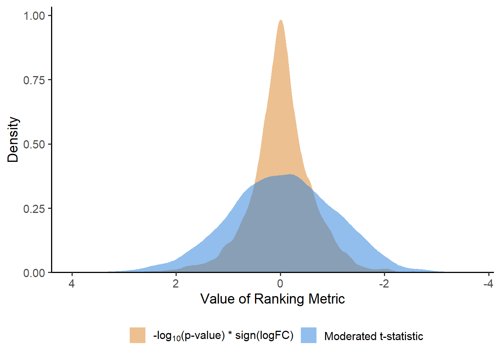

# Pathway Analysis {#pathway-analysis}


In Section \@ref(DEA), we covered analysis at the individual feature level (protein, peptide, phosphoprotein, etc.). While DEA is useful, it is not without its own set of shortcomings. For instance, there may be no features that pass the significance threshold after correcting for multiple hypothesis testing. Alternatively, there may be many features that are statistically significant, and interpreting this list can be tedious and "prone to investigator bias toward a hypothesis of interest" [@maleki_gene_2020]. Another issue is that single-feature analysis fails to detect subtle, yet coordinated changes in groups of related features [@subramanian_gene_2005]. 

In order to address these, and other, issues, pathway analysis instead examines *a priori* defined **gene sets**—groups of genes that participate in the same biological pathway, share the same cellular location, etc. In this section, we will explore some common annotation databases, as well as two pathway analysis methods: Over-Representation Analysis (ORA) and Gene Set Enrichment Analysis (GSEA).


## Annotation Databases {#annotation-databases}

In this section, we will explore some of the common annotation databases used for pathway analysis.

### Gene Ontology {#gene-ontology}

The Gene Ontology (GO) database is divided into three separate domains: Biological Process, Cellular Component, and Molecular Function (see the <a href="http://geneontology.org/docs/ontology-documentation/" title = "Gene Ontology overview">Gene Ontology overview</a> for more details regarding each domain). Each domain is structured as a directed acyclic graph (DAG) where nodes are terms and edges are the <a href="http://geneontology.org/docs/ontology-relations/#:~:text=Main%20relations%20used%20in%20GO" title = "Main relations used in GO">relations</a> between the terms (part of, is a, has part, regulates). Nodes can be connected to multiple child and parent nodes, where the group of genes annotated to a child node is a subset of those that are annotated to its parent node(s) [@noauthor_relations_2021; @goeman_multiple_2008].

#### Semantic Similarity {#semantic-similarity}

Due to the DAG structure of each domain, there is often redundancy in pathway analysis results. For example, suppose terms <a href="https://www.ebi.ac.uk/QuickGO/term/GO:0006119" title = "oxidative phosphorylation">GO:0006119</a>, <a href="https://www.ebi.ac.uk/QuickGO/term/GO:0009060" title = "aerobic respiration">GO:0009060</a>, and  <a href="https://www.ebi.ac.uk/QuickGO/term/GO:0046034" title = "ATP metabolic process">GO:0046034</a> are significantly over-represented biological processes. <a href="https://www.ebi.ac.uk/QuickGO/term/GO:0009060" title = "aerobic respiration">GO:0009060</a> and  <a href="https://www.ebi.ac.uk/QuickGO/term/GO:0046034" title = "ATP metabolic process">GO:0046034</a> are the parent terms of <a href="https://www.ebi.ac.uk/QuickGO/term/GO:0006119" title = "oxidative phosphorylation">GO:0006119</a>. Due to this relationship, the terms likely provide much of the same information, so the inclusion of all three terms in the output is unnecessary. In order to resolve this redundancy, we can calculate the **semantic similarity** between pairs of GO terms, which "assesses the likeness in meaning of two concepts" [@pesquita_semantic_2017]. Basically, if two terms are highly related, we can use some other criteria (such as adjusted p-value or level in the DAG) to retain only one of the terms. Below, we use the `GOSemSim` package to calculate the semantic similarity between the terms.


```r
## Calculate semantic similarity between GO terms
library(GOSemSim)
library(org.Hs.eg.db)

# GO DATA for measuring semantic similarity.
# keytype is "ENTREZID" by default and 
# information content is calculated (computeIC = TRUE)
semData <- godata(OrgDb = "org.Hs.eg.db", ont = "BP")
terms <- c("GO:0006119", "GO:0009060", "GO:0046034")
# measure = "Rel" is the default for clusterProfiler::simplify
# See code for clusterProfiler:::simplify_internal
sim <- mgoSim(GO1 = terms, GO2 = terms, semData = semData, 
              measure = "Rel", combine = NULL) 
```

<table class="table table-condensed" style="width: auto !important; margin-left: auto; margin-right: auto;">
<caption>(\#tab:sem-sim-table)Semantic Similarity of select GO terms</caption>
 <thead>
  <tr>
   <th style="text-align:left;">   </th>
   <th style="text-align:right;"> GO:0006119 </th>
   <th style="text-align:right;"> GO:0009060 </th>
   <th style="text-align:right;"> GO:0046034 </th>
  </tr>
 </thead>
<tbody>
  <tr>
   <td style="text-align:left;"> GO:0006119 </td>
   <td style="text-align:right;"> 0.998 </td>
   <td style="text-align:right;"> 0.754 </td>
   <td style="text-align:right;"> 0.936 </td>
  </tr>
  <tr>
   <td style="text-align:left;"> GO:0009060 </td>
   <td style="text-align:right;"> 0.754 </td>
   <td style="text-align:right;"> 0.999 </td>
   <td style="text-align:right;"> 0.128 </td>
  </tr>
  <tr>
   <td style="text-align:left;"> GO:0046034 </td>
   <td style="text-align:right;"> 0.936 </td>
   <td style="text-align:right;"> 0.128 </td>
   <td style="text-align:right;"> 0.997 </td>
  </tr>
</tbody>
</table>


If `measure` is `"Lin"`, `"Jiang"`, or `"Wang"`, the semantic similarity of a term with itself will be 1. This is not true for the other methods.

We can see from Table \@ref(tab:sem-sim-table) that <a href="https://www.ebi.ac.uk/QuickGO/term/GO:0009060" title = "aerobic respiration">GO:0009060</a> and  <a href="https://www.ebi.ac.uk/QuickGO/term/GO:0046034" title = "ATP metabolic process">GO:0046034</a> have low semantic similarity, while <a href="https://www.ebi.ac.uk/QuickGO/term/GO:0006119" title = "oxidative phosphorylation">GO:0006119</a> is highly similar to its parent terms. This makes sense because the parent terms are not related/connected in the DAG. 

Now that we have the semantic similarities, we can remove redundant terms. `clusterProfiler` has a function called `simplify` that will calculate semantic similarity and remove terms. By default, if there are two terms with a semantic similarity greater than 0.7, `simplify` retains the term with the lowest adjusted p-value. See <a href="https://guangchuangyu.github.io/2015/10/use-simplify-to-remove-redundancy-of-enriched-go-terms/" title = "use simplify to remove redundancy of enriched GO terms">this post</a> by Guangchuang Yu for more details on `clusterProfiler::simplify`.


#### GO Subsets/Slims {#go-slim}

Another way to handle the redundancy of GO terms is to use a <a href="http://geneontology.org/docs/go-subset-guide/" title = "Guide to GO subsets">GO slim</a>, which is a subset of more general or research-relevant terms from the GO. GO slims can be <a href="http://geneontology.org/docs/download-ontology/#subsets" title = "Download the ontology">downloaded</a> or the `biomaRt` package can be used to access GO slim accessions.


```r
## Create human GO slim
library(biomaRt)
library(clusterProfiler) # gcSample data
library(dplyr)

mart <- useMart(biomart = "ENSEMBL_MART_ENSEMBL",
                dataset = "hsapiens_gene_ensembl")
# Uncomment to determine which attributes to select in getBM()
# View(listAttributes(mart)) 

# The GO slim columns are goslim_goa_accession and goslim_goa_description.
# We will map from the Entrez IDs in gcSample to these attributes.
data(gcSample)
universe <- unique(unlist(gcSample))
GO_slim <- getBM(filters = "entrezgene_id",
                 attributes = c("entrezgene_id",
                                "goslim_goa_accession",
                                "goslim_goa_description"),
                 values = universe, # Subset to these Entrez IDs
                 mart = mart) %>% 
  # Convert entrezgene_id from integer to character
  mutate_all(as.character)
```


<table class="table table-hover table-condensed" style="font-size: 12px; width: auto !important; margin-left: auto; margin-right: auto;">
 <thead>
  <tr>
   <th style="text-align:left;"> entrezgene_id </th>
   <th style="text-align:left;"> goslim_goa_accession </th>
   <th style="text-align:left;"> goslim_goa_description </th>
  </tr>
 </thead>
<tbody>
  <tr>
   <td style="text-align:left;"> 100 </td>
   <td style="text-align:left;"> <a href="https://www.ebi.ac.uk/QuickGO/term/GO:0003674" style="     ">GO:0003674</a> </td>
   <td style="text-align:left;"> molecular_function </td>
  </tr>
  <tr>
   <td style="text-align:left;"> 100 </td>
   <td style="text-align:left;"> <a href="https://www.ebi.ac.uk/QuickGO/term/GO:0016810" style="     ">GO:0016810</a> </td>
   <td style="text-align:left;"> hydrolase activity, acting on carbon-nitrogen (but not peptide) bonds </td>
  </tr>
  <tr>
   <td style="text-align:left;"> 100 </td>
   <td style="text-align:left;"> <a href="https://www.ebi.ac.uk/QuickGO/term/GO:0008150" style="     ">GO:0008150</a> </td>
   <td style="text-align:left;"> biological_process </td>
  </tr>
  <tr>
   <td style="text-align:left;"> 100 </td>
   <td style="text-align:left;"> <a href="https://www.ebi.ac.uk/QuickGO/term/GO:0009058" style="     ">GO:0009058</a> </td>
   <td style="text-align:left;"> biosynthetic process </td>
  </tr>
  <tr>
   <td style="text-align:left;"> 100 </td>
   <td style="text-align:left;"> <a href="https://www.ebi.ac.uk/QuickGO/term/GO:0044281" style="     ">GO:0044281</a> </td>
   <td style="text-align:left;"> small molecule metabolic process </td>
  </tr>
  <tr>
   <td style="text-align:left;"> 100 </td>
   <td style="text-align:left;"> <a href="https://www.ebi.ac.uk/QuickGO/term/GO:0034641" style="     ">GO:0034641</a> </td>
   <td style="text-align:left;"> cellular nitrogen compound metabolic process </td>
  </tr>
</tbody>
</table>


Unfortunately, not every GO accession maps to a domain when we use `biomaRt` (unsure why this is the case), so we won't be able to separate the terms. However, there are two ways that we can still use these GO slim accessions. Either follow the steps for using `clusterProfiler::enricher` (shown in the Pfam subsection of Section \@ref(ora-examples)) with conversion tables created from `org.Hs.eg.db` that have been subset to the GO slim accessions, or remove any non GO slim accessions from the final results and readjust the remaining p-values (the easier approach).


### Reactome

[Home - Reactome Pathway Database](https://reactome.org/)

### KEGG

[KEGG: Kyoto Encyclopedia of Genes and Genomes](https://www.genome.jp/kegg/)

### Pfam

[Pfam: Home page](http://pfam.xfam.org/)
[Pfam Documentation](https://pfam-docs.readthedocs.io/en/latest/)
[profile Hidden Markov Models](https://watermark.silverchair.com/140755.pdf?token=AQECAHi208BE49Ooan9kkhW_Ercy7Dm3ZL_9Cf3qfKAc485ysgAAAvYwggLyBgkqhkiG9w0BBwagggLjMIIC3wIBADCCAtgGCSqGSIb3DQEHATAeBglghkgBZQMEAS4wEQQM8AYKH-bv0m2nHfTQAgEQgIICqYjz7XAVxAREVHGvJofH3peUmhTifphKa4BaiK7Xw4XUV41B2Eolc7IBL6Q9Oh0MAVCD0yHlxqBSwJ3cETaSRp60T6Bk9Cl6nUyjTUpq-4f8YW1pUgOxvd7OCLkE11Twa60Y9T6JFyIUuCxHs6UgbRBAbwNZ-6HG9-WRHxiWzCSf6SbrH74ouzlsabLh1OZMSoJ3dfbNrBYRz-bkonlmHUBASLKee1YA6Eg4EavR1Qa07g5FwDJhGVUgDw4IyhkyGAucfJTwl5_FxFGrs8-FEQ01LZqQDzZLsL0zcH7NsD8dB6PaWcP-lrH0TQpRK-WHhSC2WmL6rEoV_zwzUE9faUkLRzbg82siXNFUhgR9cwpe_ycHF-ffmIVMjpPWYvmMzrk4YfMfp_A0OsNbu0S7vSL7gqJ-uD2HyeJ8XkAZ1HXDjBKGHyQmQX6otAHfdNHbHUMl8GaFmgUPDkfj9swuUeQ0udhKRRssJNF8cqrs-xDzNQnB3-cGhi0bfV7PT1CZxGBMhlC4UsTu0hLZUfMxozxXfDjLY0kZEu66lTJL7CYGru4JCx7qFHvaQZg3icjHLOAiwov7v9-CimdXepQrZxZQ588N2ZlgsZ5f0xiZ5qdGkGwDyhdFmLPj2f_RFXRe5TuCWLU1DTkX5NyIUYGwGJECn6n_qSsA37n73ek--_eBPV-F6GBYQe1oRWP2S5SQTxP0r3yPyh7dIlqcqQxWozlsew1fGCMjRoUv1e3SFU7LZ0j8bUSXXEAgOxjjOBSxWu1QzgjLa-MRV0IQ61tDXfGdJhSuuZSxRwlxTbpZKQWfaS3s1jFU9Hm-B-9CvhmJQgb7elOeD0cbpVMeM03ebaK-NgPA0dX5slcIe1--BtOdKoKjepE7--RS4Z4Bls4ZI0d0valj-zsHiw)


## Over-Representation Analysis {#ora}

### Overview {#ora-overview}

Over-Representation Analysis (ORA) is used to determine which *a priori* defined gene sets are more present (over-represented) in a subset of "interesting" genes than what would be expected by chance [@huang_bioinformatics_2009]. Essentially, it identifies the gene sets—rather than the individual genes—that are significantly different between two conditions.

For each gene set, an enrichment p-value is calculated using the Binomial distribution, Hypergeometric distribution, the Fisher exact test, or the Chi-square test. Although this list is not all-encompassing, these are the most popular statistical methods [@huang_bioinformatics_2009]. Below is the formula for calculating the enrichment p-value for a particular gene set using the Hypergeometric distribution.

<div class="math">
\[
P(X\geq x) = 1 - P(X \leq x-1) = 1 - \sum\limits_{i=0}^{x-1}\frac{\hphantom{}{M \choose i }{N - M \choose n-i}}{N \choose n}
\]
</div>

In this equation, $N$ is the number of background genes, $n$ is the number of "interesting" (i.e. statistically-significant) genes, $M$ is the number of genes that are annotated to a particular gene set $S$, and $x$ is the number of "interesting" genes that are annotated to $S$. The numerator of the sum is the number of samples of $n$ genes that can be taken from a population of $N$ genes where exactly $i$ of the genes are annotated to $S$ and $n-i$ are not annotated to $S$. The denominator of the sum is the total number of samples of size $n$ that can be taken from a population of size $N$.

For example, suppose we have a list of 8000 genes, of which 400 are differentially expressed. Also suppose that 100 of the 8000 genes are annotated to a particular gene set $S$. Of these 100 genes, 20 are differentially expressed. The probability that 20 or more (up to 100) genes annotated to $S$ are differentially expressed by chance is given by

<div class="math">
\[
P(X\geq 20) = 1 - P(X \leq 19) = 1-\sum \limits_{i=0}^{19}\frac{\hphantom{}{100 \choose i}{8000 - 100 \choose 400-i}}{8000 \choose 400} = 7.88 \times 10^{-8}
\]
</div>

That is, it is extremely unlikely that 20 of the 100 genes from this set are significantly differentially expressed by chance (at least, prior to adjustment for multiple comparisons). The code to calculate this p-value is


```r
phyper(q = 20 - 1, m = 400, n = 8000 - 400, k = 100, lower.tail = FALSE)
```

After a p-value has been calculated for each of the applicable gene sets, a multiple comparison adjustment should be performed.

#### Important Considerations {-}

<ol>
<li>
The choice of the threshold for statistical significance and the multiple comparison adjustment method can greatly impact the analysis [@huang_bioinformatics_2009].
</li>
<li>
ORA fails to incorporate direction of gene regulation. (Are the genes in a given set mainly up or down-regulated?). It is not a good idea to split DEA results by the sign of the logFC and apply ORA to the two sets. Use GSEA instead.
</li>
<!--- 
TODO:
Fact-check #3
--->
<li>
If few genes are differentially expressed, ORA may not yield useful or reliable results. For example, suppose 30 out of 8000 genes are significant. 100 of the genes are annotated to a particular gene set, of which 3 are significant. The associated Hypergeometric p-value is 0.006, and this set would be considered significantly over-represented at the 0.01 level (at least, prior to adjustment for multiple comparisons); however, if only 2 of the genes in this set are significant, this p-value increases 10-fold to 0.0536 and is no longer significant even at the 0.05 level.
</li>
<li>
If the DEA results are not gene-centric (i.e. DEA was performed at the protein or phosphosite level), then there may be cases where two proteins are associated with the same gene, but only one is significantly differentially abundant. In this case, there is no way to categorize the gene as significant or not, so ORA should not be used. The other problem that could arise if the DEA results are not gene-centric is that the same gene may be counted as significant multiple times, which leads to artificial over-representation. In these cases, GSEA may be a good alternative.
</li>
</ol>


### Examples {#ora-examples}

For these examples, we will show how to perform ORA with the GOstats, clusterProfiler, and ReactomePA packages. The databases that we will cover are Gene Ontology, Reactome, and Pfam. For details on these different annotation databases, please see Section \@ref(annotation-databases). 


```r
## Setup
# Required packages
library(clusterProfiler) # GO, KEGG, and custom ORA
library(ReactomePA) # Reactome ORA
library(GOstats) # GO, KEGG, and Pfam ORA
library(PFAM.db) # Map Pfam IDs to descriptions
library(org.Hs.eg.db) # Human annotation database
library(kableExtra)
library(dplyr)
```

Normally, we would use a DEA table to create two character vectors: one for the significantly expressed genes and the other for all genes that were tested (referred to as the "background" or "universe"); instead, we will use the `gcSample` data that comes with clusterProfiler and treat the eighth cluster as our vector of significant genes and the entire list as the gene universe. Each gene is represented by a human Entrez gene ID, which is the default keytype used by the clusterProfiler functions (and the only keytype compatible with `ReactomePA::enrichPathway`).


```r
data("gcSample") # Data for examples
sig_genes <- gcSample[[8]] # significant genes
universe <- unique(unlist(gcSample)) # universe
```

It is important to note that the genes should be unique from the start. The terms between any two clusters of `gcSample` may overlap, so we must use `unique` for the sake of these examples. *If your DEA results are not gene-centric, do NOT use ORA. Instead, switch to GSEA and summarize the ranking metric in some way to make it gene-centric (i.e. take the average, min, max, etc. of the metrics for each gene group)*.


#### Gene Ontology {#ora-go}

We will first use the clusterProfiler package to test which biological processes are over-represented in the set of interesting genes. For this example, we will only consider gene sets of size 20 to 500. In order to test either molecular functions, cellular components, or all three ontologies at once, set `ont` to `"MF"`, `"CC"`, or `"ALL"`, respectively.


```r
## GO BP ORA with clusterProfiler
# This takes a while
cp_ora_go <- enrichGO(
  gene = sig_genes, 
  OrgDb = "org.Hs.eg.db", 
  keyType = "ENTREZID", 
  ont = "BP", # BP, CC, MF, or ALL for all ontologies
  pvalueCutoff = 0.05,
  qvalueCutoff = 1, # Do not filter by q-value
  pAdjustMethod = "BH", 
  universe = universe, 
  minGSSize = 20, 
  maxGSSize = 500, 
  readable = TRUE # Convert Entrez ID to gene symbol
)
```

<div style="border: 1px solid #ddd; padding: 0px; overflow-y: scroll; height:20em; "><table class="table table-hover table-condensed" style="font-size: 12px; width: auto !important; margin-left: auto; margin-right: auto;">
<caption style="font-size: initial !important;">(\#tab:cp-ora-go-table)Top significantly over-represented biological processes from enrichGO output.</caption>
 <thead>
  <tr>
   <th style="text-align:left;position: sticky; top:0; background-color: #FFFFFF;"> ID </th>
   <th style="text-align:left;position: sticky; top:0; background-color: #FFFFFF;"> Description </th>
   <th style="text-align:left;position: sticky; top:0; background-color: #FFFFFF;"> GeneRatio </th>
   <th style="text-align:left;position: sticky; top:0; background-color: #FFFFFF;"> BgRatio </th>
   <th style="text-align:right;position: sticky; top:0; background-color: #FFFFFF;"> pvalue </th>
   <th style="text-align:right;position: sticky; top:0; background-color: #FFFFFF;"> p.adjust </th>
   <th style="text-align:left;position: sticky; top:0; background-color: #FFFFFF;"> geneID </th>
  </tr>
 </thead>
<tbody>
  <tr>
   <td style="text-align:left;"> <a href="https://www.ebi.ac.uk/QuickGO/term/GO:0046034" style="     ">GO:0046034</a> </td>
   <td style="text-align:left;"> ATP metabolic process </td>
   <td style="text-align:left;"> 24/232 </td>
   <td style="text-align:left;"> 96/3652 </td>
   <td style="text-align:right;"> 0 </td>
   <td style="text-align:right;"> 0e+00 </td>
   <td style="text-align:left;"> COX4I1/PGK1/TPI1... </td>
  </tr>
  <tr>
   <td style="text-align:left;"> <a href="https://www.ebi.ac.uk/QuickGO/term/GO:0006119" style="     ">GO:0006119</a> </td>
   <td style="text-align:left;"> oxidative phosphorylation </td>
   <td style="text-align:left;"> 16/232 </td>
   <td style="text-align:left;"> 49/3652 </td>
   <td style="text-align:right;"> 0 </td>
   <td style="text-align:right;"> 0e+00 </td>
   <td style="text-align:left;"> COX4I1/COX8A/COX7C... </td>
  </tr>
  <tr>
   <td style="text-align:left;"> <a href="https://www.ebi.ac.uk/QuickGO/term/GO:0006402" style="     ">GO:0006402</a> </td>
   <td style="text-align:left;"> mRNA catabolic process </td>
   <td style="text-align:left;"> 22/232 </td>
   <td style="text-align:left;"> 93/3652 </td>
   <td style="text-align:right;"> 0 </td>
   <td style="text-align:right;"> 0e+00 </td>
   <td style="text-align:left;"> HNRNPU/YWHAZ/RPL13A... </td>
  </tr>
  <tr>
   <td style="text-align:left;"> <a href="https://www.ebi.ac.uk/QuickGO/term/GO:1902600" style="     ">GO:1902600</a> </td>
   <td style="text-align:left;"> proton transmembrane transport </td>
   <td style="text-align:left;"> 12/232 </td>
   <td style="text-align:left;"> 28/3652 </td>
   <td style="text-align:right;"> 0 </td>
   <td style="text-align:right;"> 0e+00 </td>
   <td style="text-align:left;"> COX4I1/COX8A/COX7C... </td>
  </tr>
  <tr>
   <td style="text-align:left;"> <a href="https://www.ebi.ac.uk/QuickGO/term/GO:0016071" style="     ">GO:0016071</a> </td>
   <td style="text-align:left;"> mRNA metabolic process </td>
   <td style="text-align:left;"> 35/232 </td>
   <td style="text-align:left;"> 208/3652 </td>
   <td style="text-align:right;"> 0 </td>
   <td style="text-align:right;"> 0e+00 </td>
   <td style="text-align:left;"> HNRNPU/YWHAZ/RPL13A... </td>
  </tr>
  <tr>
   <td style="text-align:left;"> <a href="https://www.ebi.ac.uk/QuickGO/term/GO:0006091" style="     ">GO:0006091</a> </td>
   <td style="text-align:left;"> generation of precursor metabolites and energy </td>
   <td style="text-align:left;"> 29/232 </td>
   <td style="text-align:left;"> 159/3652 </td>
   <td style="text-align:right;"> 0 </td>
   <td style="text-align:right;"> 0e+00 </td>
   <td style="text-align:left;"> COX4I1/PGK1/TPI1... </td>
  </tr>
  <tr>
   <td style="text-align:left;"> <a href="https://www.ebi.ac.uk/QuickGO/term/GO:0009060" style="     ">GO:0009060</a> </td>
   <td style="text-align:left;"> aerobic respiration </td>
   <td style="text-align:left;"> 12/232 </td>
   <td style="text-align:left;"> 32/3652 </td>
   <td style="text-align:right;"> 0 </td>
   <td style="text-align:right;"> 1e-04 </td>
   <td style="text-align:left;"> COX4I1/MDH1/HIF1A... </td>
  </tr>
  <tr>
   <td style="text-align:left;"> <a href="https://www.ebi.ac.uk/QuickGO/term/GO:0006401" style="     ">GO:0006401</a> </td>
   <td style="text-align:left;"> RNA catabolic process </td>
   <td style="text-align:left;"> 22/232 </td>
   <td style="text-align:left;"> 104/3652 </td>
   <td style="text-align:right;"> 0 </td>
   <td style="text-align:right;"> 1e-04 </td>
   <td style="text-align:left;"> HNRNPU/YWHAZ/RPL13A... </td>
  </tr>
  <tr>
   <td style="text-align:left;"> <a href="https://www.ebi.ac.uk/QuickGO/term/GO:0010608" style="     ">GO:0010608</a> </td>
   <td style="text-align:left;"> posttranscriptional regulation of gene expression </td>
   <td style="text-align:left;"> 28/232 </td>
   <td style="text-align:left;"> 168/3652 </td>
   <td style="text-align:right;"> 0 </td>
   <td style="text-align:right;"> 3e-04 </td>
   <td style="text-align:left;"> HNRNPU/MATR3/YWHAZ... </td>
  </tr>
  <tr>
   <td style="text-align:left;"> <a href="https://www.ebi.ac.uk/QuickGO/term/GO:0042773" style="     ">GO:0042773</a> </td>
   <td style="text-align:left;"> ATP synthesis coupled electron transport </td>
   <td style="text-align:left;"> 11/232 </td>
   <td style="text-align:left;"> 31/3652 </td>
   <td style="text-align:right;"> 0 </td>
   <td style="text-align:right;"> 3e-04 </td>
   <td style="text-align:left;"> COX4I1/COX8A/COX7C... </td>
  </tr>
</tbody>
</table></div>

</br>

There were 4436 biological processes that were tested. Of these, 2049 passed the size filter, and only 182 were significantly over-represented after multiple testing correction. The top 10 are shown in Table \@ref(tab:cp-ora-go-table).

**Remove Redundant GO Terms**

By default, if two terms have a semantic similarity above 0.7, `clusterProfiler::simplify` retains the more significantly over-represented term.


```r
# Remove redundant GO terms with simplify
cp_ora_go_sim <- simplify(cp_ora_go)
```

<div style="border: 1px solid #ddd; padding: 0px; overflow-y: scroll; height:20em; "><table class="table table-hover table-condensed" style="font-size: 12px; width: auto !important; margin-left: auto; margin-right: auto;">
<caption style="font-size: initial !important;">(\#tab:simplify-cp-ora-bp-table)Simplified top significantly over-represented biological processes from enrichGO output.</caption>
 <thead>
  <tr>
   <th style="text-align:left;position: sticky; top:0; background-color: #FFFFFF;"> ID </th>
   <th style="text-align:left;position: sticky; top:0; background-color: #FFFFFF;"> Description </th>
   <th style="text-align:left;position: sticky; top:0; background-color: #FFFFFF;"> GeneRatio </th>
   <th style="text-align:left;position: sticky; top:0; background-color: #FFFFFF;"> BgRatio </th>
   <th style="text-align:right;position: sticky; top:0; background-color: #FFFFFF;"> pvalue </th>
   <th style="text-align:right;position: sticky; top:0; background-color: #FFFFFF;"> p.adjust </th>
   <th style="text-align:left;position: sticky; top:0; background-color: #FFFFFF;"> geneID </th>
  </tr>
 </thead>
<tbody>
  <tr>
   <td style="text-align:left;"> <a href="https://www.ebi.ac.uk/QuickGO/term/GO:0046034" style="     ">GO:0046034</a> </td>
   <td style="text-align:left;"> ATP metabolic process </td>
   <td style="text-align:left;"> 24/232 </td>
   <td style="text-align:left;"> 96/3652 </td>
   <td style="text-align:right;"> 0 </td>
   <td style="text-align:right;"> 0e+00 </td>
   <td style="text-align:left;"> COX4I1/PGK1/TPI1... </td>
  </tr>
  <tr>
   <td style="text-align:left;"> <a href="https://www.ebi.ac.uk/QuickGO/term/GO:0006119" style="     ">GO:0006119</a> </td>
   <td style="text-align:left;"> oxidative phosphorylation </td>
   <td style="text-align:left;"> 16/232 </td>
   <td style="text-align:left;"> 49/3652 </td>
   <td style="text-align:right;"> 0 </td>
   <td style="text-align:right;"> 0e+00 </td>
   <td style="text-align:left;"> COX4I1/COX8A/COX7C... </td>
  </tr>
  <tr>
   <td style="text-align:left;"> <a href="https://www.ebi.ac.uk/QuickGO/term/GO:0006402" style="     ">GO:0006402</a> </td>
   <td style="text-align:left;"> mRNA catabolic process </td>
   <td style="text-align:left;"> 22/232 </td>
   <td style="text-align:left;"> 93/3652 </td>
   <td style="text-align:right;"> 0 </td>
   <td style="text-align:right;"> 0e+00 </td>
   <td style="text-align:left;"> HNRNPU/YWHAZ/RPL13A... </td>
  </tr>
  <tr>
   <td style="text-align:left;"> <a href="https://www.ebi.ac.uk/QuickGO/term/GO:1902600" style="     ">GO:1902600</a> </td>
   <td style="text-align:left;"> proton transmembrane transport </td>
   <td style="text-align:left;"> 12/232 </td>
   <td style="text-align:left;"> 28/3652 </td>
   <td style="text-align:right;"> 0 </td>
   <td style="text-align:right;"> 0e+00 </td>
   <td style="text-align:left;"> COX4I1/COX8A/COX7C... </td>
  </tr>
  <tr>
   <td style="text-align:left;"> <a href="https://www.ebi.ac.uk/QuickGO/term/GO:0016071" style="     ">GO:0016071</a> </td>
   <td style="text-align:left;"> mRNA metabolic process </td>
   <td style="text-align:left;"> 35/232 </td>
   <td style="text-align:left;"> 208/3652 </td>
   <td style="text-align:right;"> 0 </td>
   <td style="text-align:right;"> 0e+00 </td>
   <td style="text-align:left;"> HNRNPU/YWHAZ/RPL13A... </td>
  </tr>
  <tr>
   <td style="text-align:left;"> <a href="https://www.ebi.ac.uk/QuickGO/term/GO:0006091" style="     ">GO:0006091</a> </td>
   <td style="text-align:left;"> generation of precursor metabolites and energy </td>
   <td style="text-align:left;"> 29/232 </td>
   <td style="text-align:left;"> 159/3652 </td>
   <td style="text-align:right;"> 0 </td>
   <td style="text-align:right;"> 0e+00 </td>
   <td style="text-align:left;"> COX4I1/PGK1/TPI1... </td>
  </tr>
  <tr>
   <td style="text-align:left;"> <a href="https://www.ebi.ac.uk/QuickGO/term/GO:0010608" style="     ">GO:0010608</a> </td>
   <td style="text-align:left;"> posttranscriptional regulation of gene expression </td>
   <td style="text-align:left;"> 28/232 </td>
   <td style="text-align:left;"> 168/3652 </td>
   <td style="text-align:right;"> 0 </td>
   <td style="text-align:right;"> 3e-04 </td>
   <td style="text-align:left;"> HNRNPU/MATR3/YWHAZ... </td>
  </tr>
  <tr>
   <td style="text-align:left;"> <a href="https://www.ebi.ac.uk/QuickGO/term/GO:0009205" style="     ">GO:0009205</a> </td>
   <td style="text-align:left;"> purine ribonucleoside triphosphate metabolic process </td>
   <td style="text-align:left;"> 9/232 </td>
   <td style="text-align:left;"> 21/3652 </td>
   <td style="text-align:right;"> 0 </td>
   <td style="text-align:right;"> 4e-04 </td>
   <td style="text-align:left;"> RAN/ENO1/ATP5F1B... </td>
  </tr>
  <tr>
   <td style="text-align:left;"> <a href="https://www.ebi.ac.uk/QuickGO/term/GO:0034097" style="     ">GO:0034097</a> </td>
   <td style="text-align:left;"> response to cytokine </td>
   <td style="text-align:left;"> 45/232 </td>
   <td style="text-align:left;"> 357/3652 </td>
   <td style="text-align:right;"> 0 </td>
   <td style="text-align:right;"> 4e-04 </td>
   <td style="text-align:left;"> HNRNPU/YWHAZ/SLC25A5... </td>
  </tr>
  <tr>
   <td style="text-align:left;"> <a href="https://www.ebi.ac.uk/QuickGO/term/GO:0071345" style="     ">GO:0071345</a> </td>
   <td style="text-align:left;"> cellular response to cytokine stimulus </td>
   <td style="text-align:left;"> 42/232 </td>
   <td style="text-align:left;"> 325/3652 </td>
   <td style="text-align:right;"> 0 </td>
   <td style="text-align:right;"> 4e-04 </td>
   <td style="text-align:left;"> HNRNPU/YWHAZ/SLC25A5... </td>
  </tr>
</tbody>
</table></div>

</br>

Notice that <a href="https://www.ebi.ac.uk/QuickGO/term/GO:0009060" title = "aerobic respiration">GO:0009060</a> is not present in Table \@ref(tab:simplify-cp-ora-bp-table) anymore, since it was highly similar to <a href="https://www.ebi.ac.uk/QuickGO/term/GO:0006119" title = "oxidative phosphorylation">GO:0006119</a>, and the latter was more significant. After removing redundant GO terms, 95 pass the significance threshold.

Instead of retaining terms based on adjusted p-value, we could ignore significance and instead retain either parent or child terms (`select_fun = min` and `select_fun = max`, respectively). The code to do so is provided <a href="https://github.com/YuLab-SMU/clusterProfiler/issues/372" title = "New feature: simplify to parent GO terms #372">here</a>.

Another alternative would be to use a gene ID to <a href="http://geneontology.org/docs/go-subset-guide/" title = "Guide to GO subsets">GO slim</a> ID conversion table. See the Semantic Similarity subsection of Section \@ref(annotation-databases) for more details.

Now, we will perform GO ORA with the GOstats package. We begin by creating an object of class `GOHyperGParams` and passing it to `hyperGTest` for calculation of Hypergeometric p-values. We do not filter by p-value, since adjusted p-values are not provided and we must calculate them ourselves.


```r
## GO BP ORA with GOstats
hyperg_ora_go <- new(
  Class = "GOHyperGParams",
  ontology = "BP",
  geneIds = sig_genes,
  universeGeneIds = universe,
  annotation = "org.Hs.eg.db",
  pvalueCutoff = 1, # Do not filter by p-value
  testDirection = "over",
  conditional = FALSE
) %>%
  hyperGTest() # Hypergeometric testing
```

Now, we need to filter by gene set size (limit 20 to 500), adjust the p-values, and filter based on the adjusted p-values.


```r
res_go_ora <- summary(hyperg_ora_go) %>%
  # Filter by size
  filter(Size >= 20, Size <= 500) %>%
  # Adjust p-values
  mutate(p.adjust = p.adjust(Pvalue, method = "BH")) %>%
  # Filter and sort by adjusted p-values
  arrange(p.adjust) %>% 
  filter(p.adjust < 0.05)
```


<div style="border: 1px solid #ddd; padding: 0px; overflow-y: scroll; height:20em; "><table class="table table-hover table-condensed" style="font-size: 12px; width: auto !important; margin-left: auto; margin-right: auto;">
<caption style="font-size: initial !important;">(\#tab:cp-go-ora-table)Over-represented biological processes obtained using the GOstats package.</caption>
 <thead>
  <tr>
   <th style="text-align:left;position: sticky; top:0; background-color: #FFFFFF;"> GOBPID </th>
   <th style="text-align:left;position: sticky; top:0; background-color: #FFFFFF;"> Term </th>
   <th style="text-align:right;position: sticky; top:0; background-color: #FFFFFF;"> OddsRatio </th>
   <th style="text-align:right;position: sticky; top:0; background-color: #FFFFFF;"> ExpCount </th>
   <th style="text-align:right;position: sticky; top:0; background-color: #FFFFFF;"> Count </th>
   <th style="text-align:right;position: sticky; top:0; background-color: #FFFFFF;"> Size </th>
   <th style="text-align:right;position: sticky; top:0; background-color: #FFFFFF;"> Pvalue </th>
   <th style="text-align:right;position: sticky; top:0; background-color: #FFFFFF;"> p.adjust </th>
  </tr>
 </thead>
<tbody>
  <tr>
   <td style="text-align:left;"> <a href="https://www.ebi.ac.uk/QuickGO/term/GO:0046034" style="     ">GO:0046034</a> </td>
   <td style="text-align:left;"> ATP metabolic process </td>
   <td style="text-align:right;"> 5.3654 </td>
   <td style="text-align:right;"> 6.0986 </td>
   <td style="text-align:right;"> 24 </td>
   <td style="text-align:right;"> 96 </td>
   <td style="text-align:right;"> 0 </td>
   <td style="text-align:right;"> 0e+00 </td>
  </tr>
  <tr>
   <td style="text-align:left;"> <a href="https://www.ebi.ac.uk/QuickGO/term/GO:0006119" style="     ">GO:0006119</a> </td>
   <td style="text-align:left;"> oxidative phosphorylation </td>
   <td style="text-align:right;"> 7.6027 </td>
   <td style="text-align:right;"> 3.1128 </td>
   <td style="text-align:right;"> 16 </td>
   <td style="text-align:right;"> 49 </td>
   <td style="text-align:right;"> 0 </td>
   <td style="text-align:right;"> 0e+00 </td>
  </tr>
  <tr>
   <td style="text-align:left;"> <a href="https://www.ebi.ac.uk/QuickGO/term/GO:0006402" style="     ">GO:0006402</a> </td>
   <td style="text-align:left;"> mRNA catabolic process </td>
   <td style="text-align:right;"> 4.9415 </td>
   <td style="text-align:right;"> 5.9080 </td>
   <td style="text-align:right;"> 22 </td>
   <td style="text-align:right;"> 93 </td>
   <td style="text-align:right;"> 0 </td>
   <td style="text-align:right;"> 0e+00 </td>
  </tr>
  <tr>
   <td style="text-align:left;"> <a href="https://www.ebi.ac.uk/QuickGO/term/GO:1902600" style="     ">GO:1902600</a> </td>
   <td style="text-align:left;"> proton transmembrane transport </td>
   <td style="text-align:right;"> 11.6045 </td>
   <td style="text-align:right;"> 1.7788 </td>
   <td style="text-align:right;"> 12 </td>
   <td style="text-align:right;"> 28 </td>
   <td style="text-align:right;"> 0 </td>
   <td style="text-align:right;"> 0e+00 </td>
  </tr>
  <tr>
   <td style="text-align:left;"> <a href="https://www.ebi.ac.uk/QuickGO/term/GO:0016071" style="     ">GO:0016071</a> </td>
   <td style="text-align:left;"> mRNA metabolic process </td>
   <td style="text-align:right;"> 3.3346 </td>
   <td style="text-align:right;"> 13.2136 </td>
   <td style="text-align:right;"> 35 </td>
   <td style="text-align:right;"> 208 </td>
   <td style="text-align:right;"> 0 </td>
   <td style="text-align:right;"> 0e+00 </td>
  </tr>
  <tr>
   <td style="text-align:left;"> <a href="https://www.ebi.ac.uk/QuickGO/term/GO:0006091" style="     ">GO:0006091</a> </td>
   <td style="text-align:left;"> generation of precursor metabolites and energy </td>
   <td style="text-align:right;"> 3.6154 </td>
   <td style="text-align:right;"> 10.1008 </td>
   <td style="text-align:right;"> 29 </td>
   <td style="text-align:right;"> 159 </td>
   <td style="text-align:right;"> 0 </td>
   <td style="text-align:right;"> 0e+00 </td>
  </tr>
  <tr>
   <td style="text-align:left;"> <a href="https://www.ebi.ac.uk/QuickGO/term/GO:0009060" style="     ">GO:0009060</a> </td>
   <td style="text-align:left;"> aerobic respiration </td>
   <td style="text-align:right;"> 9.2727 </td>
   <td style="text-align:right;"> 2.0329 </td>
   <td style="text-align:right;"> 12 </td>
   <td style="text-align:right;"> 32 </td>
   <td style="text-align:right;"> 0 </td>
   <td style="text-align:right;"> 1e-04 </td>
  </tr>
  <tr>
   <td style="text-align:left;"> <a href="https://www.ebi.ac.uk/QuickGO/term/GO:0006401" style="     ">GO:0006401</a> </td>
   <td style="text-align:left;"> RNA catabolic process </td>
   <td style="text-align:right;"> 4.2646 </td>
   <td style="text-align:right;"> 6.6068 </td>
   <td style="text-align:right;"> 22 </td>
   <td style="text-align:right;"> 104 </td>
   <td style="text-align:right;"> 0 </td>
   <td style="text-align:right;"> 1e-04 </td>
  </tr>
  <tr>
   <td style="text-align:left;"> <a href="https://www.ebi.ac.uk/QuickGO/term/GO:0010608" style="     ">GO:0010608</a> </td>
   <td style="text-align:left;"> posttranscriptional regulation of gene expression </td>
   <td style="text-align:right;"> 3.2157 </td>
   <td style="text-align:right;"> 10.6725 </td>
   <td style="text-align:right;"> 28 </td>
   <td style="text-align:right;"> 168 </td>
   <td style="text-align:right;"> 0 </td>
   <td style="text-align:right;"> 3e-04 </td>
  </tr>
  <tr>
   <td style="text-align:left;"> <a href="https://www.ebi.ac.uk/QuickGO/term/GO:0042773" style="     ">GO:0042773</a> </td>
   <td style="text-align:left;"> ATP synthesis coupled electron transport </td>
   <td style="text-align:right;"> 8.4615 </td>
   <td style="text-align:right;"> 1.9693 </td>
   <td style="text-align:right;"> 11 </td>
   <td style="text-align:right;"> 31 </td>
   <td style="text-align:right;"> 0 </td>
   <td style="text-align:right;"> 3e-04 </td>
  </tr>
</tbody>
</table></div>

</br>

There were 4435 biological processes that were tested. Of these, 2049 passed the size filter, and only 182 were significantly over-represented after multiple testing correction. The top 10 are shown in Table \@ref(tab:cp-go-ora-table). The total number of biological processes that were tested is 1 less than the number reported from the `enrichGO` results. This is because `enrichGO` includes the "biological_process" root <a href="https://www.ebi.ac.uk/QuickGO/term/GO:0008150" title = "biological process">GO:0008150</a>.

**Remove Redundant GO Terms**

While there is no function akin to `clusterProfiler::simplify` to process results, there is an argument called `conditional`. Setting `conditional` to `TRUE` tells `hyperGTest` to use the term-term relationships when calculating p-values [@falcon_how_2021]. This approach is actually more akin to Modular Enrichment Analysis (MEA) than Over-Representation Analysis (also called Singular Enrichment Analysis; @huang_bioinformatics_2009).


```r
## Conditional GO BP ORA with GOstats
hyperg_ora_go_sim <- new(
  Class = "GOHyperGParams",
  ontology = "BP",
  geneIds = sig_genes,
  universeGeneIds = universe,
  annotation = "org.Hs.eg.db",
  pvalueCutoff = 1, # Do not filter by p-value
  testDirection = "over",
  conditional = TRUE # Use structure of GO graph
) %>%
  hyperGTest() # Hypergeometric testing
```

We will process the results the same as before and compare.


<div style="border: 1px solid #ddd; padding: 0px; overflow-y: scroll; height:20em; "><table class="table table-hover table-condensed" style="font-size: 12px; width: auto !important; margin-left: auto; margin-right: auto;">
<caption style="font-size: initial !important;">(\#tab:cp-go-ora-simple-table)Simplified over-represented biological processes obtained using the GOstats package.</caption>
 <thead>
  <tr>
   <th style="text-align:left;position: sticky; top:0; background-color: #FFFFFF;"> GOBPID </th>
   <th style="text-align:left;position: sticky; top:0; background-color: #FFFFFF;"> Term </th>
   <th style="text-align:right;position: sticky; top:0; background-color: #FFFFFF;"> OddsRatio </th>
   <th style="text-align:right;position: sticky; top:0; background-color: #FFFFFF;"> ExpCount </th>
   <th style="text-align:right;position: sticky; top:0; background-color: #FFFFFF;"> Count </th>
   <th style="text-align:right;position: sticky; top:0; background-color: #FFFFFF;"> Size </th>
   <th style="text-align:right;position: sticky; top:0; background-color: #FFFFFF;"> Pvalue </th>
   <th style="text-align:right;position: sticky; top:0; background-color: #FFFFFF;"> p.adjust </th>
  </tr>
 </thead>
<tbody>
  <tr>
   <td style="text-align:left;"> <a href="https://www.ebi.ac.uk/QuickGO/term/GO:0046034" style="     ">GO:0046034</a> </td>
   <td style="text-align:left;"> ATP metabolic process </td>
   <td style="text-align:right;"> 7.4290 </td>
   <td style="text-align:right;"> 2.3261 </td>
   <td style="text-align:right;"> 12 </td>
   <td style="text-align:right;"> 38 </td>
   <td style="text-align:right;"> 0e+00 </td>
   <td style="text-align:right;"> 0.0011 </td>
  </tr>
  <tr>
   <td style="text-align:left;"> <a href="https://www.ebi.ac.uk/QuickGO/term/GO:0042773" style="     ">GO:0042773</a> </td>
   <td style="text-align:left;"> ATP synthesis coupled electron transport </td>
   <td style="text-align:right;"> 8.4615 </td>
   <td style="text-align:right;"> 1.9693 </td>
   <td style="text-align:right;"> 11 </td>
   <td style="text-align:right;"> 31 </td>
   <td style="text-align:right;"> 0e+00 </td>
   <td style="text-align:right;"> 0.0011 </td>
  </tr>
  <tr>
   <td style="text-align:left;"> <a href="https://www.ebi.ac.uk/QuickGO/term/GO:0043043" style="     ">GO:0043043</a> </td>
   <td style="text-align:left;"> peptide biosynthetic process </td>
   <td style="text-align:right;"> 3.2288 </td>
   <td style="text-align:right;"> 9.0208 </td>
   <td style="text-align:right;"> 24 </td>
   <td style="text-align:right;"> 142 </td>
   <td style="text-align:right;"> 0e+00 </td>
   <td style="text-align:right;"> 0.0028 </td>
  </tr>
  <tr>
   <td style="text-align:left;"> <a href="https://www.ebi.ac.uk/QuickGO/term/GO:0046364" style="     ">GO:0046364</a> </td>
   <td style="text-align:left;"> monosaccharide biosynthetic process </td>
   <td style="text-align:right;"> 6.7593 </td>
   <td style="text-align:right;"> 2.2870 </td>
   <td style="text-align:right;"> 11 </td>
   <td style="text-align:right;"> 36 </td>
   <td style="text-align:right;"> 0e+00 </td>
   <td style="text-align:right;"> 0.0028 </td>
  </tr>
  <tr>
   <td style="text-align:left;"> <a href="https://www.ebi.ac.uk/QuickGO/term/GO:0009145" style="     ">GO:0009145</a> </td>
   <td style="text-align:left;"> purine nucleoside triphosphate biosynthetic process </td>
   <td style="text-align:right;"> 10.1429 </td>
   <td style="text-align:right;"> 1.2705 </td>
   <td style="text-align:right;"> 8 </td>
   <td style="text-align:right;"> 20 </td>
   <td style="text-align:right;"> 0e+00 </td>
   <td style="text-align:right;"> 0.0044 </td>
  </tr>
  <tr>
   <td style="text-align:left;"> <a href="https://www.ebi.ac.uk/QuickGO/term/GO:0009201" style="     ">GO:0009201</a> </td>
   <td style="text-align:left;"> ribonucleoside triphosphate biosynthetic process </td>
   <td style="text-align:right;"> 8.6888 </td>
   <td style="text-align:right;"> 1.3976 </td>
   <td style="text-align:right;"> 8 </td>
   <td style="text-align:right;"> 22 </td>
   <td style="text-align:right;"> 0e+00 </td>
   <td style="text-align:right;"> 0.0083 </td>
  </tr>
  <tr>
   <td style="text-align:left;"> <a href="https://www.ebi.ac.uk/QuickGO/term/GO:0006094" style="     ">GO:0006094</a> </td>
   <td style="text-align:left;"> gluconeogenesis </td>
   <td style="text-align:right;"> 6.5618 </td>
   <td style="text-align:right;"> 1.8981 </td>
   <td style="text-align:right;"> 9 </td>
   <td style="text-align:right;"> 30 </td>
   <td style="text-align:right;"> 1e-04 </td>
   <td style="text-align:right;"> 0.0127 </td>
  </tr>
  <tr>
   <td style="text-align:left;"> <a href="https://www.ebi.ac.uk/QuickGO/term/GO:0009141" style="     ">GO:0009141</a> </td>
   <td style="text-align:left;"> nucleoside triphosphate metabolic process </td>
   <td style="text-align:right;"> 6.2336 </td>
   <td style="text-align:right;"> 1.9693 </td>
   <td style="text-align:right;"> 9 </td>
   <td style="text-align:right;"> 31 </td>
   <td style="text-align:right;"> 1e-04 </td>
   <td style="text-align:right;"> 0.0130 </td>
  </tr>
  <tr>
   <td style="text-align:left;"> <a href="https://www.ebi.ac.uk/QuickGO/term/GO:0034655" style="     ">GO:0034655</a> </td>
   <td style="text-align:left;"> nucleobase-containing compound catabolic process </td>
   <td style="text-align:right;"> 2.8081 </td>
   <td style="text-align:right;"> 9.2114 </td>
   <td style="text-align:right;"> 22 </td>
   <td style="text-align:right;"> 145 </td>
   <td style="text-align:right;"> 1e-04 </td>
   <td style="text-align:right;"> 0.0130 </td>
  </tr>
  <tr>
   <td style="text-align:left;"> <a href="https://www.ebi.ac.uk/QuickGO/term/GO:0048002" style="     ">GO:0048002</a> </td>
   <td style="text-align:left;"> antigen processing and presentation of peptide antigen </td>
   <td style="text-align:right;"> 3.8578 </td>
   <td style="text-align:right;"> 4.4469 </td>
   <td style="text-align:right;"> 14 </td>
   <td style="text-align:right;"> 70 </td>
   <td style="text-align:right;"> 1e-04 </td>
   <td style="text-align:right;"> 0.0130 </td>
  </tr>
</tbody>
</table></div>

</br>

Now, only 2953 terms showed up in the summary. Of these, 1445 passed the size filter, and 31 were significantly over-represented after multiple testing correction. The top 10 are shown in Table \@ref(tab:cp-go-ora-simple-table). The major difference between these results and the ones from `enrichGO` after using `simplify` is that p-value adjustment is not affected by `simplify`, as redundant GO terms are removed after. The conditional method is actually more akin to performing modular enrichment analysis (MEA) than ORA (also called singular enrichment analysis)


#### Reactome {#ora-reactome}

GOstats does not have a dedicated class to test for Reactome pathway over-representation, but we can use ReactomePA. For this example, we will only consider pathways of size 20 to 500. `enrichPathway` only accepts Entrez gene IDs as input. In cases where the Entrez ID is not readily available, we must convert to them. Alternatively, we could use the custom ORA function `enricher`, which allows us to use any ID type (use demonstrated in Pfam example).


```r
## Reactome ORA with ReactomePA
cp_ora_reactome <- enrichPathway(
  gene = sig_genes, 
  organism = "human", 
  pvalueCutoff = 0.05, 
  pAdjustMethod = "BH", 
  qvalueCutoff = 1, # Do not filter by q-value
  universe = universe, 
  minGSSize = 20, 
  maxGSSize = 500,
  readable = TRUE # Convert Entrez ID to gene symbol
)
```

<div style="border: 1px solid #ddd; padding: 0px; overflow-y: scroll; height:20em; "><table class="table table-hover table-condensed" style="font-size: 12px; width: auto !important; margin-left: auto; margin-right: auto;">
<caption style="font-size: initial !important;">(\#tab:cp-ora-react-table)Top significantly over-represented Reactome pathways from enrichPathway output.</caption>
 <thead>
  <tr>
   <th style="text-align:left;position: sticky; top:0; background-color: #FFFFFF;"> ID </th>
   <th style="text-align:left;position: sticky; top:0; background-color: #FFFFFF;"> Description </th>
   <th style="text-align:left;position: sticky; top:0; background-color: #FFFFFF;"> GeneRatio </th>
   <th style="text-align:left;position: sticky; top:0; background-color: #FFFFFF;"> BgRatio </th>
   <th style="text-align:right;position: sticky; top:0; background-color: #FFFFFF;"> pvalue </th>
   <th style="text-align:right;position: sticky; top:0; background-color: #FFFFFF;"> p.adjust </th>
   <th style="text-align:left;position: sticky; top:0; background-color: #FFFFFF;"> geneID </th>
  </tr>
 </thead>
<tbody>
  <tr>
   <td style="text-align:left;"> <a href="https://reactome.org/content/detail/R-HSA-8953897" style="     ">R-HSA-8953897</a> </td>
   <td style="text-align:left;"> Cellular responses to external stimuli </td>
   <td style="text-align:left;"> 39/193 </td>
   <td style="text-align:left;"> 185/2548 </td>
   <td style="text-align:right;"> 0 </td>
   <td style="text-align:right;"> 0e+00 </td>
   <td style="text-align:left;"> COX4I1/RPL13A/SKP1... </td>
  </tr>
  <tr>
   <td style="text-align:left;"> <a href="https://reactome.org/content/detail/R-HSA-2262752" style="     ">R-HSA-2262752</a> </td>
   <td style="text-align:left;"> Cellular responses to stress </td>
   <td style="text-align:left;"> 37/193 </td>
   <td style="text-align:left;"> 181/2548 </td>
   <td style="text-align:right;"> 0 </td>
   <td style="text-align:right;"> 0e+00 </td>
   <td style="text-align:left;"> COX4I1/RPL13A/SKP1... </td>
  </tr>
  <tr>
   <td style="text-align:left;"> <a href="https://reactome.org/content/detail/R-HSA-163200" style="     ">R-HSA-163200</a> </td>
   <td style="text-align:left;"> Respiratory electron transport, ATP synthesis by chemiosmotic coupling, and heat production by uncoupling proteins. </td>
   <td style="text-align:left;"> 15/193 </td>
   <td style="text-align:left;"> 37/2548 </td>
   <td style="text-align:right;"> 0 </td>
   <td style="text-align:right;"> 0e+00 </td>
   <td style="text-align:left;"> COX4I1/COX8A/COX7C... </td>
  </tr>
  <tr>
   <td style="text-align:left;"> <a href="https://reactome.org/content/detail/R-HSA-5663205" style="     ">R-HSA-5663205</a> </td>
   <td style="text-align:left;"> Infectious disease </td>
   <td style="text-align:left;"> 38/193 </td>
   <td style="text-align:left;"> 212/2548 </td>
   <td style="text-align:right;"> 0 </td>
   <td style="text-align:right;"> 0e+00 </td>
   <td style="text-align:left;"> PRKAR1A/SLC25A5/RPL13A... </td>
  </tr>
  <tr>
   <td style="text-align:left;"> <a href="https://reactome.org/content/detail/R-HSA-9711123" style="     ">R-HSA-9711123</a> </td>
   <td style="text-align:left;"> Cellular response to chemical stress </td>
   <td style="text-align:left;"> 18/193 </td>
   <td style="text-align:left;"> 61/2548 </td>
   <td style="text-align:right;"> 0 </td>
   <td style="text-align:right;"> 0e+00 </td>
   <td style="text-align:left;"> COX4I1/SKP1/PSMB7... </td>
  </tr>
  <tr>
   <td style="text-align:left;"> <a href="https://reactome.org/content/detail/R-HSA-9707564" style="     ">R-HSA-9707564</a> </td>
   <td style="text-align:left;"> Cytoprotection by HMOX1 </td>
   <td style="text-align:left;"> 16/193 </td>
   <td style="text-align:left;"> 50/2548 </td>
   <td style="text-align:right;"> 0 </td>
   <td style="text-align:right;"> 0e+00 </td>
   <td style="text-align:left;"> COX4I1/SKP1/PSMB7... </td>
  </tr>
  <tr>
   <td style="text-align:left;"> <a href="https://reactome.org/content/detail/R-HSA-1428517" style="     ">R-HSA-1428517</a> </td>
   <td style="text-align:left;"> The citric acid (TCA) cycle and respiratory electron transport </td>
   <td style="text-align:left;"> 17/193 </td>
   <td style="text-align:left;"> 57/2548 </td>
   <td style="text-align:right;"> 0 </td>
   <td style="text-align:right;"> 0e+00 </td>
   <td style="text-align:left;"> COX4I1/LDHB/COX8A... </td>
  </tr>
  <tr>
   <td style="text-align:left;"> <a href="https://reactome.org/content/detail/R-HSA-72766" style="     ">R-HSA-72766</a> </td>
   <td style="text-align:left;"> Translation </td>
   <td style="text-align:left;"> 17/193 </td>
   <td style="text-align:left;"> 58/2548 </td>
   <td style="text-align:right;"> 0 </td>
   <td style="text-align:right;"> 0e+00 </td>
   <td style="text-align:left;"> RPL13A/RPL29/KARS1... </td>
  </tr>
  <tr>
   <td style="text-align:left;"> <a href="https://reactome.org/content/detail/R-HSA-5628897" style="     ">R-HSA-5628897</a> </td>
   <td style="text-align:left;"> TP53 Regulates Metabolic Genes </td>
   <td style="text-align:left;"> 12/193 </td>
   <td style="text-align:left;"> 34/2548 </td>
   <td style="text-align:right;"> 0 </td>
   <td style="text-align:right;"> 1e-04 </td>
   <td style="text-align:left;"> COX4I1/YWHAZ/YWHAQ... </td>
  </tr>
  <tr>
   <td style="text-align:left;"> <a href="https://reactome.org/content/detail/R-HSA-8953854" style="     ">R-HSA-8953854</a> </td>
   <td style="text-align:left;"> Metabolism of RNA </td>
   <td style="text-align:left;"> 31/193 </td>
   <td style="text-align:left;"> 181/2548 </td>
   <td style="text-align:right;"> 0 </td>
   <td style="text-align:right;"> 3e-04 </td>
   <td style="text-align:left;"> HNRNPU/YWHAZ/RPL13A... </td>
  </tr>
</tbody>
</table></div>

</br>

There were 919 Reactome pathways that were tested. Of these, 388 passed the size filter, and 155 were significantly over-represented after multiple testing correction. The top 10 are shown in Table \@ref(tab:cp-ora-react-table).

<!---
#### KEGG {#ora-kegg}


```r
## KEGG ORA with clusterProfiler
cp_ora_kegg <- enrichKEGG(
gene = sig_genes,
organism = "rno", # Rattus norvegicus
keyType = "ncbi-proteinid",
pvalueCutoff = 0.05,
pAdjustMethod = "BH",
universe = universe,
minGSSize = 20,
maxGSSize = 500,
qvalueCutoff = 1,
use_internal_data = FALSE
)
```
--->

#### Pfam {#ora-pfam}

Now, we will perform Pfam ORA with the GOstats package. We begin by constructing a new object of class `PFAMHyperGParams` and then passing it to `hyperGTest` for calculation of Hypergeometric p-values. We do not filter by p-value, since adjusted p-values are not provided and we must calculate them ourselves.


```r
## Pfam ORA with GOstats
hyperg_pfam_ora <- new(
  Class = "PFAMHyperGParams",
  geneIds = sig_genes,
  universeGeneIds = universe,
  annotation = "org.Hs.eg.db",
  pvalueCutoff = 1,
  testDirection = "over"
) %>%
  hyperGTest() # Hypergeometric testing
```

Now, we need to filter by gene set size (limit 15 to 500) and adjust the p-values. Normally, we would also filter based on the adjusted p-values, but we will skip this step so that we can compare the output with that of `clusterProfiler::enricher`.


```r
res_pfam_ora <- summary(hyperg_pfam_ora) %>%
  # Filter by Pfam entry size
  filter(Size >= 15, Size <= 500) %>%
  # Adjust p-values
  mutate(p.adjust = p.adjust(Pvalue, method = "BH")) %>%
  # Sort by adjusted p-values
  arrange(p.adjust)
```

<!---

The last step is to add the human-readable Pfam descriptions. We will use the `TERM2NAME` data frame from before and just change the column names for easy joining.


```r
# Pfam entries to descriptions
colnames(TERM2NAME) <- c("PFAMID", "Description")
res_pfam_ora <- left_join(res_pfam_ora, TERM2NAME)
```

--->

<div style="border: 1px solid #ddd; padding: 0px; overflow-y: scroll; height:20em; "><table class="table table-hover table-condensed" style="font-size: 12px; width: auto !important; margin-left: auto; margin-right: auto;">
<caption style="font-size: initial !important;">(\#tab:gostats-pfam-ora-table)Top Pfam entries obtained using the GOstats package.</caption>
 <thead>
  <tr>
   <th style="text-align:left;position: sticky; top:0; background-color: #FFFFFF;"> PFAMID </th>
   <th style="text-align:right;position: sticky; top:0; background-color: #FFFFFF;"> OddsRatio </th>
   <th style="text-align:right;position: sticky; top:0; background-color: #FFFFFF;"> ExpCount </th>
   <th style="text-align:right;position: sticky; top:0; background-color: #FFFFFF;"> Count </th>
   <th style="text-align:right;position: sticky; top:0; background-color: #FFFFFF;"> Size </th>
   <th style="text-align:right;position: sticky; top:0; background-color: #FFFFFF;"> Pvalue </th>
   <th style="text-align:right;position: sticky; top:0; background-color: #FFFFFF;"> p.adjust </th>
  </tr>
 </thead>
<tbody>
  <tr>
   <td style="text-align:left;"> <a href="http://pfam.xfam.org/family/PF01391" style="     ">PF01391</a> </td>
   <td style="text-align:right;"> 4.5163 </td>
   <td style="text-align:right;"> 1.9368 </td>
   <td style="text-align:right;"> 7 </td>
   <td style="text-align:right;"> 30 </td>
   <td style="text-align:right;"> 0.0024 </td>
   <td style="text-align:right;"> 0.0530 </td>
  </tr>
  <tr>
   <td style="text-align:left;"> <a href="http://pfam.xfam.org/family/PF00076" style="     ">PF00076</a> </td>
   <td style="text-align:right;"> 2.1478 </td>
   <td style="text-align:right;"> 3.5509 </td>
   <td style="text-align:right;"> 7 </td>
   <td style="text-align:right;"> 55 </td>
   <td style="text-align:right;"> 0.0613 </td>
   <td style="text-align:right;"> 0.4980 </td>
  </tr>
  <tr>
   <td style="text-align:left;"> <a href="http://pfam.xfam.org/family/PF00092" style="     ">PF00092</a> </td>
   <td style="text-align:right;"> 3.6568 </td>
   <td style="text-align:right;"> 0.9684 </td>
   <td style="text-align:right;"> 3 </td>
   <td style="text-align:right;"> 15 </td>
   <td style="text-align:right;"> 0.0679 </td>
   <td style="text-align:right;"> 0.4980 </td>
  </tr>
  <tr>
   <td style="text-align:left;"> <a href="http://pfam.xfam.org/family/PF00071" style="     ">PF00071</a> </td>
   <td style="text-align:right;"> 2.1888 </td>
   <td style="text-align:right;"> 1.4849 </td>
   <td style="text-align:right;"> 3 </td>
   <td style="text-align:right;"> 23 </td>
   <td style="text-align:right;"> 0.1824 </td>
   <td style="text-align:right;"> 0.8976 </td>
  </tr>
  <tr>
   <td style="text-align:left;"> <a href="http://pfam.xfam.org/family/PF07679" style="     ">PF07679</a> </td>
   <td style="text-align:right;"> 1.9016 </td>
   <td style="text-align:right;"> 1.6786 </td>
   <td style="text-align:right;"> 3 </td>
   <td style="text-align:right;"> 26 </td>
   <td style="text-align:right;"> 0.2338 </td>
   <td style="text-align:right;"> 0.8976 </td>
  </tr>
  <tr>
   <td style="text-align:left;"> <a href="http://pfam.xfam.org/family/PF13499" style="     ">PF13499</a> </td>
   <td style="text-align:right;"> 1.8182 </td>
   <td style="text-align:right;"> 1.1621 </td>
   <td style="text-align:right;"> 2 </td>
   <td style="text-align:right;"> 18 </td>
   <td style="text-align:right;"> 0.3256 </td>
   <td style="text-align:right;"> 0.8976 </td>
  </tr>
  <tr>
   <td style="text-align:left;"> <a href="http://pfam.xfam.org/family/PF00271" style="     ">PF00271</a> </td>
   <td style="text-align:right;"> 1.3200 </td>
   <td style="text-align:right;"> 1.5495 </td>
   <td style="text-align:right;"> 2 </td>
   <td style="text-align:right;"> 24 </td>
   <td style="text-align:right;"> 0.4652 </td>
   <td style="text-align:right;"> 0.8976 </td>
  </tr>
  <tr>
   <td style="text-align:left;"> <a href="http://pfam.xfam.org/family/PF00412" style="     ">PF00412</a> </td>
   <td style="text-align:right;"> 1.3200 </td>
   <td style="text-align:right;"> 1.5495 </td>
   <td style="text-align:right;"> 2 </td>
   <td style="text-align:right;"> 24 </td>
   <td style="text-align:right;"> 0.4652 </td>
   <td style="text-align:right;"> 0.8976 </td>
  </tr>
  <tr>
   <td style="text-align:left;"> <a href="http://pfam.xfam.org/family/PF13855" style="     ">PF13855</a> </td>
   <td style="text-align:right;"> 1.1458 </td>
   <td style="text-align:right;"> 2.6470 </td>
   <td style="text-align:right;"> 3 </td>
   <td style="text-align:right;"> 41 </td>
   <td style="text-align:right;"> 0.4995 </td>
   <td style="text-align:right;"> 0.8976 </td>
  </tr>
  <tr>
   <td style="text-align:left;"> <a href="http://pfam.xfam.org/family/PF00595" style="     ">PF00595</a> </td>
   <td style="text-align:right;"> 1.2092 </td>
   <td style="text-align:right;"> 1.6786 </td>
   <td style="text-align:right;"> 2 </td>
   <td style="text-align:right;"> 26 </td>
   <td style="text-align:right;"> 0.5079 </td>
   <td style="text-align:right;"> 0.8976 </td>
  </tr>
</tbody>
</table></div>

</br>

260 Pfam entries were tested. Of these, 16 passed the size filter, and none were significantly over-represented after multiple testing correction. The top 10 are shown in Table \@ref(tab:gostats-pfam-ora-table).


#### Other Databases {#ora-other}

For databases without a dedicated ORA function, we use `clusterProfiler::enricher`, which is a general ORA function that can be used with any term to gene conversion table. This function is also much faster than the dedicated `enrichGO` and `enrichPathway` functions (since the conversion table does not need to be fetched), so it may be preferred if running many separate over-representation analyses.

**NOTE: The term to gene conversion table must have exactly two columns: term and gene. They must also be in that exact order!**

For this example, we will perform Pfam ORA. The conversion table can be generated with the biomaRt package as follows.


```r
library(biomaRt)

mart <- useMart(biomart = "ENSEMBL_MART_ENSEMBL",
                dataset = "hsapiens_gene_ensembl")
View(listAttributes(mart)) # Determine which columns to return

TERM2GENE <- getBM(filters = "entrezgene_id",
                   attributes = c("entrezgene_id",
                                  "pfam"),
                   values = universe,
                   mart = mart) %>%
  mutate_all(as.character) %>% 
  # !!! These specific column names must be in this exact order
  dplyr::select(term = pfam, gene = entrezgene_id) %>% 
  dplyr::filter(term != "") # remove empty terms
```


In addition to the required term to gene conversion table, we can supply an optional term to name table that maps Pfam IDs to human-readable descriptions. While org.Hs.eg.db does not provide Pfam descriptions, the <a href="https://doi.org/doi:10.18129/B9.bioc.PFAM.db" title = "PFAM.db: A set of protein ID mappings for PFAM">PFAM.db</a> annotation data package has a Bimap with this information. Like the `TERM2GENE` table, name and order of columns matters.


```r
library(PFAM.db)

# Pfam IDs to descriptions
TERM2NAME <- as.data.frame.Bimap(PFAMDE) %>% 
  # !!! These specific column names must be used in this exact order
  setNames(c("term", "name"))
```


Now that we have the two conversion tables, we will perform ORA and limit the output to Pfam entries of size 15 to 500.


```r
# Pfam ORA with clusterProfiler
cp_ora_pfam <- enricher(
  gene = sig_genes,
  pvalueCutoff = 0.05,
  pAdjustMethod = "BH",
  universe = universe,
  minGSSize = 15,
  maxGSSize = 500,
  qvalueCutoff = 1,
  TERM2GENE = TERM2GENE,
  TERM2NAME = TERM2NAME
)
```

<div style="border: 1px solid #ddd; padding: 0px; overflow-y: scroll; height:20em; "><table class="table table-hover table-condensed" style="font-size: 12px; width: auto !important; margin-left: auto; margin-right: auto;">
<caption style="font-size: initial !important;">(\#tab:cp-ora-pfam-table)Top Pfam entries from enricher output.</caption>
 <thead>
  <tr>
   <th style="text-align:left;position: sticky; top:0; background-color: #FFFFFF;"> ID </th>
   <th style="text-align:left;position: sticky; top:0; background-color: #FFFFFF;"> Description </th>
   <th style="text-align:left;position: sticky; top:0; background-color: #FFFFFF;"> GeneRatio </th>
   <th style="text-align:left;position: sticky; top:0; background-color: #FFFFFF;"> BgRatio </th>
   <th style="text-align:right;position: sticky; top:0; background-color: #FFFFFF;"> pvalue </th>
   <th style="text-align:right;position: sticky; top:0; background-color: #FFFFFF;"> p.adjust </th>
   <th style="text-align:left;position: sticky; top:0; background-color: #FFFFFF;"> geneID </th>
  </tr>
 </thead>
<tbody>
  <tr>
   <td style="text-align:left;"> <a href="http://pfam.xfam.org/family/PF01391" style="     ">PF01391</a> </td>
   <td style="text-align:left;"> Collagen triple helix repeat (20 copies) </td>
   <td style="text-align:left;"> 7/236 </td>
   <td style="text-align:left;"> 31/3676 </td>
   <td style="text-align:right;"> 0.0029 </td>
   <td style="text-align:right;"> 0.0686 </td>
   <td style="text-align:left;"> 1293/1281/1277... </td>
  </tr>
  <tr>
   <td style="text-align:left;"> <a href="http://pfam.xfam.org/family/PF00076" style="     ">PF00076</a> </td>
   <td style="text-align:left;"> RNA recognition motif. (a.k.a. RRM, RBD, or RNP domain) </td>
   <td style="text-align:left;"> 7/236 </td>
   <td style="text-align:left;"> 55/3676 </td>
   <td style="text-align:right;"> 0.0598 </td>
   <td style="text-align:right;"> 0.5360 </td>
   <td style="text-align:left;"> 1153/3182/5042... </td>
  </tr>
  <tr>
   <td style="text-align:left;"> <a href="http://pfam.xfam.org/family/PF00092" style="     ">PF00092</a> </td>
   <td style="text-align:left;"> von Willebrand factor type A domain </td>
   <td style="text-align:left;"> 3/236 </td>
   <td style="text-align:left;"> 15/3676 </td>
   <td style="text-align:right;"> 0.0670 </td>
   <td style="text-align:right;"> 0.5360 </td>
   <td style="text-align:left;"> 1293/1292/1291 </td>
  </tr>
  <tr>
   <td style="text-align:left;"> <a href="http://pfam.xfam.org/family/PF00071" style="     ">PF00071</a> </td>
   <td style="text-align:left;"> Ras family </td>
   <td style="text-align:left;"> 3/236 </td>
   <td style="text-align:left;"> 23/3676 </td>
   <td style="text-align:right;"> 0.1803 </td>
   <td style="text-align:right;"> 0.9021 </td>
   <td style="text-align:left;"> 5901/6009/388 </td>
  </tr>
  <tr>
   <td style="text-align:left;"> <a href="http://pfam.xfam.org/family/PF07679" style="     ">PF07679</a> </td>
   <td style="text-align:left;"> Immunoglobulin I-set domain </td>
   <td style="text-align:left;"> 3/236 </td>
   <td style="text-align:left;"> 27/3676 </td>
   <td style="text-align:right;"> 0.2488 </td>
   <td style="text-align:right;"> 0.9021 </td>
   <td style="text-align:left;"> 23022/3490/25878 </td>
  </tr>
  <tr>
   <td style="text-align:left;"> <a href="http://pfam.xfam.org/family/PF13499" style="     ">PF13499</a> </td>
   <td style="text-align:left;"> EF-hand domain pair </td>
   <td style="text-align:left;"> 2/236 </td>
   <td style="text-align:left;"> 20/3676 </td>
   <td style="text-align:right;"> 0.3710 </td>
   <td style="text-align:right;"> 0.9021 </td>
   <td style="text-align:left;"> 6717/80303 </td>
  </tr>
  <tr>
   <td style="text-align:left;"> <a href="http://pfam.xfam.org/family/PF00271" style="     ">PF00271</a> </td>
   <td style="text-align:left;"> Helicase conserved C-terminal domain </td>
   <td style="text-align:left;"> 2/236 </td>
   <td style="text-align:left;"> 24/3676 </td>
   <td style="text-align:right;"> 0.4622 </td>
   <td style="text-align:right;"> 0.9021 </td>
   <td style="text-align:left;"> 1973/10521 </td>
  </tr>
  <tr>
   <td style="text-align:left;"> <a href="http://pfam.xfam.org/family/PF00412" style="     ">PF00412</a> </td>
   <td style="text-align:left;"> LIM domain </td>
   <td style="text-align:left;"> 2/236 </td>
   <td style="text-align:left;"> 24/3676 </td>
   <td style="text-align:right;"> 0.4622 </td>
   <td style="text-align:right;"> 0.9021 </td>
   <td style="text-align:left;"> 1396/9124 </td>
  </tr>
  <tr>
   <td style="text-align:left;"> <a href="http://pfam.xfam.org/family/PF13855" style="     ">PF13855</a> </td>
   <td style="text-align:left;"> Leucine rich repeat </td>
   <td style="text-align:left;"> 3/236 </td>
   <td style="text-align:left;"> 42/3676 </td>
   <td style="text-align:right;"> 0.5121 </td>
   <td style="text-align:right;"> 0.9021 </td>
   <td style="text-align:left;"> 4060/1634/25878 </td>
  </tr>
  <tr>
   <td style="text-align:left;"> <a href="http://pfam.xfam.org/family/PF00046" style="     ">PF00046</a> </td>
   <td style="text-align:left;"> Homeodomain </td>
   <td style="text-align:left;"> 2/236 </td>
   <td style="text-align:left;"> 27/3676 </td>
   <td style="text-align:right;"> 0.5253 </td>
   <td style="text-align:right;"> 0.9021 </td>
   <td style="text-align:left;"> 5087/29956 </td>
  </tr>
</tbody>
</table></div>

</br>

There were 275 Pfam entries that were tested. Of these, 24 passed the size filter, and 0 were significantly over-represented after multiple testing correction. While none were significant, the top 10 are shown in Table \@ref(tab:cp-ora-pfam-table).

Notice that this table and Table \@ref(tab:gostats-pfam-ora-table) are different. For one, the sizes of the entries are not always the same. For example, <a href="http://pfam.xfam.org/family/PF01391" title = "Collagen triple helix repeat (20 copies)">PF01391</a> has size 31 according to the mapping file created from the `biomaRt` package, but only size 30 according to `org.Hs.eg.db` (used by GOstats). This has to do with how up-to-date the information is and leads to differences in the number of total Pfam entries that remain after filtering by size and, subsequently, differences in the adjusted p-values.

<!---
First, we will perform Pfam ORA with the GOstats package using the org.Hs.eg.db human annotation database; however, it is a good idea to check the number of Pfam entries that are provided by this database before doing so. Ideally, it should be close to the number shown at the top of the <a href="http://pfam.xfam.org">main Pfam page</a>. We can accomplish this with functions in AnnotationDbi.


```r
# Map from Entrez gene to Pfam ID
ENTREZ2PFAM <- AnnotationDbi::select(
org.Hs.eg.db, keys = keys(org.Hs.eg.db, keytype = "ENTREZID"),
columns = c("ENTREZID", "PFAM"), keytype = "ENTREZID"
)

# Nice table
kable(head(ENTREZ2PFAM)) %>% 
kable_styling(full_width = FALSE, font_size = 12)
```

<table class="table" style="font-size: 12px; width: auto !important; margin-left: auto; margin-right: auto;">
 <thead>
  <tr>
   <th style="text-align:left;"> ENTREZID </th>
   <th style="text-align:left;"> PFAM </th>
  </tr>
 </thead>
<tbody>
  <tr>
   <td style="text-align:left;"> 1 </td>
   <td style="text-align:left;"> PF13895 </td>
  </tr>
  <tr>
   <td style="text-align:left;"> 2 </td>
   <td style="text-align:left;"> PF17791 </td>
  </tr>
  <tr>
   <td style="text-align:left;"> 2 </td>
   <td style="text-align:left;"> PF07703 </td>
  </tr>
  <tr>
   <td style="text-align:left;"> 2 </td>
   <td style="text-align:left;"> PF07678 </td>
  </tr>
  <tr>
   <td style="text-align:left;"> 2 </td>
   <td style="text-align:left;"> PF00207 </td>
  </tr>
  <tr>
   <td style="text-align:left;"> 2 </td>
   <td style="text-align:left;"> PF17789 </td>
  </tr>
</tbody>
</table>

In this data frame, there are only 6186 Pfam entries. This is not even close to the most up-to-date number. We will continue for the sake of demonstration, but the results are unlikely to be reliable. 
--->


## Gene Set Enrichment Analysis {#gsea}

### Overview {#gsea-overview}

Gene Set Enrichment Analysis (GSEA) employs a "no-cutoff" strategy that utilizes some experimental value (such as fold change, the moderated t-statistic, or Z-Score) to rank a list of $N$ genes in descending order. Using this ranked list $L$, the values of the ranking metric, and an *a priori* defined gene set $S$, we can calculate an enrichment score. This is done by "walking down the list $L$, increasing a running-sum statistic when we encounter a gene in $S$ and decreasing it when we encounter genes not in $S$." The maximum deviation from zero of this running-sum statistic is the enrichment score for $S$, denoted by $ES(S)$. If the genes in $S$ are randomly distributed throughout $L$, $ES(S)$ will be relatively small; however, if they are not randomly distributed (i.e. primarily located near either end of $L$), then $ES(S)$ will be relatively large [@mootha_pgc-1-responsive_2003; @subramanian_gene_2005].

To assess the statistical significance of each $ES(S)$, we permute the phenotype labels in the expression data and recalculate the ranking metric and subsequent enrichment score $ES_{\text{NULL}}$. Alternatively, we could permute the genes: for a given $S$ of size $k$, we randomly select $k$ genes from the list $L$ and calculate an enrichment score $ES_{\text{NULL}}$. This is the method implemented by <a href="https://doi.org/doi:10.18129/B9.bioc.fgsea" title = "fgsea: Fast Gene Set Enrichment Analysis">fgsea</a> and, consequently, <a href="https://doi.org/doi:10.18129/B9.bioc.clusterProfiler" title = "clusterProfiler: A universal enrichment tool for interpreting omics data">clusterProfiler</a>, though it is "not strictly accurate" because it does not preserve the correlations between genes [@subramanian_gene_2005]. Regardless of the permutation approach, it is repeated one thousand to tens of thousands of times to produce an empirical null distribution. Then, we define the nominal p-value as the proportion of $ES_{\text{NULL}}$ that are more extreme than $ES(S)$. Once a p-value has been obtained for every gene set, we apply an appropriate adjustment for multiple hypothesis testing. The phenotype randomization approach is summarized in <a href="https://www.nature.com/articles/ng1180/figures/1" title = "Figure 1: Schematic overview of GSEA.">Figure 1: Schematic overview of GSEA</a> in the paper by @mootha_pgc-1-responsive_2003. The mathematical details of GSEA are provided below.

Let $x = \{x_1, ..., x_N : x_i > x_j \ \forall i < j\}$ be the vector of ranking metric values. Also let $S$ be a particular gene set of size $k$ and $NS = \sum\limits_{i \in S}|x_i|$. We define the value of the running sum at gene $i$ as

<div class="math">
\[
r_i = \begin{cases}
0 & \text{if } i = 0, \\
r_{i-1} + \frac{1}{NS}|x_i| & \text{if } 1 \leq i \leq N \text{ and } i \in S, \\
r_{i-1} - \frac{1}{N-k} & \text{if } 1 \leq i \leq N \text{ and } i \not\in S
\end{cases}
\]
</div>

$ES(S)$ is the largest (in terms of absolute value) element of $r_N$. This notation is a slightly modified version of what is presented in the paper by @korotkevich_fast_2016.

#### Important Considerations {-}

<ol>
<li>
GSEA is not influenced by an arbitrary cutoff for statistical significance. This is especially useful when only a few features pass this threshold after adjustment for multiple testing, and it also means that it does not depend on the choice of p-value adjustment.
</li>
<li>
All genes in an experiment are allowed to "contribute to the enrichment analysis in differing degrees" [@huang_bioinformatics_2009]. This addresses the point brought up at the beginning of Section \@ref(pathway-analysis) that biological changes may be the result of small changes in many related genes. GSEA allows for the detection of such changes.
</li>
<li>
The sign of the enrichment score tell us in which category a set of genes is primarily up- or down-regulated. For example, suppose we test the difference between the means of two groups for each gene using the <a href="https://doi.org/doi:10.18129/B9.bioc.limma" title = "limma: Linear Models for Microarray Data">limma</a> package. Since ranking metrics incorporate the direction of change, a positive enrichment score would mean that the majority of genes in that particular set are up-regulated in A relative to B/down-regulated in B relative to A.
</li>
<li>
The choice of ranking metric is important: `-log10(p-value) * sign(logFC)`, `-log10(p-value) * logFC`, t-statistics, and Z-Scores are just a few possible choices.
</li>
</ol>


### Examples


```r
library(MSnID) # fetch_conversion_table
library(MSnSet.utils) # oca.set data
library(org.Hs.eg.db) # Human database package
library(clusterProfiler) # GO and custom GSEA
library(ReactomePA) # Reactome GSEA
library(dplyr)

data(cptac_oca) # data
m <- oca.set
```

The input for the GSEA functions is a named vector of ranking metric values (t-statistics, F-statistics, -log10(p-value) * sign(logFC), etc.) where the names are typically unique Entrez gene IDs. We need to go from an MSnSet to differential analysis results to this named vector. First, we will get the Entrez IDs for each RefSeq and add this as a column in `fData`.


```r
# Get RefSeq to Entrez ID conversion table
conv_tbl <- fetch_conversion_table(organism_name = "Homo sapiens", 
                                   from = "REFSEQ", 
                                   to = "ENTREZID") %>% 
  setNames(c("RefSeq_no_iso", "entrez_gene")) # rename columns
head(conv_tbl)
```

```
##   RefSeq_no_iso entrez_gene
## 1     NP_570602           1
## 2     NP_000005           2
## 3  NP_001334352           2
## 4  NP_001334353           2
## 5  NP_001334354           2
## 6  XP_006719119           2
```


```r
# Add RefSeq_no_iso and entrez_gene columns to fData(m)
fData(m) <- mutate(fData(m),
                   # Remove isoform number from RefSeq
                   RefSeq_no_iso = gsub("(.*)\\.\\d{+}", "\\1", RefSeq)) %>% 
  # Add entrez_gene column
  left_join(conv_tbl, by = "RefSeq_no_iso") %>% 
  # Set rownames to RefSeq column
  {rownames(.) <- .[["RefSeq"]]; .}
head(fData(m))
```

```
##                  RefSeq RefSeq_no_iso entrez_gene
## NP_000005.2 NP_000005.2     NP_000005           2
## NP_000007.1 NP_000007.1     NP_000007          34
## NP_000008.1 NP_000008.1     NP_000008          35
## NP_000009.1 NP_000009.1     NP_000009          37
## NP_000010.1 NP_000010.1     NP_000010          38
## NP_000012.1 NP_000012.1     NP_000012        5663
```

Not every RefSeq mapped to an Entrez gene. We will not be able to use these features, and the code below shows how many were mapped/not mapped.


```r
table(!is.na(fData(m)$entrez_gene))
```

```
## 
## FALSE  TRUE 
##   110  7993
```

110 proteins (~1.4% in table below) were not mapped to any gene. We will remove those rows.


```r
100 * prop.table(table(!is.na(fData(m)$entrez_gene)))
```

```
## 
##     FALSE      TRUE 
##  1.357522 98.642478
```

Now that we have an Entrez ID column in the `fData`, we can move on to the next steps. I have combined all steps below so that the code is easier to copy. First, we need a table of differential analysis results. We combine it with the `fData` in order to include the Entrez gene column. From there, we subset to rows without any missing values. This removes proteins that did not map to a gene, as well as proteins with no test statistics or p-values. Then, we create a column for the ranking metric. We will use $-log10(\text{p-value}) \cdot sign(\text{log}_2 \text{ fold-change})$. We could have also used the moderated t-statistic, which is similar (see Figure \@ref(fig:rank-metric-comp)). Now, we need to make sure that there is only one value per gene. We do so by calculating the average ranking metric for each gene. The last step is to sort from high to low by ranking metric and convert to a named vector. We can see the first and last 6 entries of this named vector below.


```r
# Named vector for GSEA
# Start with differential analysis results
gsea_input <- limma_gen(m, model.str = "~ PLATINUM.STATUS", 
                        coef.str = "PLATINUM.STATUS") %>% 
  mutate(RefSeq = rownames(.)) %>% # Create RefSeq column
  left_join(fData(m), by = "RefSeq") %>%  # Add columns from fData
  .[complete.cases(.), ] %>% # Remove rows with any missing values
  # Create GSEA ranking metric column: signed -log10 p-value
  mutate(ranking_metric = -log10(P.Value) * sign(logFC)) %>% 
  # Average ranking metric for each gene
  group_by(entrez_gene) %>% 
  summarise(ranking_metric = mean(ranking_metric)) %>% 
  # Sort from high to low by ranking metric
  arrange(-ranking_metric) %>%
  # Convert to named vector
  tibble::deframe()

head(gsea_input)
```

```
##     1729     3696    10313     1738    23277      178 
## 3.714891 3.327848 3.303450 3.208326 2.908294 2.772761
```

```r
tail(gsea_input)
```

```
##     79969     79977      4925      2953     10970      3486 
## -2.578652 -2.621050 -2.713811 -2.899121 -2.984474 -3.284757
```

<div class="figure" style="text-align: center">

<p class="caption">(\#fig:rank-metric-comp)Comparison of two common GSEA ranking metrics.</p>
</div>

Now that we have the input vector, we can move on to the examples.


#### Gene Ontology


```r
# Biological Process GSEA
go_gsea <- gseGO(geneList = gsea_input, 
                 ont = "BP", 
                 eps = 0,
                 OrgDb = org.Hs.eg.db, 
                 nPermSimple = 1000) # may need to increase nPermSimple
```

<div style="border: 1px solid #ddd; padding: 0px; overflow-y: scroll; height:20em; "><table class="table table-hover table-condensed" style="font-size: 12px; width: auto !important; margin-left: auto; margin-right: auto;">
<caption style="font-size: initial !important;">(\#tab:unnamed-chunk-19) </caption>
 <thead>
  <tr>
   <th style="text-align:left;position: sticky; top:0; background-color: #FFFFFF;"> ID </th>
   <th style="text-align:left;position: sticky; top:0; background-color: #FFFFFF;"> Description </th>
   <th style="text-align:right;position: sticky; top:0; background-color: #FFFFFF;"> setSize </th>
   <th style="text-align:right;position: sticky; top:0; background-color: #FFFFFF;"> enrichmentScore </th>
   <th style="text-align:right;position: sticky; top:0; background-color: #FFFFFF;"> NES </th>
   <th style="text-align:right;position: sticky; top:0; background-color: #FFFFFF;"> pvalue </th>
   <th style="text-align:right;position: sticky; top:0; background-color: #FFFFFF;"> p.adjust </th>
   <th style="text-align:right;position: sticky; top:0; background-color: #FFFFFF;"> qvalues </th>
   <th style="text-align:right;position: sticky; top:0; background-color: #FFFFFF;"> rank </th>
   <th style="text-align:left;position: sticky; top:0; background-color: #FFFFFF;"> leading_edge </th>
   <th style="text-align:left;position: sticky; top:0; background-color: #FFFFFF;"> core_enrichment </th>
  </tr>
 </thead>
<tbody>
  <tr>
   <td style="text-align:left;"> <a href="https://www.ebi.ac.uk/QuickGO/term/GO:0031424" style="     ">GO:0031424</a> </td>
   <td style="text-align:left;"> keratinization </td>
   <td style="text-align:right;"> 54 </td>
   <td style="text-align:right;"> 0.7794 </td>
   <td style="text-align:right;"> 2.7035 </td>
   <td style="text-align:right;"> 0 </td>
   <td style="text-align:right;"> 0 </td>
   <td style="text-align:right;"> 0 </td>
   <td style="text-align:right;"> 990 </td>
   <td style="text-align:left;"> tags=61%, list=13%, signal=54% </td>
   <td style="text-align:left;"> 3855/3860/121391... </td>
  </tr>
  <tr>
   <td style="text-align:left;"> <a href="https://www.ebi.ac.uk/QuickGO/term/GO:0070268" style="     ">GO:0070268</a> </td>
   <td style="text-align:left;"> cornification </td>
   <td style="text-align:right;"> 50 </td>
   <td style="text-align:right;"> 0.7820 </td>
   <td style="text-align:right;"> 2.6888 </td>
   <td style="text-align:right;"> 0 </td>
   <td style="text-align:right;"> 0 </td>
   <td style="text-align:right;"> 0 </td>
   <td style="text-align:right;"> 990 </td>
   <td style="text-align:left;"> tags=64%, list=13%, signal=56% </td>
   <td style="text-align:left;"> 3855/3860/121391... </td>
  </tr>
  <tr>
   <td style="text-align:left;"> <a href="https://www.ebi.ac.uk/QuickGO/term/GO:0046034" style="     ">GO:0046034</a> </td>
   <td style="text-align:left;"> ATP metabolic process </td>
   <td style="text-align:right;"> 234 </td>
   <td style="text-align:right;"> 0.5070 </td>
   <td style="text-align:right;"> 2.2250 </td>
   <td style="text-align:right;"> 0 </td>
   <td style="text-align:right;"> 0 </td>
   <td style="text-align:right;"> 0 </td>
   <td style="text-align:right;"> 1753 </td>
   <td style="text-align:left;"> tags=41%, list=23%, signal=33% </td>
   <td style="text-align:left;"> 1738/64802/11315... </td>
  </tr>
  <tr>
   <td style="text-align:left;"> <a href="https://www.ebi.ac.uk/QuickGO/term/GO:0007005" style="     ">GO:0007005</a> </td>
   <td style="text-align:left;"> mitochondrion organization </td>
   <td style="text-align:right;"> 370 </td>
   <td style="text-align:right;"> 0.4318 </td>
   <td style="text-align:right;"> 1.9836 </td>
   <td style="text-align:right;"> 0 </td>
   <td style="text-align:right;"> 0 </td>
   <td style="text-align:right;"> 0 </td>
   <td style="text-align:right;"> 1530 </td>
   <td style="text-align:left;"> tags=35%, list=20%, signal=30% </td>
   <td style="text-align:left;"> 23277/54927/9141... </td>
  </tr>
  <tr>
   <td style="text-align:left;"> <a href="https://www.ebi.ac.uk/QuickGO/term/GO:0006119" style="     ">GO:0006119</a> </td>
   <td style="text-align:left;"> oxidative phosphorylation </td>
   <td style="text-align:right;"> 112 </td>
   <td style="text-align:right;"> 0.6049 </td>
   <td style="text-align:right;"> 2.4078 </td>
   <td style="text-align:right;"> 0 </td>
   <td style="text-align:right;"> 0 </td>
   <td style="text-align:right;"> 0 </td>
   <td style="text-align:right;"> 1916 </td>
   <td style="text-align:left;"> tags=54%, list=25%, signal=41% </td>
   <td style="text-align:left;"> 1738/11315/1340... </td>
  </tr>
  <tr>
   <td style="text-align:left;"> <a href="https://www.ebi.ac.uk/QuickGO/term/GO:0045229" style="     ">GO:0045229</a> </td>
   <td style="text-align:left;"> external encapsulating structure organization </td>
   <td style="text-align:right;"> 225 </td>
   <td style="text-align:right;"> -0.4919 </td>
   <td style="text-align:right;"> -2.1088 </td>
   <td style="text-align:right;"> 0 </td>
   <td style="text-align:right;"> 0 </td>
   <td style="text-align:right;"> 0 </td>
   <td style="text-align:right;"> 1624 </td>
   <td style="text-align:left;"> tags=46%, list=21%, signal=37% </td>
   <td style="text-align:left;"> 780/9510/3687... </td>
  </tr>
  <tr>
   <td style="text-align:left;"> <a href="https://www.ebi.ac.uk/QuickGO/term/GO:0007007" style="     ">GO:0007007</a> </td>
   <td style="text-align:left;"> inner mitochondrial membrane organization </td>
   <td style="text-align:right;"> 47 </td>
   <td style="text-align:right;"> 0.7458 </td>
   <td style="text-align:right;"> 2.5613 </td>
   <td style="text-align:right;"> 0 </td>
   <td style="text-align:right;"> 0 </td>
   <td style="text-align:right;"> 0 </td>
   <td style="text-align:right;"> 1450 </td>
   <td style="text-align:left;"> tags=72%, list=19%, signal=59% </td>
   <td style="text-align:left;"> 54927/10989/55735... </td>
  </tr>
  <tr>
   <td style="text-align:left;"> <a href="https://www.ebi.ac.uk/QuickGO/term/GO:0030198" style="     ">GO:0030198</a> </td>
   <td style="text-align:left;"> extracellular matrix organization </td>
   <td style="text-align:right;"> 224 </td>
   <td style="text-align:right;"> -0.4933 </td>
   <td style="text-align:right;"> -2.1138 </td>
   <td style="text-align:right;"> 0 </td>
   <td style="text-align:right;"> 0 </td>
   <td style="text-align:right;"> 0 </td>
   <td style="text-align:right;"> 1624 </td>
   <td style="text-align:left;"> tags=46%, list=21%, signal=37% </td>
   <td style="text-align:left;"> 780/9510/3687... </td>
  </tr>
  <tr>
   <td style="text-align:left;"> <a href="https://www.ebi.ac.uk/QuickGO/term/GO:0043062" style="     ">GO:0043062</a> </td>
   <td style="text-align:left;"> extracellular structure organization </td>
   <td style="text-align:right;"> 224 </td>
   <td style="text-align:right;"> -0.4933 </td>
   <td style="text-align:right;"> -2.1138 </td>
   <td style="text-align:right;"> 0 </td>
   <td style="text-align:right;"> 0 </td>
   <td style="text-align:right;"> 0 </td>
   <td style="text-align:right;"> 1624 </td>
   <td style="text-align:left;"> tags=46%, list=21%, signal=37% </td>
   <td style="text-align:left;"> 780/9510/3687... </td>
  </tr>
  <tr>
   <td style="text-align:left;"> <a href="https://www.ebi.ac.uk/QuickGO/term/GO:0045333" style="     ">GO:0045333</a> </td>
   <td style="text-align:left;"> cellular respiration </td>
   <td style="text-align:right;"> 146 </td>
   <td style="text-align:right;"> 0.5398 </td>
   <td style="text-align:right;"> 2.2240 </td>
   <td style="text-align:right;"> 0 </td>
   <td style="text-align:right;"> 0 </td>
   <td style="text-align:right;"> 0 </td>
   <td style="text-align:right;"> 916 </td>
   <td style="text-align:left;"> tags=32%, list=12%, signal=28% </td>
   <td style="text-align:left;"> 1738/1743/11315... </td>
  </tr>
</tbody>
</table></div>


#### Reactome


```r
# Reactome GSEA
react_gsea <- gsePathway(geneList = gsea_input,
                         organism = "human", 
                         eps = 0,
                         nPermSimple = 1000)
```


#### Pfam

#### Other Databases


