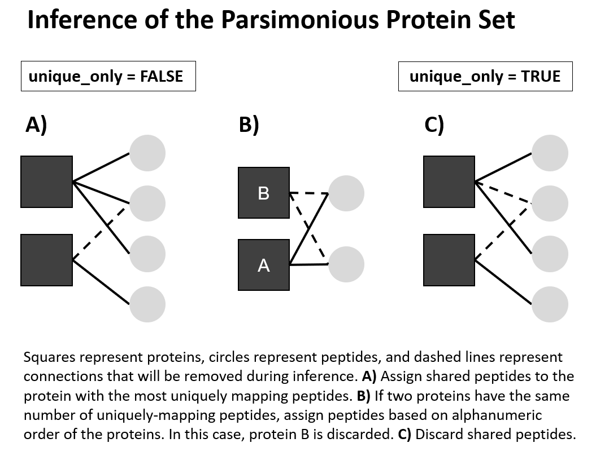

# Isobaric Quantification: Proteomics {#iso-global}

This pipeline shows how to process global proteomics TMT data with `PlexedPiper`. We will use data package 3442, which is "PlexedPiperTestData global". In addition to PlexedPiper, we will also need MSnID (the basis for PlexedPiper) and PNNL.DMS.utils to interface with PNNL's DMS.

```{r include=FALSE}
# Global chunk options
knitr::opts_chunk$set(message=FALSE, warning=FALSE, 
                      fig.align='center', fig.asp=0.65, out.width='75%')
```

```{r iso-lab-setup}
## Install missing packages
if (!require("remotes", quietly = T)) install.packages("remotes")
git_packages <- c("MSnID@pnnl-master", "PlexedPiper", "PNNL.DMS.utils")
for (pkg_i in git_packages) {
  if (!require(sub("@.*", "", pkg_i), quietly = T, character.only = T))
    remotes::install_github(file.path("PNNL-Comp-Mass-Spec", pkg_i))
}
## ------------------------

library(MSnID)
library(PlexedPiper)
library(PNNL.DMS.utils)
```

```{r include=FALSE}
library(ggplot2) # plotting
library(knitr) # embed images
library(kableExtra)
library(dplyr)
```

The pipeline can be broken up into four major parts: prepare MS/MS identifications, prepare reporter ion intensities, create study design tables, and create a quantitative cross-tab. There is another step that is required for statistical testing, which is to create an MSnSet.

## Prepare MS/MS Identifications

### Read MS-GF+ Data

The first step in the preparation of the MS/MS identifications is to fetch the data. This can either be obtained from PNNL's DMS or from a local folder.  If working with the DMS, use `PNNL.DMS.utils::read_msgf_data_from_DMS`; otherwise, use `PlexedPiper::read_msgf_data`.

```{r read-msgf-1, eval=FALSE}
## Get MS-GF+ results from local folder - not run
# Get file path
path_to_MSGF_results <- "path_to_msgf_results"
# Read MS-GF+ data from path
msnid <- read_msgf_data(path_to_MSGF_results)
```

```{r read-msgf-2, results='hide'}
## Get MS-GF+ results from DMS
data_package_num <- 3442 # global proteomics
msnid <- read_msgf_data_from_DMS(data_package_num) # global proteomics
```

Normally, this would display a progress bar in the console as the data is being fetched. However, the output was suppressed to save space. We can view a summary of the MSnID object with the `show()` function.

```{r}
show(msnid)
```

This summary tells us that `msnid` consists of 4 spectrum files (datasets), and contains a total of 1,156,754 peptide-spectrum-matches (PSMs), 511,617 total peptides, and 128,378 total accessions (proteins). The reported FDR is the empirical **false-discovery rate**, which is calculated as the ratio of the number of unique decoy to unique non-decoy PSMs, peptides, or accessions.

### Correct Isotope Selection Error 

Carbon has two stable isotopes: $^{12}\text{C}$ and $^{13}\text{C}$, with natural abundances of 98.93% and 1.07%, respectively [@berglund_isotopic_2011]. That is, we expect that about 1 out of every 100 carbon atoms is naturally going to be a $^{13}\text{C}$, while the rest are $^{12}\text{C}$. In larger peptides with many carbon atoms, it is more likely that at least one atom will be a $^{13}\text{C}$ than all atoms will be $^{12}\text{C}$. In cases such as these, a non-monoisotopic ion will be selected by the instrument for fragmentation.

```{r MS1-peak, echo=FALSE, fig.cap="MS1 spectra with peak at non-monoisotopic precursor ion."}
include_graphics("images/MS1_non_monoisotopic.PNG")
```

In Figure \@ref(fig:MS1-peak), the monoisotopic ion (m/z of 1427.29) is not the most abundant, so it is not selected as the precursor. Instead, the ion with a $^{13}\text{C}$ in place of a $^{12}\text{C}$ is selected for fragmentation. We calculate the mass difference between these two ions as the difference between the mass-to-charge ratios multiplied by the ion charge. In this case, the mass difference is 1 Dalton, or about the difference between $^{13}\text{C}$ and $^{12}\text{C}$. (More accurately, the difference between these isotopes is 1.0033548378 Da.) While MS-GF+ is still capable of correctly identifying these peptides, the downstream calculations of mass measurement error need to be fixed because they are used for filtering later on (Section \@ref(global-peptide-filter)). The `correct_peak_selection` function corrects these mass measurement errors, and Figure \@ref(fig:mass-to-charge-diff) shows the distribution of the absolute mass measurement errors (in PPM) before and after correction.

```{r echo=FALSE}
# absParentMassErrorPPM
absParentMassErrorPPM_pre <- abs(mass_measurement_error(msnid))
```

```{r}
# Correct for isotope selection error
msnid <- correct_peak_selection(msnid)
```

```{r mass-to-charge-diff, fig.cap="Histogram of mass measurement errors before and after correction.", fig.asp=0.5, echo=FALSE}
# absParentMassErrorPPM
absParentMassErrorPPM_post <- abs(mass_measurement_error(msnid))

ppm_df <- data.frame(
  delta_m = c(absParentMassErrorPPM_pre, absParentMassErrorPPM_post),
  group = rep(c("pre", "post"), each = length(absParentMassErrorPPM_post))) %>% 
  mutate(group = factor(group, levels = c("pre", "post")))

facet_labs <- c("Before Correction", "After Correction")
names(facet_labs) <- c("pre", "post")

# Plot mass measurement error
ggplot(ppm_df) +
  geom_histogram(aes(x = delta_m), bins = 20, fill = "grey", color = "black") +
  facet_grid(cols = vars(group), labeller = labeller(group = facet_labs),
             scales = "free") +
  scale_y_continuous(name = "Count", labels = scales::label_scientific(),
                     expand = expansion(mult = c(0, 0.05))) +
  labs(x = "Absolute Parent Mass Error (ppm)") +
  theme_classic(base_size = 12) +
  theme(strip.background = element_blank(),
        strip.text = element_text(size = 14, face = "bold"))
```


### Remove Contaminants 

Now, we will remove contaminants such as the trypsin that was used for protein digestion. We can see which contaminants will be removed with `accessions(msnid)[grepl("Contaminant", accessions(msnid))]`. To remove contaminants, we use `apply_filter` with an appropriate string that tells the function what rows to keep. In this case, we keep rows where the accession does not contain "Contaminant". We will use `show` to see how the counts change.

```{r}
# Remove contaminants
msnid <- apply_filter(msnid, "!grepl('Contaminant', accession)")
show(msnid)
```

We can see that the number of PSMs decreased by about 1300, peptides by ~400, and proteins by 25.

### MS/MS ID Filter: Peptide Level {#global-peptide-filter}

The next step is to filter the MS/MS identifications such that the empirical peptide-level FDR is less than some threshold and the number of identifications is maximized. We will use the $-log_{10}$ of the `PepQValue` column as one of our filtering criteria and assign it to a new column in `psms(msnid)` called `msmsScore`. The `PepQValue` column is the MS-GF+ Spectrum E-value, which reflects how well the theoretical and experimental fragmentation spectra match; therefore, high values of `msmsScore` indicate a good match (see Figure \@ref(fig:plot-msmsScore)).

```{r plot-msmsScore, fig.cap="Density plot of msmsScore.", fig.asp=0.5, echo=FALSE}
msmsScore <- -log10(msnid$PepQValue) # > 2
absParentMassErrorPPM <- abs(mass_measurement_error(msnid)) # < 10
isDecoy <- msnid$isDecoy

# Plot msmsScore
ggplot() +
  geom_density(aes(x = msmsScore, color = isDecoy), 
               fill = NA, na.rm = TRUE, size = 1.4) +
  scale_y_continuous("Density", expand = expansion(mult = c(0, 0.05))) +
  scale_x_continuous(expand = expansion(0)) +
  scale_color_manual(values = c("orange", "skyblue"), breaks = c(TRUE, FALSE)) +
  theme_minimal(base_size = 12)
```
</br>

The other filtering criteria is the absolute deviation of the mass measurement error of the precursor ions in parts-per-million (ppm), which is assigned to the `absParentMassErrorPPM` column in `psms(msnid)` (see Figure \@ref(fig:plot-mass-error)).

```{r plot-mass-error, fig.cap="Density plot of absParentMassErrorPPM.", echo=FALSE, fig.asp=0.5}
ggplot() +
  geom_density(aes(x = absParentMassErrorPPM, color = isDecoy), 
               fill = NA, na.rm = TRUE, size = 1.4) +
  scale_y_continuous("Density", expand = expansion(mult = c(0, 0.05))) +
  scale_x_continuous(expand = expansion(0)) +
  scale_color_manual(values = c("orange", "skyblue"), breaks = c(TRUE, FALSE)) +
  theme_minimal(base_size = 12)
```

</br>

These new columns `msmsScore` and `absParentMassErrorPPM` are generated automatically by `filter_msgf_data`, so we don't need to worry about creating them ourselves.

```{r global-fdr-filter-peptide}
# 1% FDR filter at the peptide level
msnid <- filter_msgf_data(msnid, level = "peptide", fdr.max = 0.01)
show(msnid)
```

We can see that filtering drastically reduces the number of PSMs, and the empirical peptide-level FDR is now 1%. However, notice that the empirical protein-level FDR is still fairly high.

### MS/MS ID Filter: Protein Level 

Now, we need to filter proteins so that the FDR is at most 1%. For each protein, we divide the number of associated peptides by its length and multiply this value by 1000. This new `peptides_per_1000aa` column is used as the filter criteria (Figure \@ref(fig:plot-num-pep)).

We will need the lengths of each protein, which can be obtained from the FASTA (pronounced FAST-AYE) file that contains the protein sequences used in the database search. The first three entries of the FASTA file are shown in Figure \@ref(fig:fasta-ex).

```{r fasta-ex, echo=FALSE, fig.cap="First three entries of the FASTA file."}
include_graphics("images/FASTA_example_MoTrPAC.PNG")
```

</br>

The path to the FASTA file can be specified as a local file path or it can be obtained with `PNNL.DMS.utils::path_to_FASTA_used_by_DMS`. We will use the latter method.

```{r eval=FALSE}
## Get path to FASTA file from local folder - not run
path_to_FASTA <- "some_folder/name_of_fasta_file.fasta"
```

```{r}
## Get path to FASTA file from DMS
path_to_FASTA <- path_to_FASTA_used_by_DMS(data_package_num)
```

```{r}
# Compute number of peptides per 1000 amino acids
msnid <- compute_num_peptides_per_1000aa(msnid, path_to_FASTA)
```

```{r plot-num-pep, fig.cap="Density plot of peptides_per_1000aa. The plot area has been zoomed in.", echo=FALSE, fig.asp=0.5}
peptides_per_1000aa <- msnid$peptides_per_1000aa
isDecoy <- msnid$isDecoy

ggplot() +
  geom_density(aes(x = peptides_per_1000aa, color = isDecoy), 
               fill = NA, na.rm = TRUE, size = 1.4) +
  scale_y_continuous("Density", expand = expansion(mult = c(0, 0.05))) +
  scale_x_continuous("peptides_per_1000aa", expand = expansion(0)) +
  scale_color_manual(values = c("orange", "skyblue"), breaks = c(TRUE, FALSE)) +
  theme_minimal(base_size = 12) +
  coord_cartesian(xlim = c(0, 250)) +
  guides(color = guide_legend(title = "isDecoy"))
```
</br>

Now, we filter the proteins to 1% FDR.

```{r message=FALSE, warning=FALSE}
# 1% FDR filter at the protein level
msnid <- filter_msgf_data(msnid, level = "accession", fdr.max = 0.01)
show(msnid)
```


### Inference of Parsimonious Protein Set 

The situation when a certain peptide sequence matches multiple proteins adds complication to the downstream quantitative analysis, as it is not clear which protein this peptide is originating from. There are common ways for dealing with this. One is to simply retain uniquely matching peptides and discard shared peptides (`unique_only = TRUE`). Alternatively, assign the shared peptides to the proteins with the larger number of uniquely mapping peptides (`unique_only = FALSE`). If there is a choice between multiple proteins with equal numbers of uniquely mapping peptides, the shared peptides are assigned to the first protein according to alphanumeric order (Figure \@ref(fig:parsimony)). 

<!---
This step could be done prior to filtering at the accession level, but if peptides are assigned to a low-confidence protein, and that protein is removed during filtering, those peptides will be lost. Instead, it is better to filter to the set of confidently-identified proteins and then determine the parsimonious set.
--->

```{r parsimony, echo=FALSE, fig.cap="Visual explanation of the inference of the parsimonious protein set."}

```

</br>

```{r}
# Inference of parsimonious protein set
msnid <- infer_parsimonious_accessions(msnid, unique_only = FALSE)
show(msnid)
```

Notice that the protein-level FDR increased slightly above the 1% threshold. In this case, the difference isn't significant, so we can ignore it. 

**Note:** If the peptide or accession-level FDR increases significantly above 1% after inference of the parsimonious protein set, consider lowering the FDR cutoff (for example, to 0.9%) and redoing the previous processing steps. That is, start with the MSnID prior to any filtering and redo the FDR filtering steps.

### Remove Decoy PSMs

The final step in preparing the MS/MS identifications is to remove the decoy PSMs, as they were only needed for the FDR filters. We use the `apply_filter` function again and only keep entries where `isDecoy` is `FALSE`.

```{r}
# Remove Decoy PSMs
msnid <- apply_filter(msnid, "!isDecoy")
show(msnid)
```

After processing, we are left with 450,928 PSMs, 90,411 peptides, and 5,201 proteins. Table \@ref(tab:global-msnid-table) shows the first 6 rows of the processed MS-GF+ output.

```{r global-msnid-table, echo=FALSE}
kable(head(psms(msnid), 6), digits = 3, row.names = FALSE, 
      caption = "<left>First 6 rows of the processed MS-GF+ results.</left>",
      escape = FALSE, format = "html") %>% 
  kable_styling(full_width = FALSE, font_size = 12,
                bootstrap_options = c("hover", "condensed")) %>% 
  scroll_box(height = "90%") # restrict width
```

</br>


## Prepare Reporter Ion Intensities

### Read MASIC Output 

MASIC is a tool for extracting ion intensities. With proper parameter settings, it can be used for extracting TMT (or iTRAQ) reporter ion intensities. In addition, it reports a number of other helpful metrics. Notably, the interference score at the precursor ion level and the signal-to-noise ratio (S/N) at the reporter ion level (computed by Thermo software). The interference score reflects the proportion of the ion population that was isolated for fragmentation that is due to the targeted ion. In other words, `1 - InterferenceScore` is due to co-isolated species that have similar elution time and precursor ion m/z. The first step in the preparation of the reporter ion intensity data is to read the MASIC results. By default, the interference score is not included, so we need to set that argument to `TRUE` in order to filter the results.

Similar to the MS-GF+ results, we can read the MASIC results from a local folder with `PlexedPiper::read_masic_data` or from PNNL's DMS with `PNNL.DMS.utils::read_masic_data_from_DMS`.

```{r read-masic-1, eval=FALSE}
## Get MASIC results from local folder - not run
# Get file path
path_to_MASIC_results <- "path_to_folder_containing_necessary_files"
# Read MASIC results from path
masic_data <- read_masic_data(path_to_MASIC_results, 
                              interference_score = TRUE)
```

```{r read-masic-2, results='hide'}
## Get MASIC results from DMS
masic_data <- read_masic_data_from_DMS(data_package_num, 
                                       interference_score = TRUE)
```

Normally, this would display progress bars in the console as the data is being fetched. However, the output was suppressed to save space.

Table \@ref(tab:global-masic-unfiltered) shows the first 6 rows of the unfiltered `masic_data`.

```{r global-masic-unfiltered, echo=FALSE}
kable(head(masic_data, 6), digits = 3, row.names = FALSE, 
      caption = "<left>First 6 rows of the unfiltered MASIC data.</left>",
      escape = FALSE, format = "html") %>% 
  kable_styling(full_width = FALSE, font_size = 12,
                bootstrap_options = c("hover", "condensed")) %>% 
  scroll_box(height = "90%") # restrict width
```

</br>


### Filter MASIC Data 

The only other step in reporter ion intensity data preparation is to filter the results. Currently, we recommend keeping entries where at least 50% of the ion population is due to the targeted ion (interference score $\geq$ 0.5) and not filtering by S/N.

```{r}
# Filter MASIC data
masic_data <- filter_masic_data(masic_data, 
                                interference_score_threshold = 0.5,
                                s2n_threshold = 0)
```

Table \@ref(tab:global-masic-unfiltered) shows the first 6 rows of the filtered `masic_data`.

```{r global-masic-filtered, echo=FALSE}
kable(head(masic_data, 6), digits = 3, row.names = FALSE, 
      caption = "<left>First 6 rows of the filtered MASIC data.</left>",
      escape = FALSE, format = "html") %>% 
  kable_styling(full_width = FALSE, font_size = 12,
                bootstrap_options = c("hover", "condensed")) %>% 
  scroll_box(height = "90%") # restrict width
```

Lastly, we will save the processed MSnID and MASIC data to an .RData file with compression. This is useful in case we want to create different cross-tabs with new study design tables later on.

```{r eval=FALSE}
# Save processed MSnID and MASIC data
save(msnid, masic_data, file = "data/3442_processed_msnid_and_masic.RData",
     compress = TRUE)
```


## Create Study Design Tables {#fetch-study-design-tables}

To convert from PSMs and reporter ion intensities to meaningful quantitative data, it is necessary to specify the study design. The entire study design is captured by three tables - fractions, samples, references. With newly processed data, these typically do not exist, and must be created. The next sections show how to create these tables in R. 

**NOTE:** simple study designs can be created in Excel and read in with `readxl::read_excel`, though R is the better choice when dealing with many samples.


### Fractions 

The fractions table consists of two columns: `Dataset` and `PlexID`. The `Dataset` column contains all of the unique datasets that are common to `msnid` and `masic_data`. Sometimes, entire datasets may be removed during the FDR filtering steps, so that is why we use the unique intersection of datasets. The `PlexID` column contains the plex ID associated with each dataset, and is typically a letter followed by a number ("S1", "S2", etc.). A plex is a set of samples that are processed together (under the same conditions). We can extract the plex ID from the datasets. In this case, the plex ID always comes after "_W_", so we can use a regular expression (use `help(topic = regex, package = base)` to learn more). The regular expression below says to capture an "S" followed by a single digit that appears after "\_W\_" and before an underscore. The plex ID is always included in the dataset names, but the format of the names will be different.

```{r}
# Create fractions table
datasets <- unique(intersect(msnid$Dataset, masic_data$Dataset))
fractions <- data.frame(Dataset = datasets) %>% 
  mutate(PlexID = gsub(".*_W_(S\\d{1})_.*", "\\1", Dataset))
```

```{r fractions-table, echo=FALSE}
kable(fractions, row.names = FALSE, 
      caption = "<left>Fractions</left>",
      escape = FALSE, format = "html") %>% 
  kable_styling(full_width = FALSE, font_size = 12,
                bootstrap_options = c("hover", "condensed")) %>% 
  scroll_box(height = "20em") # restrict height
```


### Samples 

The samples table contains columns `PlexID`, `QuantBlock`, `ReporterName`, `ReporterAlias`, and `MeasurementName`. 

- `PlexID` must be the same as the `PlexID` in the fractions table.
- `ReporterName` is the reporter ion name ("126", "127N", "127C", etc.). 
- `ReporterAlias` is used for defining the reference channel(s).
- `MeasurementName` determines the column names for the final cross-tab, and must be unique and begin with a letter. If any values of `ReporterAlias` are "ref", the corresponding `MeasurementName` should be `NA`. `NA` measurement names will not appear as columns in the final cross-tab.
- `QuantBlock` defines the sub-plex. In a typical TMT experiment, `QuantBlock` is always 1. In case of 5 pairwise comparisons within TMT10, there will be 5 QuantBlocks (1-5) with a reference for each `QuantBlock`.

For this experiment, TMT10 was used as the basis for two plexes, and channel 131 is the reference, so we set `ReporterAlias` to "ref" and `MeasurementName` to `NA` when `ReporterName` is `"131"`. This will divide the intensities of each channel by their associated reference and make the reference channel absent from the quantitative cross-tab. In cases where reporter ion intensities are not normalized by a reference channel (reference = 1) or they are normalized by the average of select channels, do not set any `ReporterAlias` to "ref" or `MeasurementName` to `NA`.

```{r}
# Create samples table
samples <- reporter_converter$tmt10 %>% 
  dplyr::select(ReporterName) %>% # only keep ReporterName column
  dplyr::slice(rep(1:n(), times = 2)) %>% # Copy TMT10 table twice (2 plexes)
  # Create PlexID and QuantBlock columns. 
  # Plex S1 goes with first 10 rows, plex S2 with last 10
  mutate(PlexID = paste0("S", rep(1:2, each = 10)),
         QuantBlock = 1) %>% 
  group_by(PlexID) %>% 
  # Within each of the two PlexID groups, create unique reporter aliases
  # and measurement names. ReporterAlias is "ref" for channel 131,
  # and MeasurementName is NA so it is not included in the cross-tab.
  mutate(ReporterAlias = paste(PlexID, 1:n(), sep = "_"),
         ReporterAlias = ifelse(ReporterName == "131", "ref", ReporterAlias),
         MeasurementName = ifelse(ReporterAlias == "ref", 
                                  NA, ReporterAlias)) %>% 
  ungroup() # stop grouping by PlexID
```

```{r samples-table, echo=FALSE}
kable(samples, row.names = FALSE, 
      caption = "<left>Samples</left>",
      escape = FALSE, format = "html") %>% 
  kable_styling(full_width = FALSE, font_size = 12,
                bootstrap_options = c("hover", "condensed")) %>% 
  scroll_box(height = "20em") # restrict height
```

</br>

Table \@ref(tab:samples-table) shows the `samples` table.


### References {#global-references}

The reference can be a certain channel, average of multiple channels, or 1 (no reference). The general form is an expression with `ReporterAlias` names as variables. It is evaluated for each `PlexID`/`QuantBlock` combination and applied to divide reporter ion intensities within corresponding `PlexID`/`QuantBlock`. A reference is used to convert raw intensities to relative intensities.

```{r}
# Create references table
references <- samples %>% 
  filter(ReporterAlias == "ref") %>% 
  # Select required columns and rename ReporterAlias to Reference
  select(PlexID, QuantBlock, Reference = ReporterAlias)
```

```{r references-table, echo=FALSE}
kable(references, row.names = FALSE, 
      caption = "<left>References</left>",
      escape = FALSE, format = "html") %>% 
  kable_styling(full_width = FALSE, font_size = 12,
                bootstrap_options = c("hover", "condensed"))
```

</br>

Table \@ref(tab:references-table) shows the `references` table. The code to use the geometric average instead of a single channel as the reference is shown below. The geometric average is the product of the reporter ion channels to the power of (1/number of channels). For each `PlexID` group, collapse the vector of reporter ion names with `*`, surround them in parentheses, and raise to the power of (1/number of channels).

**Note:** if using the geometric average or no reference, make sure the samples table is correct. There should not be any `ReporterAlias` that are "ref" or `MeasurementName` that are `NA`.

```{r eval=FALSE}
## Example of how to use the geometric average as reference - not run
references <- samples %>%
  group_by(PlexID, QuantBlock) %>%
  summarise(Reference = sprintf("(%s)^(1/%d)", 
                                paste(ReporterAlias, collapse = "*"), 
                                n()),
            .groups = "keep")
```

```{r eval=FALSE}
## Example of how to set the reference to 1 - not run
references <- samples %>% 
  distinct(PlexID, QuantBlock) %>% 
  mutate(Reference = 1)
```

Now that we have the three study design tables, we should save them.

```{r}
# Save study design tables with write.table
write.table(fractions, file = "data/3442_fractions.txt",
            sep = "\t", quote = FALSE, row.names = FALSE)
write.table(samples, file = "data/3442_samples.txt",
            sep = "\t", quote = FALSE, row.names = FALSE)
write.table(references, file = "data/3442_references.txt",
            sep = "\t", quote = FALSE, row.names = FALSE)
```

Once the study design tables have been saved to text files, it is good practice to make them available to others. To do so, navigate to the Share Path provided in the DMS Data Package Detail Report (shown in Figure \@ref(fig:DMS-share-path)), and copy the three study design files to this location. This allows them to be accessed by others with the `get_study_design_by_dataset_package` function in the future.

```{r DMS-share-path, echo=FALSE, fig.cap="Location of the Share Path used to add the study design tables."}
include_graphics("images/data_package_share_path.PNG")
```


## Create Quantitative Cross-tab {#global-quant-crosstab}

This is the step where MS/MS IDs and reporter ions are linked together and aggregated to the peptide or accession (i.e. protein) level. To retain protein IDs while aggregating to peptide level, set `aggregation_level <- c("accession","peptide")`. The aggregation level can be any column or combination of columns in `psms(msnid)`. If specified by the study design tables, the intensities are converted to relative intensities by dividing by a reference. Then, they are log$_2$-transformed.

```{r}
# Create protein-level cross-tab by aggregating to accession level
crosstab <- create_crosstab(msnid = msnid, 
                            reporter_intensities = masic_data,
                            aggregation_level = "accession",
                            fractions = fractions, 
                            samples = samples, 
                            references = references)
```

```{r cross-tab, echo=FALSE}
kable(head(crosstab, 6), row.names = TRUE, 
      caption = "<left>First 6 rows of the cross-tab.</left>",
      escape = FALSE, format = "html") %>% 
  kable_styling(full_width = FALSE, font_size = 12,
                bootstrap_options = c("hover", "condensed")) %>% 
  scroll_box(height = "90%") # restrict width
```

</br>

Now that we have the cross-tab, we should save it.

```{r}
# Save cross-tab
write.table(crosstab, file = "data/3442_global_crosstab.txt",
            sep = "\t", quote = FALSE, row.names = TRUE)
```

We will also save the proteins (row names) of this cross-tab in order to demonstrate prioritized inference later on.

```{r}
# Save global proteins
global_proteins <- rownames(crosstab)
save(global_proteins, file = "data/3442_global_proteins.RData")
```


## Create MSnSet {#global-msnset}

The `create_msnset` function can be used to easily create an MSnSet from the cross-tab and samples tables. More details about MSnSets will be added in a separate section at a later date. For now, read the documentation with `help("MSnSet")` or `?MSnSet`.

```{r}
# Create MSnSet
m <- create_msnset(crosstab = crosstab, samples = samples)
m
```


```{r}
# Save global MSnSet
save(m, file = "data/global_msnset.RData", compress = TRUE)
```


